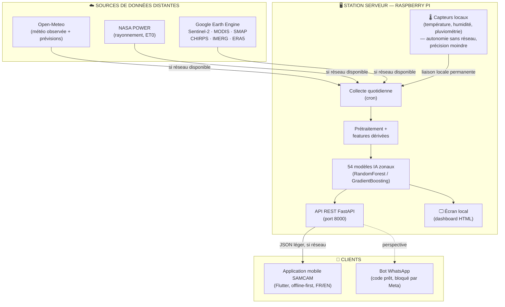
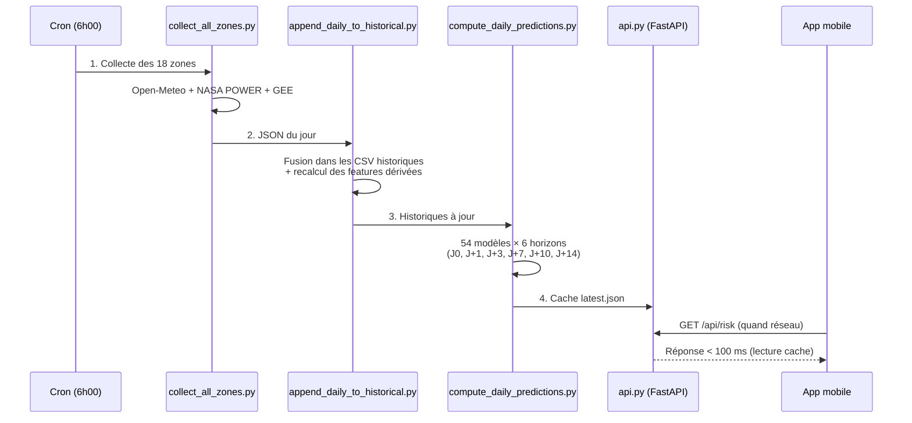
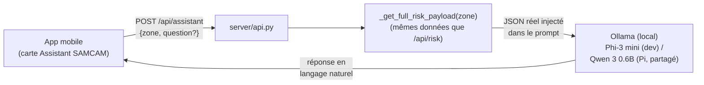
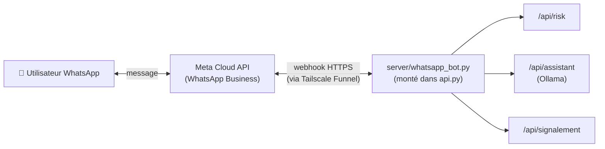

# SAMCAM — Système d'Alerte Météorologique du Cameroun

**Rapport de projet**

| | |
|---|---|
| **Projet** | SAMCAM — Surveillance et Alerte climatique Multi-zones du CAMeroun |
| **Type** | Système d'alerte précoce (inondation, sécheresse, vague de chaleur) |
| **Plateformes** | Serveur embarqué Raspberry Pi · Application mobile Flutter (Android/iOS) |
| **Technologies** | Python, FastAPI, scikit-learn, Flutter/Dart, Google Earth Engine |
| **Date** | Juillet 2026 (mis à jour le 15 juillet 2026) |

---

## Table des matières

1. [Introduction](#1-introduction)
2. [Contexte et problématique](#2-contexte-et-problématique)
3. [Architecture générale du système](#3-architecture-générale-du-système)
4. [Le serveur : la station Raspberry Pi](#4-le-serveur--la-station-raspberry-pi)
5. [Le cœur intelligent : données, algorithmes et modèles IA](#5-le-cœur-intelligent--données-algorithmes-et-modèles-ia)
6. [Problématiques rencontrées et solutions apportées](#6-problématiques-rencontrées-et-solutions-apportées)
7. [L'application mobile SAMCAM](#7-lapplication-mobile-samcam)
8. [Évaluation de la fiabilité du système](#8-évaluation-de-la-fiabilité-du-système)
9. [Prise en main et guide d'utilisation](#9-prise-en-main-et-guide-dutilisation)
10. [Perspectives d'évolution](#10-perspectives-dévolution)
11. [Conclusion](#11-conclusion)

---

## 1. Introduction

SAMCAM est un prototype de **système d'alerte climatique précoce** conçu pour le Cameroun. Il estime quotidiennement, pour dix-huit zones représentatives du pays, le risque d'**inondation**, de **sécheresse** et de **vague de chaleur**, aujourd'hui et jusqu'à 14 jours à l'avance.

Le système repose sur trois piliers :

1. **Une station serveur autonome** (Raspberry Pi) qui collecte les données, exécute les modèles d'intelligence artificielle et affiche la situation sur un écran local ;
2. **Des données météorologiques et satellitaires open source**, complétées par des capteurs locaux reliés à la station ;
3. **Une application mobile** (Flutter) qui restitue les alertes de façon simple et lisible pour les habitants, agriculteurs et autorités locales, y compris en cas de connectivité limitée.

L'ambition du projet n'est pas de remplacer les services météorologiques nationaux, mais de démontrer qu'un système d'alerte **léger, peu coûteux et déployable localement** peut fournir une information de risque exploitable là où l'accès à l'information climatique fait défaut.

---

## 2. Contexte et problématique

### 2.1 Le contexte climatique camerounais

Le Cameroun est surnommé « l'Afrique en miniature » : il concentre sur son territoire la quasi-totalité des climats du continent, de la forêt équatoriale humide (Kribi, Ebolowa) au Sahel semi-aride (Maroua), en passant par les hauts plateaux de l'Ouest (Bafoussam) et la savane soudanienne (Garoua, Ngaoundéré).

Cette diversité expose le pays à des aléas climatiques variés et récurrents :

- **Inondations** : les crues du Logone et de la Bénoué ont provoqué des catastrophes majeures dans l'Extrême-Nord (2012, 2020, 2022 — plus de 300 000 personnes affectées en 2022 selon OCHA). À l'Ouest, les pluies torrentielles d'octobre 2019 ont causé un éboulement meurtrier à Bafoussam (~43 morts).
- **Sécheresses** : la crise alimentaire sahélienne de 2011-2012 a durement touché l'Extrême-Nord ; l'agriculture pluviale, majoritaire, y est extrêmement vulnérable.
- **Vagues de chaleur** : les canicules sahéliennes (avril 2010, mars-avril 2024 avec des pointes > 45 °C) s'intensifient avec le changement climatique.

### 2.2 La problématique

> **Comment concevoir un système d'alerte climatique léger, peu coûteux et accessible sur smartphone, capable d'exploiter des données météorologiques et satellitaires pour estimer des risques climatiques localisés, tout en restant utilisable dans un contexte de connectivité intermittente et de ressources matérielles limitées ?**

Cette problématique se décompose en plusieurs sous-questions :

| Sous-problème | Contrainte associée |
|---|---|
| Où trouver des données climatiques fiables et gratuites ? | Pas de réseau de stations météo dense au Cameroun |
| Comment produire une prédiction de risque locale ? | Chaque zone a sa propre climatologie (Kribi ≠ Maroua) |
| Où exécuter les calculs ? | Le téléphone des utilisateurs est souvent d'entrée de gamme |
| Comment servir l'information sans connexion permanente ? | Couverture réseau intermittente en zone rurale |
| Comment rendre l'alerte compréhensible ? | Publics variés : agriculteurs, habitants, autorités |

### 2.3 Les dix-huit zones surveillées

Les 8 zones initiales couvraient les grandes villes et leur climat régional. Une deuxième vague de **10 zones agricoles** a été ajoutée pour couvrir des filières et régions non représentées (riziculture, coton, cacao, café, palmier à huile, élevage) — voir §6.6 pour la méthode d'intégration.

**Zones initiales**

| Zone | Région | Climat | Risques dominants |
|---|---|---|---|
| Kribi | Sud (côte) | Équatorial océanique | Inondation, houle |
| Ebolowa | Sud | Équatorial forestier | Inondation |
| Kumba | Sud-Ouest | Équatorial très humide | Inondation |
| Bafoussam | Ouest | Tropical d'altitude | Pluies torrentielles, glissements |
| Yaoundé (périphérie) | Centre | Équatorial à 4 saisons | Inondation urbaine |
| Ngaoundéré | Adamaoua | Soudano-guinéen | Sécheresse, chaleur |
| Garoua | Nord | Soudanien | Inondation (Bénoué), chaleur |
| Maroua | Extrême-Nord | Sahélien | Tous : crues du Logone, sécheresse, canicule |

**Zones agricoles ajoutées**

| Zone | Région | Filière | Climat |
|---|---|---|---|
| Ndop | Nord-Ouest | Riziculture irriguée (plaine du Noun) | Hauts plateaux bimodal |
| Foumbot | Ouest | Maraîchage/maïs (sols volcaniques) | Hauts plateaux bimodal |
| Kaélé | Extrême-Nord | Sorgho/mil pluvial | Sahélien |
| Guider | Nord | Coton, sorgho, arachide | Sahélien |
| Meiganga | Adamaoua | Élevage bovin extensif | Hauts plateaux (transition) |
| Mbalmayo | Centre | Manioc/plantain (bassin vivrier) | Équatorial bimodal |
| Bafia | Centre | Vivrier/arachide | Équatorial bimodal |
| Bertoua | Est | Café robusta/cacao | Équatorial bimodal |
| Nkongsamba | Littoral | Cacao/bananeraie d'exportation | Équatorial bimodal |
| Buea | Sud-Ouest | Palmier à huile/banane | Équatorial bimodal, forte pluviométrie |

---

## 3. Architecture générale du système

### 3.1 Vue d'ensemble

Le système suit une **architecture hybride centrée sur la station serveur** : le traitement lourd (collecte, IA) est centralisé sur la Raspberry Pi ; l'application mobile ne fait qu'interroger une API REST légère et conserve un cache local pour fonctionner hors-ligne.



### 3.2 Principe de fonctionnement

1. **En local, en permanence** : les capteurs reliés à la Raspberry Pi remontent leurs mesures ; la station affiche sur son écran le tableau de bord de la situation (dernier bulletin calculé, niveaux d'alerte par zone). La station reste utile même totalement isolée du réseau — avec une précision réduite : les capteurs ne voient que les conditions du point d'installation, sans prévisions ni imagerie satellite (voir §4.1).
2. **Quand le réseau est disponible** : la station récupère automatiquement (tâches cron) les données météo observées et prévues ainsi que les données satellitaires, recalcule les risques pour les 18 zones et les 6 horizons (J0, J+1, J+3, J+7, J+10, J+14), et met les résultats à disposition de l'application mobile via son API.
3. **Côté téléphone** : l'application interroge l'API quand elle a du réseau et met en cache chaque réponse ; hors couverture, elle affiche les dernières données connues avec leur date, sans jamais laisser l'utilisateur devant un écran vide.

Ce découpage répond directement à la contrainte de connectivité : **aucun des trois maillons (station, écran local, téléphone) ne dépend d'une connexion permanente pour rester utile**.

---

## 4. Le serveur : la station Raspberry Pi

### 4.1 Rôle et composition matérielle

La station est le cerveau du système. Elle est construite autour d'une **Raspberry Pi** — choisie pour son coût (< 100 €), sa faible consommation (alimentable par panneau solaire) et sa capacité suffisante pour exécuter des modèles scikit-learn.

```
┌──────────────────────────────────────────────────────────────┐
│                    STATION SAMCAM (Raspberry Pi)             │
│                                                              │
│   ┌────────────┐    ┌─────────────────────────────────┐     │
│   │  Capteurs  │───▶│  Raspberry Pi                   │     │
│   │  locaux    │    │  · collecte (cron)              │     │
│   │  T°/hum./  │    │  · pipeline de features         │     │
│   │  pluie     │    │  · 54 modèles IA (.pkl)         │     │
│   └────────────┘    │  · API FastAPI :8000            │     │
│                     │  · historiques CSV (36 ans)     │     │
│                     └───────┬──────────────┬──────────┘     │
│                             │ HDMI         │ WiFi/4G        │
│                     ┌───────▼──────┐   ┌───▼────────────┐   │
│                     │ Écran local  │   │ Vers Internet  │   │
│                     │ (dashboard)  │   │ (APIs + app)   │   │
│                     └──────────────┘   └────────────────┘   │
└──────────────────────────────────────────────────────────────┘
```

- **Capteurs locaux** (température, humidité, pluviométrie) : ils constituent la **station météo de secours** du système. Leur rôle est double : (1) fournir une mesure de terrain en temps réel qui permet de contrôler la cohérence des données d'API, et (2) garantir qu'en **absence totale de réseau**, la station continue de mesurer les conditions locales et d'alimenter l'écran d'affichage. Cette autonomie a un prix assumé : les capteurs ne mesurent qu'en un point unique et ne remplacent ni les prévisions à 14 jours, ni les données satellitaires (humidité des sols, végétation) — le mode « capteurs seuls » est donc **complet en local mais moins précis** que le mode connecté. Dès que le réseau revient, les données d'API reprennent la priorité et les modèles retrouvent leur pleine capacité.
- **Écran local** : branché en HDMI, il affiche en continu le tableau de bord (`dashboard/samcam-v4-dashboard.html`, servi par l'API sur `/dashboard`) : météo courante, niveaux de risque des zones, dernières alertes. Il fait de la station un point d'information public (mairie, coopérative agricole, école).
- **Connexion réseau (WiFi/4G)** : opportuniste. Quand elle est présente, la station se synchronise avec les sources distantes et sert l'application mobile.

### 4.2 Architecture logicielle du serveur

Le dépôt est organisé en modules à responsabilité unique :

```
SAMCAM/
├── config/zones/            ← Climatologie de chaque zone (normales, seuils, percentiles)
├── data_collection/         ← Collecte quotidienne (Open-Meteo, NASA POWER, GEE)
│   ├── collect_all_zones.py         (orchestrateur 18 zones)
│   ├── collect_zone.py              (collecteur générique)
│   └── append_daily_to_historical.py (consolidation des historiques)
├── data/
│   ├── historical/          ← 18 CSV historiques (1990/2000 → aujourd'hui)
│   ├── predictions/         ← Cache des prédictions du jour (latest.json)
│   └── community_reports/   ← Signalements terrain des utilisateurs
├── training/                ← Génération des labels + entraînement des modèles
│   ├── build_labels.py              (labels par règles climatologiques + événements réels)
│   ├── generate_zone_config.py      (calibration climatique depuis l'historique réel — §6.6)
│   ├── calibrate_zone_thresholds.py (ré-étalonnage statistique des seuils — §6.6)
│   ├── train_zonal_models.py        (54 modèles : 18 zones × 3 risques)
│   ├── onboard_new_zones.sh         (pipeline complet d'intégration d'une nouvelle zone)
│   └── evaluate_real_events.py      (validation contre événements réels)
├── inference/               ← Moteur de prédiction
│   ├── infer_zonal.py               (inférence multi-horizon J0 → J+14)
│   └── compute_daily_predictions.py (pré-calcul quotidien → cache)
├── models/zonal/            ← 54 modèles entraînés (.pkl) + métriques
├── server/
│   ├── api.py                       (API REST FastAPI)
│   ├── whatsapp_bot.py              (bot WhatsApp — voir §10.2)
│   └── send_push_alerts.py          (notifications push — voir §10.3)
├── docker/                  ← Images Docker (API + collecteur) pour déploiement Pi
├── docker-compose.yml       ← Orchestration des conteneurs SAMCAM (Ollama reste natif)
├── install_pi.sh            ← Installation automatique sur Raspberry Pi (voir §9.2bis)
├── dashboard/               ← Tableau de bord HTML (écran local)
└── samcam_app/              ← Application mobile Flutter (FR/EN, lib/l10n/)
```

### 4.3 Le cycle quotidien de la station

Chaque jour, une chaîne de tâches cron s'exécute :



Le **cache de prédictions** est un choix d'architecture important : l'inférence complète (chargement des historiques + calcul des features glissantes + 54 modèles × 6 horizons) prend plusieurs secondes — inacceptable par requête HTTP sur une Raspberry Pi. En pré-calculant une fois par jour, l'API répond en **moins de 100 ms** quelle que soit la charge, et le calcul en direct ne sert que de secours si le cache est absent.

### 4.4 L'API REST

L'API (FastAPI + uvicorn, port 8000) expose des réponses JSON légères, pensées pour des connexions lentes :

| Endpoint | Rôle |
|---|---|
| `GET /health` | État du serveur et des modèles |
| `GET /api/zones` | Liste des zones disponibles |
| `GET /api/risk?zone=X` | Bulletin de risque complet d'une zone (J0 → J+14) |
| `GET /api/nearest?lat=&lon=` | Bulletin de la zone la plus proche d'une position GPS |
| `GET /api/overview` | Niveau d'alerte des 18 zones en une requête (~58 ms) |
| `GET /api/history?zone=&days=` | Évolution jour par jour des scores (jusqu'à 90 j) |
| `GET /api/meteo?zone=X` | Météo courante et prévisions |
| `POST /api/signalement` | Dépôt d'un signalement terrain par un utilisateur |
| `GET /api/signalements` | Consultation des signalements (recalibration des modèles) |
| `GET /dashboard` | Tableau de bord HTML (écran local) |

---

## 5. Le cœur intelligent : données, algorithmes et modèles IA

### 5.1 Schéma complet du flux de données

Le schéma ci-dessous détaille tout ce qui est récupéré, comment c'est traité, et ce que produisent les modèles — l'ensemble s'exécutant sur la Raspberry Pi :

```mermaid
flowchart TB
    subgraph ACQ["1 — ACQUISITION"]
        direction LR
        A1["Open-Meteo<br/>· température min/moy/max<br/>· précipitations<br/>· humidité, vent, ET0<br/>· prévisions 14 jours"]
        A2["NASA POWER<br/>· rayonnement solaire<br/>· évapotranspiration"]
        A3["Google Earth Engine<br/>· Sentinel-2 : NDVI, NDWI, NDRE<br/>· MODIS : NDVI (secours)<br/>· SMAP/ERA5 : humidité des sols<br/>(0-7, 7-28, 28-100 cm)<br/>· CHIRPS + IMERG : pluie satellite"]
        A4["Capteurs locaux<br/>· T°, humidité, pluie<br/>(secours autonome sans réseau,<br/>moins précis)"]
    end

    subgraph FEAT["2 — PRÉTRAITEMENT & FEATURES (23 à 31 par risque)"]
        direction LR
        F1["Cumuls glissants<br/>rain_7d / 14d / 30d / 90d"]
        F2["Anomalies<br/>temp_anom_30d, SPI-3 approché"]
        F3["Extrêmes<br/>temp_max_7d, jours consécutifs"]
        F4["Sols & végétation<br/>humidité par couche, NDVI"]
        F5["Saisonnalité<br/>mois, semaine, jour de l'année"]
    end

    subgraph LABELS["3 — LABELS D'ENTRAÎNEMENT (par zone)"]
        L1["Règles climatologiques<br/>calibrées sur les normales réelles<br/>de chaque zone (config/zones/*.json) :<br/>pluie vs percentiles hebdo, ET0 vs normale,<br/>humidité sol vs climatologie, T° vs seuils"]
    end

    subgraph TRAIN["4 — ENTRAÎNEMENT (training/)"]
        T1["54 modèles = 18 zones × 3 risques<br/>RandomForest ou GradientBoosting<br/>(sélection auto du meilleur)"]
        T2["Validation croisée temporelle<br/>(TimeSeriesSplit, anti-fuite)<br/>AUC médian : 0,91"]
        T3["Seuil de décision optimisé<br/>par modèle (F1)"]
    end

    subgraph INF["5 — INFÉRENCE QUOTIDIENNE (inference/)"]
        I1["J0 : fenêtre des 30 derniers jours"]
        I2["J+1 → J+14 : les prévisions météo réelles<br/>prolongent l'historique, les features<br/>glissantes sont recalculées ;<br/>l'humidité des sols est extrapolée<br/>par tendance (régression 14 j)"]
        I3["Cache latest.json<br/>18 zones × 3 risques × 6 horizons"]
    end

    subgraph OUT["6 — RESTITUTION"]
        O1["API REST → app mobile"]
        O2["Dashboard → écran local"]
        O3["Niveaux : VERT / JAUNE /<br/>ORANGE / ROUGE"]
    end

    ACQ --> FEAT
    FEAT --> LABELS
    LABELS --> TRAIN
    FEAT --> INF
    TRAIN -->|"modèles .pkl"| INF
    INF --> OUT
```



### 5.2 Les données collectées en détail

| Source | Données | Fréquence | Usage |
|---|---|---|---|
| **Open-Meteo** | Températures, précipitations, humidité, vent, ET0 ; prévisions à 14 jours | Quotidienne | Socle des features + horizons J+1 → J+14 |
| **NASA POWER** | Rayonnement solaire, évapotranspiration de référence | Quotidienne | Stress hydrique (sécheresse) |
| **Sentinel-2** (GEE) | NDVI, NDWI, NDRE (indices de végétation et d'eau, masquage des nuages) | ~5 jours | État de la végétation |
| **MODIS** (GEE) | NDVI | Quotidien | Secours quand Sentinel-2 est trop nuageux |
| **SMAP / ERA5** (GEE) | Humidité des sols sur 3 profondeurs (0-7, 7-28, 28-100 cm) | Quotidienne | Signal clé de la sécheresse |
| **CHIRPS / IMERG** (GEE) | Précipitations estimées par satellite | Quotidienne | Contrôle croisé de la pluie |
| **Capteurs locaux** | T°, humidité, pluviométrie sur site | Continue | Mode de secours autonome (sans réseau) + contrôle terrain — moins précis que les sources satellite/API |

Les historiques couvrent **36 ans pour les zones du Nord** (1990-2026) et **26 ans pour les zones du Sud** (2000-2026), soit ~9 500 à 13 200 jours de données par zone — une profondeur indispensable pour apprendre la variabilité interannuelle.

### 5.3 Pourquoi 54 modèles et pas un seul ?

Un modèle unique « Cameroun » serait dominé par les contrastes entre zones (il pleut 10 fois plus à Kribi qu'à Maroua en janvier) au lieu d'apprendre les anomalies *au sein* de chaque zone. Le choix retenu : **un modèle par zone et par risque** (18 × 3 = 54), chacun entraîné sur l'historique de sa zone avec des labels calibrés sur la climatologie locale (fichiers `config/zones/*.json` : normales mensuelles de pluie et d'ET0, percentiles hebdomadaires, climatologie de l'humidité des sols — tous recalculés depuis les données réelles).

L'entraînement (script `train_zonal_models.py`) :

- essaie **RandomForest** et **GradientBoosting** et retient le meilleur ;
- valide en **TimeSeriesSplit** (validation croisée temporelle) : on ne teste jamais sur le passé de ce qu'on a appris, pour éviter la fuite temporelle ;
- optimise le **seuil de décision** de chaque modèle (compromis précision/rappel via F1).

Résultats sur les 54 modèles : AUC de validation croisée entre 0,61 et 0,998, **médiane 0,96**. Les modèles les plus performants sont ceux des risques à forte signature saisonnière (inondation Maroua : 0,99) ; les plus difficiles restent la sécheresse en zone sahélienne (Maroua : 0,63, Garoua : 0,66), où la saison sèche « normale » ressemble beaucoup à une sécheresse anormale — un défi structurel plutôt qu'un problème d'entraînement, qui persiste sur les nouvelles zones sahéliennes (Kaélé, Guider) malgré un ré-étalonnage dédié (voir §6.6).

### 5.4 La prévision multi-horizon (J+1 à J+14)

C'est l'un des apports techniques du projet. Pour prédire le risque à J+7, le moteur (`infer_zonal.py`) :

1. prend l'historique réel jusqu'à aujourd'hui ;
2. le **prolonge avec les prévisions météo réelles** d'Open-Meteo (pluie, températures prévues jour par jour) ;
3. **recalcule toutes les features glissantes** (rain_30d, anomalies…) sur cette série étendue ;
4. pour les variables sans prévision disponible (humidité des sols), applique une **extrapolation de tendance** (régression linéaire sur les 14 derniers jours) plutôt qu'une simple persistance ;
5. applique le modèle de la zone sur la ligne correspondant à la date cible.

La prédiction à J+7 reflète donc réellement la météo annoncée, et non une simple reconduction du présent.

---

## 6. Problématiques rencontrées et solutions apportées

Le développement a traversé plusieurs difficultés significatives. Les plus instructives sont détaillées ici.

### 6.1 Des scores de risque aberrants : l'audit des labels

**Symptôme** : certaines zones affichaient des risques quasi permanents (sécheresse Kribi épinglée à 99,9 % sur tous les horizons, inondation Maroua à 100 %… en pleine saison sèche).

**Diagnostic** : les modèles apprenaient des labels générés par règles, et ces règles étaient mal calibrées. Trois bugs distincts ont été identifiés par un audit systématique des 8 zones :

| Bug | Cause | Effet | Correction |
|---|---|---|---|
| **Normales d'ET0 sous-évaluées** (~4 à 5× trop basses, 8 zones) | Valeurs de config jamais confrontées aux données réelles | Le critère « stress ET0 » de la sécheresse se déclenchait presque tous les jours de l'année | Recalcul des normales mensuelles d'ET0 depuis les historiques réels |
| **Normales de pluie sous-évaluées** (ex. Kribi juillet : 30 mm configurés vs 224 mm réels) | Idem | Le critère « excès de pluie » de l'inondation sur-déclenchait toute la saison humide | Recalcul des normales et des percentiles hebdomadaires depuis les données réelles |
| **Comparaison `>= 0`** | Quand la normale mensuelle de pluie vaut 0 (saison sèche profonde à Maroua), les seuils dérivés valent 0 et `pluie >= 0` est toujours vrai | Label « inondation » à 100 % à Maroua… en décembre-janvier | Remplacement de `>=` par `>` dans les critères concernés |

**Leçon retenue** : dans un système à base de règles + ML, **la qualité des labels prime sur celle du modèle**. Un AUC élevé ne garantit rien si les labels sont faux ; chaque valeur « bizarre » affichée par l'application méritait d'être tracée jusqu'à la donnée source. Après correction, les 24 modèles ont été réentraînés et les taux de positifs sont revenus à des valeurs physiquement plausibles.

### 6.2 Un historique figé

**Symptôme** : l'écran « Historique » de l'app affichait la même valeur pour chaque jour passé.

**Cause** : après l'introduction du cache de prédictions, l'endpoint `/api/history` relisait pour chaque jour la valeur *du jour courant* (le cache ne contient qu'une entrée par zone).

**Solution** : exposer la série journalière que le modèle calcule déjà en interne (une probabilité par jour de la fenêtre d'inférence) via une nouvelle fonction `infer_zone_risk_series()`, court-circuitant le cache pour les requêtes historiques. L'historique montre désormais l'évolution réelle jour par jour.

### 6.3 Performance sur Raspberry Pi

**Problème** : l'inférence complète par requête HTTP est trop lente pour le matériel cible.

**Solution** : séparation calcul/restitution. Le pipeline quotidien pré-calcule tout (`compute_daily_predictions.py` → `latest.json`) ; l'API ne fait que lire ce cache (invalidé par mtime), avec le calcul en direct en simple secours. Résultat : `/api/overview` répond en quelques dizaines de ms pour les 18 zones.

### 6.4 Connectivité intermittente

**Problème** : en zone rurale, ni la station ni les téléphones n'ont de réseau garanti.

**Solutions** (à chaque maillon) :

- **Station** : les données d'API sont consolidées dans des CSV locaux ; les capteurs et l'écran fonctionnent sans réseau (mode dégradé : mesures locales seules, moins précises, sans prévisions ni satellite) ; la collecte complète reprend automatiquement au retour du réseau.
- **Application** : chaque réponse réseau réussie est mise en cache (`SharedPreferences`) ; en cas d'échec, l'app ressort la dernière donnée connue avec un bandeau « Mode hors-ligne — données du JJ/MM à HH:MM ». La carte du Cameroun est dessinée localement (`CustomPainter`) sans aucune tuile réseau.
- **Bulletins partageables en texte brut** (pas de pièce jointe) : transmissibles par SMS ou WhatsApp même sur une connexion minimale.

### 6.5 Autres difficultés notables

- **Fiabilité de mesure vs vérité terrain** : les labels d'entraînement restent des règles climatologiques, pas des événements confirmés — d'où le module de **signalement communautaire** (§7) et l'**évaluation contre événements réels** (§8).
- **Nuages sur Sentinel-2** : en saison des pluies, l'optique satellite est souvent aveugle → masquage des nuages + repli automatique sur MODIS.
- **Compatibilité des formats de modèles** : trois générations de fichiers `.pkl` coexistent (V3/V4/V5) → chargeur rétro-compatible gérant les trois formats.

### 6.6 Intégrer 10 nouvelles zones sans dégrader la fiabilité

**Contexte** : l'ajout des 10 zones agricoles (§2.3) ne pouvait pas se limiter à dupliquer la configuration climatique d'une zone existante — chaque nouvelle zone a sa propre climatologie, inconnue au départ.

**Étape 1 — normales réelles, pas génériques.** Un script dédié (`training/generate_zone_config.py`) calcule les normales mensuelles de pluie, d'ET0, de température et les percentiles hebdomadaires **directement depuis l'historique météo réellement collecté** de chaque nouvelle zone (20 à 36 ans de données Open-Meteo/NASA POWER), plutôt que d'utiliser des profils climatiques génériques par grande catégorie (équatorial/hauts-plateaux/sahélien).

**Étape 2 — un premier écueil : seuils trop sensibles.** Même avec des normales réelles, les *facteurs* de déclenchement des alertes (à partir de quel écart à la normale déclarer un risque) restaient repris des profils génériques. Résultat mesuré : jusqu'à **68 % des jours en alerte chaleur** pour Guider et **32 % en alerte sécheresse** pour Ndop — largement au-dessus des 5-20 % observés sur les zones déjà calibrées.

**Étape 3 — ré-étalonnage statistique automatique.** Un second script (`training/calibrate_zone_thresholds.py`) recherche par dichotomie, pour chaque zone et chaque risque, le facteur de seuil qui aligne le taux de jours en alerte sur la moyenne des zones déjà calibrées de la même classe climatique. Résultat : Guider passe de 68 % à 14,7 % d'alerte chaleur (cible : 14,8 %), Ndop de 32 % à 4,4 % de sécheresse (cible : 4,4 %).

**Étape 4 — ancrage sur des événements réels documentés.** Pour les zones où c'était possible, des événements OCHA confirmés ont été intégrés comme vérité terrain forcée dans `KNOWN_EVENTS` (même mécanisme que pour les 8 zones initiales, voir §8.2) : les inondations de l'Extrême-Nord d'août-septembre 2024 (365 000 personnes touchées, zones Kaélé/Guider) et les inondations de Buea de mars 2023.

**Résultat** : les 30 nouveaux modèles (10 zones × 3 risques) atteignent des AUC de validation croisée entre 0,73 et 0,998 — cohérents avec les 24 modèles initiaux (voir Annexe A pour le détail).

**Réutilisabilité** : `training/onboard_new_zones.sh` enchaîne automatiquement backfill → calibration → labellisation → entraînement pour toute zone future ; ajouter une 19ᵉ zone est désormais mécanique plutôt qu'un travail sur mesure.

---

## 7. L'application mobile SAMCAM

L'application (Flutter, Android/iOS, thème sombre) est la vitrine du système pour l'utilisateur final. Elle a été conçue autour d'un principe : **une information de risque doit être comprise en moins de cinq secondes**.

### 7.1 Écran principal

- **Météo courante animée** : température, ressenti, humidité, vent, avec animation d'arrière-plan selon le temps (pluie, soleil, orage) ;
- **Prévisions horaires et journalières** ;
- **Bandeau d'alerte permanent** en haut de l'écran dès qu'un risque est modéré ou élevé (couleur + zone + niveau) ;
- **Tuiles de prévision de risque** en grille 2×2 : 3 jours / 7 jours / 10 jours / 14 jours, chacune colorée par niveau global ;
- **Barres de risque du jour** : inondation, sécheresse, chaleur, avec explication en langage simple (« Pluie reçue 7j : 132 mm ») ;
- **Graphique de tendance** (fl_chart) : évolution des trois risques sur tous les horizons ;
- **Badge de méthode** : indique si le score vient des modèles IA ou des règles de secours ;
- **Bouton de signalement** d'événement observé (voir 7.5).

### 7.2 Localisation et zones

- **GPS automatique** : l'app trouve la zone SAMCAM la plus proche (endpoint `/api/nearest`), en affichant la distance si l'on est hors zone ;
- **Sélecteur de zones** (tiroir latéral) : les 18 zones SAMCAM + recherche de villes par géocodage (Nominatim) pour ajouter des **lieux personnalisés** ;
- **Zone favorite** : affichée par défaut au démarrage, configurable dans les réglages.

### 7.3 Vue d'ensemble nationale et carte

- **Grille des 18 zones** : niveau d'alerte + les trois scores en mini-barres, en une requête (`/api/overview`) ;
- **Carte du Cameroun** : contour du pays dessiné localement, marqueurs colorés par niveau d'alerte, sélection d'une zone au toucher, légende des niveaux — **fonctionne hors-ligne**.

### 7.4 Historique

- Évolution jour par jour des trois risques sur 14 jours, par zone (sélecteur de zone intégré), avec barres colorées par risque et par jour.

### 7.5 Participation communautaire

- **Signalement terrain** : l'utilisateur peut déclarer une inondation, sécheresse ou vague de chaleur observée (type + description + position GPS). Ces signalements sont stockés côté serveur et servent de **vérité terrain** pour recalibrer les modèles — une boucle de rétroaction entre les utilisateurs et l'IA.

### 7.6 Alertes et notifications

- **Seuils d'alerte personnalisables** par risque (curseurs dans les réglages) ;
- **Notifications locales** quand un seuil est franchi (avec déduplication pour ne pas notifier en boucle) ;
- Push véritable (app fermée) : préparé côté serveur, voir §10.

### 7.7 Partage et robustesse

- **Bulletin partageable** : rapport texte complet (niveau, scores, prévisions, indicateurs) via la feuille de partage native ;
- **Mode hors-ligne** intégral décrit en §6.4 ;
- **Réglages** : URL du serveur, zone favorite, seuils, notifications, **langue**.

### 7.8 Support multilingue (Français/Anglais)

L'interface complète (accueil, réglages, vue d'ensemble, historique, tiroir de zones, signalement, assistant IA, mode démo) est disponible en français et en anglais, via le système officiel de localisation Flutter (fichiers ARB, ~130 chaînes traduites). Le choix se fait dans **Réglages → Langue**, persiste entre les sessions, et s'applique instantanément sans redémarrer l'app. Les noms de zones/lieux et le nom de marque « SAMCAM » restent inchangés dans les deux langues.

---

## 8. Évaluation de la fiabilité du système

### 8.1 Les limites de l'AUC

L'AUC de validation croisée (médiane 0,96 sur les 54 modèles) mesure la capacité des modèles à **reproduire les labels climatologiques** — pas à détecter de vrais événements. Pour mesurer la fiabilité réelle, un protocole d'évaluation contre des **événements documentés** (EM-DAT, OCHA, ReliefWeb) a été développé (`training/evaluate_real_events.py`).

### 8.2 Protocole

Pour chaque événement historique documenté, on vérifie :

- **Détection** : la probabilité du modèle a-t-elle dépassé son seuil pendant l'événement ?
- **Préavis** : à quelle date le seuil a-t-il été franchi pour la première fois ?
- **Taux de fausse alerte** : sur la même fenêtre calendaire des ~35 autres années, à quelle fréquence le seuil est-il aussi dépassé ?
- **Percentile de l'année** : la probabilité moyenne de l'année de l'événement, classée parmi toutes les années — mesure si le modèle distingue vraiment cette année-là.

### 8.3 Résultats sur 10 événements majeurs (1990-2026)

| Événement | Zone / risque | Détecté | Percentile |
|---|---|---|---|
| Inondations Extrême-Nord 2012 (Logone/Lagdo) | Maroua / inondation | ✅ | 100 % |
| Inondations Nord 2012 (Bénoué) | Garoua / inondation | ✅ | 80 % |
| Inondations Extrême-Nord 2020 | Maroua / inondation | ✅ | 63 % |
| Inondations Extrême-Nord 2022 | Maroua / inondation | ✅ | 86 % |
| Inondations Nord 2022 | Garoua / inondation | ✅ | 80 % |
| Pluies torrentielles Bafoussam oct. 2019 | Bafoussam / inondation | ✅ | 100 % |
| Canicule sahélienne 2024 | Maroua / chaleur | ✅ | 86 % |
| Canicule sahélienne 2024 | Garoua / chaleur | ✅ | 94 % |
| Canicule Sahel avril 2010 | Maroua / chaleur | ✅ | 89 % |
| Sécheresse Sahel 2011-2012 | Maroua / sécheresse | ✅ | 59 % |

**Bilan : 10/10 événements détectés**, souvent dès le premier jour de la fenêtre — mais avec un **taux de fausse alerte saisonnier de 89 %** : à ces périodes de l'année, le seuil est dépassé presque chaque année.

### 8.4 Interprétation honnête

Les modèles capturent très bien la **saisonnalité du danger** (« août-septembre à Maroua est une période à risque d'inondation ») mais distinguent encore imparfaitement les **années exceptionnelles** des saisons ordinaires. Le percentile moyen de 84 % montre néanmoins que le signal discriminant existe : les années à catastrophe se classent bien au-dessus des années normales.

Pistes d'amélioration identifiées (et amorcées) :

1. **Seuils relatifs à la saison** plutôt qu'absolus (alerter quand la probabilité dépasse la normale saisonnière) ;
2. **Labels enrichis par la vérité terrain** : les signalements communautaires (§7.5) sont automatiquement intégrés au protocole d'évaluation et pourront à terme servir de labels d'entraînement ;
3. **Capteurs locaux** comme signal de contrôle indépendant.

Cette transparence sur les limites est une caractéristique assumée du projet : un système d'alerte n'est crédible que si ses performances réelles sont mesurées et publiées.

---

## 9. Prise en main et guide d'utilisation

Cette section est un guide opérationnel complet : elle permet à une personne n'ayant jamais vu le projet d'installer la station serveur, de déployer l'application mobile et d'exploiter le système au quotidien.

### 9.1 Prérequis

**Matériel**

| Élément | Minimum | Remarque |
|---|---|---|
| Serveur | Raspberry Pi 4 (4 Go) ou tout PC Linux/macOS | 2 Go suffisent pour l'API seule ; 4 Go recommandés pour le réentraînement |
| Stockage | 16 Go | Historiques CSV + modèles ≈ 1 Go |
| Écran (optionnel) | Tout écran HDMI | Pour le tableau de bord public |
| Téléphone | Android 8+ | iOS possible (build non signé fourni) |

**Logiciel**

- **Python 3.9 minimum** (3.10+ recommandé) — le projet est testé sous 3.9.6 ;
- **Flutter 3.44+** (Dart ≥ 3.12) pour compiler l'application — nécessaire uniquement sur la machine de développement, pas sur la station ;
- Un compte Google Cloud avec un **service account Google Earth Engine** (gratuit) pour les données satellitaires — *optionnel : sans lui, la collecte fonctionne en mode dégradé (météo seule, sans satellite)*.

### 9.2 Installation de la station serveur

**Étape 1 — Récupérer le projet et créer l'environnement Python**

```bash
git clone <url-du-depot> SAMCAM && cd SAMCAM

# ⚠️ Nommer le venv exactement « venv » : c'est le seul nom que
# server/start.sh et les schedulers détectent et activent automatiquement.
python3 -m venv venv
source venv/bin/activate
```

> Sur Raspberry Pi OS (Debian bookworm), cette étape est **obligatoire** : `pip install` dans le Python système est bloqué (erreur *externally-managed-environment*, PEP 668).

**Étape 2 — Installer les dépendances (trois fichiers requirements)**

```bash
pip install -r data_collection/requirements.txt   # earthengine-api, requests
pip install -r inference/requirements_v4.txt      # scikit-learn, pandas, numpy…
pip install -r server/requirements.txt            # fastapi, uvicorn, httpx
pip install imbalanced-learn                      # optionnel : SMOTE au réentraînement
```

> Sur Raspberry Pi, scikit-learn s'installe en binaire via piwheels ; viser une version **1.6.x** (celle utilisée pour entraîner les 54 modèles) pour dépickler les `.pkl` sans avertissement — sinon, réentraîner sur place (étape 9.7).

**Étape 3 — Configurer la clé Google Earth Engine (optionnel mais recommandé)**

La collecte satellite s'authentifie par **service account** (pas de `earthengine authenticate` interactif). Depuis la console Google Cloud : créer un service account avec accès Earth Engine, générer une clé JSON, puis :

```bash
mkdir -p ~/.config/gee
mv ~/Downloads/<votre-cle>.json ~/.config/gee/kribi-key.json
chmod 600 ~/.config/gee/kribi-key.json
```

Le chemin `~/.config/gee/kribi-key.json` est le chemin par défaut ; un autre emplacement se déclare via la variable d'environnement `EE_PRIVATE_KEY_PATH`. Les identifiants du projet GCP (`PROJECT_ID`, `SERVICE_ACCOUNT`) sont définis en tête de `data_collection/collect_zone.py` — à adapter si vous utilisez votre propre projet.

**Sans cette clé** : Open-Meteo et NASA POWER (aucune clé requise) continuent d'alimenter le système ; seuls les indicateurs satellitaires (NDVI, humidité des sols SMAP) manqueront.

**Étape 4 — Première collecte et premières prédictions**

```bash
# 1. Collecter les 18 zones (~2 min ; --zones Kribi pour une seule)
python3 data_collection/collect_all_zones.py

# 2. Fusionner dans les historiques (recalcule les features dérivées)
python3 data_collection/append_daily_to_historical.py

# 3. Pré-calculer les prédictions J0 → J+14 (remplit data/predictions/latest.json)
python3 inference/compute_daily_predictions.py
```

Vérification rapide : `python3 inference/infer_zonal.py --zone Kribi` affiche un tableau lisible des probabilités par risque.

**Étape 5 — Lancer le serveur**

```bash
# Depuis la RACINE du projet (impératif : le module est server.api:app)
bash server/start.sh          # production (2 workers, port 8000)
bash server/start.sh --dev    # développement (hot-reload)
# ou directement :
uvicorn server.api:app --host 0.0.0.0 --port 8000
```

`start.sh` installe les dépendances serveur, crée les dossiers manquants, lance une collecte si `data/` est vide, puis démarre l'API avec un planificateur intégré (pipeline quotidien à 05:00 UTC).

**Étape 6 — Vérifier**

| Test | URL / commande | Résultat attendu |
|---|---|---|
| Santé | `curl http://localhost:8000/health` | JSON avec version et date de mise à jour |
| Bulletin | `curl "http://localhost:8000/api/risk?zone=Kribi"` | Scores + niveaux J0 → J+14 |
| Doc interactive | `http://localhost:8000/docs` | Interface Swagger de tous les endpoints |
| Écran local | `http://localhost:8000/dashboard/samcam-v4-dashboard.html` | Tableau de bord graphique |

Au démarrage, la console doit afficher `[API] ✅ Moteur zonal chargé (infer_zonal.py, prioritaire)` — sinon le serveur tourne en mode dégradé (voir dépannage, 9.9).

### 9.2bis Alternative recommandée sur Raspberry Pi 4 2 Go : installation Docker

L'installation native ci-dessus (§9.2) convient à une machine de développement ou à un Pi disposant de 4 Go+ de RAM. Sur un **Raspberry Pi 4 limité à 2 Go**, en particulier s'il héberge déjà un serveur **Ollama partagé** avec d'autres projets, l'installation Docker ci-dessous est recommandée : elle isole strictement la consommation mémoire de chaque service (API, collecteur) et ne duplique jamais Ollama.

```bash
git clone <url-du-depot> SAMCAM && cd SAMCAM
bash install_pi.sh
```

`install_pi.sh` est idempotent (relançable après chaque `git pull`) et automatise :

1. Augmentation du swap à 2 Go si insuffisant (filet de sécurité anti-OOM) ;
2. Installation de Docker Engine + plugin Compose si absent — sur Linux natif (pas Docker Desktop), l'overhead du démon est de l'ordre de 30-50 Mo, négligeable même à 2 Go ;
3. Vérification qu'Ollama est bien installé, démarré et joignable sur le port 11434 — **SAMCAM ne lance pas son propre conteneur Ollama**, il se connecte à l'instance native partagée (`network_mode: host`, modèle configurable via `OLLAMA_MODEL` dans `docker-compose.yml`, `qwen3:0.6b` par défaut) ;
4. Installation de Tailscale si absent, puis activation automatique du Funnel dès que l'appareil est authentifié (même logique qu'en §9.5) — seule la toute première authentification (`sudo tailscale up --hostname=cameroun`) reste manuelle, elle nécessite de suivre un lien dans un navigateur (sur n'importe quel appareil, pas forcément le Pi) ;
5. Build et démarrage de 2 conteneurs : `api` (FastAPI, 1 seul worker, 300 Mo max) et `collector` (pipeline météo/satellite quotidien, isolé car il embarque les dépendances Google Earth Engine, 250 Mo max — ne tourne réellement que quelques minutes par jour, le reste du temps c'est une boucle bash quasi gratuite).

Le code et les données (`data/`, `models/`, `config/`) sont montés en volume, pas copiés dans l'image : un `git pull` suffit à mettre à jour, pas besoin de reconstruire sauf changement de dépendances Python. Guide complet, budget mémoire détaillé et pistes de repli si la RAM globale du Pi (partagée entre plusieurs projets) ne suffit pas : `docs/DEPLOIEMENT_RASPBERRY_PI.md`.

### 9.3 Automatisation quotidienne

⚠️ **Choisir UNE seule stratégie** (les cumuler provoquerait des collectes en double) :

- **Option A (recommandée)** — cron explicite sur la chaîne moderne :

```cron
# crontab -e — pipeline quotidien à 05h00 UTC (06h00 WAT)
0 5 * * *  cd /chemin/SAMCAM && venv/bin/python data_collection/collect_all_zones.py  >> logs/collect.log 2>&1
15 5 * * * cd /chemin/SAMCAM && venv/bin/python data_collection/append_daily_to_historical.py >> logs/collect.log 2>&1
25 5 * * * cd /chemin/SAMCAM && venv/bin/python inference/compute_daily_predictions.py >> logs/collect.log 2>&1
```

- **Option B** — laisser faire le planificateur intégré de `start.sh` (05:00 UTC), qui exécute la même chaîne. Simple, mais lié à la vie du processus serveur.

Suivi : `tail -f logs/collect.log`.

### 9.4 Démarrage automatique au boot (Raspberry Pi)

`start.sh` tourne en avant-plan : si la session SSH se ferme, le serveur meurt. Pour un service permanent, créer `/etc/systemd/system/samcam.service` :

```ini
[Unit]
Description=SAMCAM API
After=network-online.target

[Service]
WorkingDirectory=/home/pi/SAMCAM
ExecStart=/home/pi/SAMCAM/venv/bin/uvicorn server.api:app --host 0.0.0.0 --port 8000
Restart=always
User=pi

[Install]
WantedBy=multi-user.target
```

```bash
sudo systemctl daemon-reload
sudo systemctl enable --now samcam
sudo systemctl status samcam        # vérifier
```

Recommandations réseau : attribuer une **IP fixe** (ou réservation DHCP) à la station — l'application mobile pointe vers cette IP et casserait à chaque changement ; si un pare-feu est actif : `sudo ufw allow 8000/tcp` ; l'heure doit être à l'heure (NTP) pour la collecte planifiée. Pour l'écran public, ouvrir Chromium en mode kiosque sur l'URL du dashboard au démarrage de la session graphique.

### 9.5 Accès distant : rendre l'API accessible depuis Internet (gratuit)

Sur le réseau WiFi local, l'app joint la station via `http://<IP-locale>:8000`. Pour que **n'importe qui, n'importe où** puisse y accéder, la solution retenue est **Tailscale Funnel** : gratuite, sans nom de domaine à acheter, et fonctionnelle derrière la 4G (les connexions mobiles camerounaises sont derrière du CGNAT : pas d'adresse IP publique, donc la redirection de ports classique est impossible — un tunnel sortant est la seule approche fiable).

**Principe** : la station ouvre elle-même une connexion sortante vers le réseau Tailscale, qui publie l'API sur une URL HTTPS stable du type `https://<nom-de-la-machine>.<votre-tailnet>.ts.net`. Les utilisateurs n'installent **rien** : l'URL est publique.

**Installation sur le Raspberry Pi (une seule fois) :**

```bash
# 1. Installer Tailscale (même compte que les autres machines du projet —
#    Google/GitHub/Microsoft, gratuit)
curl -fsSL https://tailscale.com/install.sh | sh

# 2. Se connecter en nommant explicitement la machine « Cameroun » : c'est
#    ce nom qui apparaît dans l'URL publique (https://cameroun.<tailnet>.ts.net)
sudo tailscale up --hostname=cameroun   # ouvre un lien d'authentification

# 3. Activer HTTPS sur le tailnet (une fois pour tout le compte, depuis la
#    console web https://login.tailscale.com/admin/dns → HTTPS Certificates → Enable)

# 4. Activer Funnel sur le tailnet si ce n'est pas déjà fait pour une autre
#    machine du compte (un lien d'activation s'affiche au premier essai) :
sudo tailscale funnel --bg 8000
```

Toutes les machines connectées avec le **même compte Tailscale** partagent le même suffixe de tailnet (ex. `tail7296d8.ts.net`) — seul le nom de machine change dans l'URL. La station Raspberry Pi, nommée **Cameroun**, est donc joignable sur `https://cameroun.tail7296d8.ts.net` dès que les 4 étapes ci-dessus sont faites une fois.

Une fois cette première connexion établie, **la publication redevient automatique à chaque démarrage** : `server/start.sh` détecte Tailscale, republie le port 8000 via Funnel et affiche l'URL dans sa console (`[funnel] API publiée sur Internet : https://cameroun.….ts.net`). Si Tailscale est absent ou déconnecté, le serveur démarre quand même en accès local. La publication est persistante et le trafic est chiffré en HTTPS.

> **Piège rencontré en test** : après activation de Funnel, la première poignée de main HTTPS peut mettre 15 à 25 secondes (relais + certificat) — un client avec un délai d'expiration court (ex. `curl -m 10`) peut sembler échouer alors que le service fonctionne. L'app mobile utilise un délai de 10 s (`Config.httpTimeout`) ; si le premier essai échoue juste après un redémarrage de la station, un second essai (tirer l'écran vers le bas) suffit généralement.

**Côté application : aucune configuration.** Au premier lancement, l'app teste automatiquement une liste d'adresses connues et retient la première qui répond au `/health` — voir `Config.defaultServerCandidates` dans `lib/config.dart` : l'URL publique de la station (`https://cameroun.tail7296d8.ts.net`) y est en première position, suivie de repli de développement (Mac, IP LAN, localhost, émulateur) à retirer une fois la station Cameroun en service permanent. Une URL saisie manuellement dans **Réglages → Connexion serveur** garde toujours la priorité (cas particuliers).

**Limites et alternatives :**

| Solution | Coût | Utilisateurs | Remarque |
|---|---|---|---|
| **Tailscale Funnel** (retenue) | Gratuit | Grand public | URL `.ts.net` ; bande passante adaptée à une API JSON légère |
| Cloudflare Tunnel | Domaine ~10 €/an | Grand public | URL personnalisée (`api.samcam.cm`), protection DDoS — à envisager en production |
| Tailscale VPN simple | Gratuit | Administrateurs seulement | Accès SSH/maintenance à distance — complément utile du Funnel |
| Redirection de ports + DynDNS | Gratuit | Grand public | **Impossible derrière la 4G (CGNAT)** ; envisageable uniquement sur une box fibre |

> **Note d'échelle** : le Funnel convient au prototype et à quelques centaines d'utilisateurs. Pour un déploiement massif, basculer vers l'architecture « miroir cloud » (la station pousse `data/predictions/latest.json` vers un petit serveur hébergé qui encaisse le trafic public — voir §10.3) : la station n'est alors plus exposée du tout.

### 9.6 Installation de l'application mobile

**Compiler** (sur la machine de développement, dossier `samcam_app/`) :

```bash
cd samcam_app
flutter pub get
flutter devices                          # lister les cibles disponibles

# Développement :
flutter run                              # téléphone branché (débogage USB activé)
flutter run -d chrome                    # test rapide dans le navigateur

# Distribution :
flutter build apk --release --split-per-abi   # APK ~17-21 Mo par architecture
adb install build/app/outputs/flutter-apk/app-arm64-v8a-release.apk
```

L'APK peut aussi être copié sur les téléphones par câble, Bluetooth ou lien de téléchargement (installation « sources inconnues »).

**Connecter l'app au serveur** — dans le cas normal, **rien à faire** : au premier lancement, l'app détecte automatiquement le serveur en testant les adresses de `Config.defaultServerCandidates` (URL publique Funnel, IP locale de la station, localhost, alias émulateur `10.0.2.2`) et retient la première qui répond.

La configuration manuelle (**Réglages ⚙️ → Connexion serveur → Tester → Sauvegarder**) ne sert que si la station est à une adresse inhabituelle ; une URL sauvegardée garde alors la priorité sur la détection automatique (effacer le champ pour la réactiver).

| Contexte | Adresse détectée / à utiliser |
|---|---|
| Téléphone en 4G ou autre réseau | URL publique `https://….ts.net` (Funnel, voir 9.5) |
| Téléphone sur le même WiFi que la station | `http://<IP-de-la-station>:8000` |
| Émulateur Android sur la machine du serveur | `http://10.0.2.2:8000` (jamais `localhost`) |
| Test web/desktop local | `http://localhost:8000` |

### 9.7 Guide d'utilisation de l'application

**Parcours quotidien type :**

1. **Ouvrir l'app** → la météo et les risques de la zone favorite (ou de la zone GPS la plus proche) se chargent ; un bandeau coloré apparaît en haut si un risque est modéré ou élevé.
2. **Lire les risques** : les trois barres (inondation, sécheresse, chaleur) donnent la situation du jour avec une explication simple ; les quatre tuiles (3 j / 7 j / 10 j / 14 j) donnent la tendance ; le graphique en bas visualise l'évolution.
3. **Changer de zone** : menu latéral (☰) → 18 zones SAMCAM + recherche de ville pour un lieu personnalisé.
4. **Vue nationale** : icône grille → les 18 zones d'un coup d'œil ; icône carte → la carte du Cameroun colorée par alerte (taper une zone pour l'ouvrir).
5. **Historique** : icône horloge → l'évolution jour par jour des 14 derniers jours, par zone.
6. **Personnaliser** : Réglages → zone favorite au démarrage, seuils d'alerte par risque (curseurs), notifications, **langue (Français/Anglais)**.
7. **Partager** : icône de partage dans la section risques → bulletin texte complet vers WhatsApp/SMS/e-mail.
8. **Signaler** : bouton « Signaler un événement observé » → type + description ; l'observation part au serveur et servira à améliorer les modèles.
9. **Sans réseau** : l'app affiche les dernières données connues avec un bandeau « Mode hors-ligne — données du JJ/MM à HH:MM » ; tirer vers le bas pour réessayer.

### 9.8 Réentraîner les modèles

À faire après un enrichissement des historiques, une correction de configuration de zone, ou périodiquement (trimestriel) :

```bash
cd /chemin/SAMCAM && source venv/bin/activate

python training/build_labels.py                    # 1. Régénérer les labels (toutes zones)
python training/train_zonal_models.py --force      # 2. Réentraîner les 54 modèles
python training/evaluate_real_events.py            # 3. Valider contre les événements réels
python3 inference/compute_daily_predictions.py     # 4. Rafraîchir le cache de prédictions
```

- `--zone Maroua` limite chaque étape à une zone ; `--risk inondation` limite à un risque ;
- **sans `--force`, un modèle existant est sauté** — indispensable donc pour un vrai réentraînement ;
- le résumé final doit annoncer `54/54 modèles entraînés avec succès` (métriques détaillées dans `models/zonal/metrics/*.json`) ;
- lancer ces scripts **depuis la racine du projet** (chemins relatifs).

**Ajouter une nouvelle zone** (19ᵉ zone et suivantes) : le pipeline est entièrement automatisé depuis l'intégration des 10 zones agricoles (§6.6).

```bash
python3 data_collection/collect_historical.py --zone <Nom> --start 2000-01-01
python3 training/generate_zone_config.py --zone <Nom> --climate <equatorial|tropical_highland|sahelian>
python3 training/calibrate_zone_thresholds.py --zone <Nom>
python3 training/build_labels.py --zone <Nom>
python3 training/train_zonal_models.py --zone <Nom> --force
```

Ou en une seule commande via `bash training/onboard_new_zones.sh` (édité au préalable avec le nom de la nouvelle zone) qui enchaîne les 5 étapes. Ne pas oublier d'ajouter la zone dans les listes de zones du serveur (`server/api.py`), du bot WhatsApp (`server/whatsapp_bot.py`) et de l'app (`samcam_app/lib/widgets/zone_drawer.dart`) — ces fichiers restent à modifier manuellement.

### 9.9 Dépannage

| Symptôme | Cause probable | Remède |
|---|---|---|
| L'app affiche « Erreur serveur » | Mauvaise URL, station éteinte, pas le même réseau | Réglages → Tester ; vérifier `curl http://<IP>:8000/health` depuis un autre appareil |
| Console serveur : « Modèle ML non disponible — fallback sur JSON » | Dépendances ML absentes ou `.pkl` illisibles | `pip install -r inference/requirements_v4.txt` ; vérifier la version scikit-learn (1.6.x) ou réentraîner |
| API 503 « Aucune donnée pour la zone » | Collecte jamais lancée | `python3 data_collection/collect_all_zones.py --zones <Zone>` |
| Valeurs qui ne changent pas d'un jour à l'autre | Cache de prédictions périmé | Relancer `compute_daily_predictions.py` ; vérifier le cron (`tail logs/collect.log`) |
| Collecte sans données satellite | Clé GEE absente/invalide | Vérifier `~/.config/gee/kribi-key.json` et les droits (600) ; le reste fonctionne sans |
| `pip install` échoue sur Raspberry Pi | PEP 668 (Python système protégé) | Créer et activer le venv (étape 9.2.1) |
| `flutter pub get` échoue | Flutter trop ancien | Mettre à jour vers Flutter ≥ 3.44 (`flutter upgrade`) |
| Build Android échoue sur flutter_local_notifications | Desugaring désactivé | Ne pas retirer `isCoreLibraryDesugaringEnabled = true` du `build.gradle.kts` |
| Requêtes bloquées sur Android 9+ | HTTP non chiffré interdit par défaut | `android:usesCleartextTraffic="true"` est déjà dans le manifest — ne pas le retirer tant que le serveur est en `http://` |

---

## 10. Perspectives d'évolution

### 10.1 Assistant IA dans l'application (implémenté)

Les 54 modèles de risque restent l'unique source des scores — un modèle de langage **ne calcule jamais un risque**. Ce qu'il apporte : reformuler en français simple des données déjà calculées, à la demande de l'utilisateur.

**Principe (RAG léger)** : le serveur calcule le bulletin réel de la zone (`_get_full_risk_payload()`, la même fonction que `/api/risk`), l'injecte tel quel dans un prompt, et un modèle de langage local le reformule. Le modèle ne peut pas inventer un chiffre : il ne voit que ceux qu'on lui donne. Le modèle utilisé dépend de la machine hôte (variable d'environnement `OLLAMA_MODEL`) : **Phi-3 mini (3.8B)** par défaut sur la machine de développement, **Qwen 3 0.6B** sur la station Raspberry Pi — un modèle nettement plus léger, choisi pour tenir dans les 2 Go de RAM du Pi 4 tout en étant **partagé avec d'autres projets hébergés sur le même appareil** (l'API SAMCAM ne fait tourner aucune instance Ollama propre, voir §9.2bis).



- **Backend** : `POST /api/assistant` (`server/api.py`) — accepte `{zone, question?}` ; sans question, génère un résumé automatique du bulletin (niveau, tendance, conseil) ; avec une question libre (« puis-je semer cette semaine ? »), répond spécifiquement, toujours ancré sur les données réelles.
- **App** : nouvelle carte pliable **« Assistant SAMCAM »** (`lib/widgets/assistant_card.dart`) sous la section risques — résumé automatique à l'ouverture, champ de question libre pour aller plus loin.
- **Limite mesurée en test** : sur un Mac de développement, une réponse prend 20 à 30 secondes (jusqu'à 1-2 minutes au tout premier appel, le temps qu'Ollama charge le modèle en mémoire). Le design anticipe des machines plus modestes : timeout serveur de 120 s, timeout app de 90 s, et l'interface affiche explicitement « l'analyse peut prendre jusqu'à une minute » plutôt que de donner l'impression d'un blocage. Sur le Pi, un délai supplémentaire est possible si un autre projet sollicite Ollama en même temps (service partagé, pas dédié).

### 10.2 Bot WhatsApp (code prêt, bloqué par une vérification anti-fraude Meta)

Le code du bot est écrit et monté dans le serveur (`server/whatsapp_bot.py`) : c'est une simple façade qui traduit un message WhatsApp en appel aux endpoints existants (`/api/risk`, `/api/assistant`, `/api/signalement`) et renvoie la réponse formatée. Il ne recalcule jamais rien. Chaque étape a été testée par simulation de webhook (zone détectée, bulletin formaté, question libre routée vers l'assistant, signalement par message) : la logique fonctionne.

**Statut réel** : lors de la configuration du compte Meta Business nécessaire à l'activation, le compte WhatsApp Business a été **verrouillé par le système anti-fraude de Meta** (erreur 131031, « Business Account locked ») — un blocage automatique déclenché par l'enchaînement rapide de la création d'un compte Facebook récent → Business Portfolio → WhatsApp Business Account → accès API. Ce n'est pas un problème de code : c'est une procédure de vérification côté Meta, en cours de résolution (appel/support Meta), indépendante du projet. Dès le déverrouillage, le test réel (message WhatsApp → réponse du bot) peut être fait immédiatement, sans redéploiement.



**Ce qu'il comprend déjà** :

| Message utilisateur | Comportement |
|---|---|
| `Maroua` (nom de zone seul) | Bulletin complet formaté (niveau, 3 scores, prévisions J+3→J+14) |
| `risque à Garoua cette semaine ?` | Question libre → `/api/assistant`, réponse en langage naturel |
| `signalement inondation Maroua eau dans les rues` | Enregistré via `/api/signalement`, confirmation renvoyée |
| `aide` / `bonjour` / `menu` | Message d'aide avec la liste des zones et des exemples |

Une petite mémoire par numéro (`data/whatsapp_state.json`) retient la dernière zone utilisée, pour ne pas avoir à la répéter à chaque message.

**Ce qui reste à faire — uniquement des étapes côté compte, pas de code :**

1. **Créer un compte Meta Business** (business.facebook.com, gratuit) et une **app WhatsApp Business** dans Meta for Developers (developers.facebook.com/apps) ;
2. Dans l'app Meta, section **WhatsApp → API Setup**, récupérer un **numéro de test** (immédiat, gratuit, limité à quelques destinataires vérifiés) ou faire vérifier un numéro de production ;
3. Récupérer le **jeton d'accès temporaire** (ou en générer un permanent via un utilisateur système) et l'**ID du numéro de téléphone** ;
4. Configurer ces informations sur la station (jamais en dur dans le code) :
   ```bash
   export WHATSAPP_VERIFY_TOKEN="un-secret-choisi-par-vous"
   export WHATSAPP_ACCESS_TOKEN="EAAxxxxx..."       # depuis la console Meta
   export WHATSAPP_PHONE_NUMBER_ID="1234567890"     # depuis la console Meta
   ```
   (à placer dans un fichier chargé par `server/start.sh`, ex. `.env` + `source .env`) ;
5. Dans la console Meta, section **Configuration → Webhook**, renseigner :
   - URL de rappel : `https://cameroun.tail7296d8.ts.net/webhook/whatsapp` (l'URL Funnel de la station, déjà publique — §9.5)
   - Jeton de vérification : la même valeur que `WHATSAPP_VERIFY_TOKEN`
   - S'abonner au champ `messages` ;
6. Redémarrer le serveur (`bash server/start.sh`) et envoyer un message WhatsApp au numéro de test pour valider.

Le tunnel Tailscale Funnel déjà en service pour l'app mobile (§9.5) sert donc aussi de webhook WhatsApp — aucune infrastructure supplémentaire à déployer.

**Coût** : la Cloud API WhatsApp offre un quota gratuit de conversations par mois largement suffisant pour un prototype ou un déploiement local ; au-delà, la facturation est à l'usage (par conversation), sans engagement.

### 10.3 Notifications push (préparé)

Complémentaire au bot WhatsApp : de vraies notifications push app fermée (Firebase Cloud Messaging), pour les utilisateurs de l'app mobile plutôt que de WhatsApp.

- `server/send_push_alerts.py` : publie une alerte sur un topic par zone (`zone_maroua`, …) dès qu'une zone passe ORANGE/ROUGE, avec déduplication jour à jour — testé en simulation ;
- `docs/NOTIFICATIONS_PUSH_FCM.md` : guide d'installation complet (~10 min, nécessite un compte Firebase).

### 10.4 Autres pistes

- **Miroir cloud pour le passage à l'échelle** : la station pousse quotidiennement son cache de prédictions (`data/predictions/latest.json`, quelques Ko) vers un petit serveur hébergé qui sert le trafic public ; la Raspberry Pi n'est plus exposée à Internet et une coupure de courant locale n'interrompt plus le service pour les utilisateurs (ils lisent les dernières prédictions poussées) ;
- **Alertes proactives par WhatsApp** : diffuser automatiquement aux numéros abonnés d'une zone quand elle passe en alerte, en réutilisant la logique de `send_push_alerts.py` adaptée à l'API WhatsApp — en attente du déverrouillage du compte Meta (§10.2) ;
- **Langues locales** : au-delà du français/anglais déjà disponibles (§7.8), le prompt de l'assistant IA pourrait être adapté pour répondre en fulfulde ou en pidgin, élargissant l'audience dans le Nord et l'Ouest ;
- **Capteurs sur site** : un ensemble de capteurs (pression, température, humidité, pluviométrie, humidité du sol) installés dans une zone agricole est techniquement exploitable par les modèles actuels, qui utilisent déjà des variables équivalentes — actuellement estimées par satellite/réanalyse plutôt que mesurées localement. Deux limites à traiter : pas de mesure directe de l'ET0 ni des indices de végétation (NDVI) par ces capteurs (solution hybride en conservant ces deux-là via satellite), et une accumulation d'environ 90 jours de données glissantes nécessaire avant que les fenêtres de calcul (pluie 7j/30j, anomalies) soient fiables ;
- **Ré-entraînement continu** : intégrer les signalements validés comme labels, avec ré-entraînement périodique automatisé (le pipeline `RETRAIN_GUIDE.md` existe déjà) ;
- **Publication Play Store** : changer l'identifiant d'application, signer la version release (le build APK release est déjà fonctionnel) ;
- **Architecture multi-serveurs** : si plusieurs stations régionales sont déployées à terme, le bot WhatsApp (un numéro = un webhook chez Meta) devra être centralisé sur un serveur « hub » agrégeant les données de toutes les zones, plutôt que dupliqué par station.

---

## 11. Conclusion

SAMCAM démontre qu'avec des **données ouvertes** (météo et satellite), du **matériel modeste** (une Raspberry Pi, des capteurs, un écran) et des **modèles d'apprentissage classiques** bien calibrés, il est possible de construire un système d'alerte climatique multirisque, multizone et multi-horizon, fonctionnel de bout en bout :

- **18 zones** couvrant tous les climats du Cameroun, des grandes villes aux filières agricoles (riz, coton, cacao, café, palmier, élevage) ;
- **3 risques** (inondation, sécheresse, chaleur) × **6 horizons** (aujourd'hui → J+14) ;
- **54 modèles IA** entraînés sur 20 à 36 ans d'historique, validés contre 10 catastrophes réelles documentées (10/10 détectées, §8) et enrichis de 2 épisodes complémentaires intégrés comme vérité terrain pour les nouvelles zones (§6.6) ;
- **Un déploiement reproductible en une commande** sur Raspberry Pi 4, même à 2 Go de RAM, via Docker ;
- **Une interface bilingue** (français/anglais) et une **chaîne complète** : capteurs (perspective) et APIs → Raspberry Pi → écran local + API REST → application mobile offline-first → assistant IA local → bot WhatsApp (code prêt, activation en attente côté Meta).

Le projet assume ses limites — la difficulté à distinguer l'année exceptionnelle de la saison ordinaire, un bot WhatsApp bloqué par une procédure de vérification externe — et embarque les outils pour les dépasser : évaluation contre événements réels, signalements communautaires comme future vérité terrain, seuils saisonniers en perspective, et une méthode de calibration reproductible pour toute future zone (§6.6).

Au-delà de la technique, SAMCAM illustre une conviction : **l'information climatique doit aller vers les populations, dans leur langue et sur leurs canaux**, et non l'inverse. C'est le sens de l'écran public sur la station, du mode hors-ligne de l'application, de l'interface bilingue, des bulletins partageables par SMS — et du bot WhatsApp dès qu'il sera activé.

---

## Annexes

### A. Métriques des 54 modèles (validation croisée temporelle)

**Zones initiales**

| Zone | Inondation (AUC) | Sécheresse (AUC) | Chaleur (AUC) |
|---|---|---|---|
| Kribi | 0,94 | 0,94 | 0,61 |
| Ebolowa | 0,96 | 0,89 | 0,94 |
| Kumba | 0,81 | 0,91 | 0,97 |
| Bafoussam | 0,84 | 0,72 | 0,98 |
| Yaoundé (péri.) | 0,92 | 0,90 | 0,91 |
| Ngaoundéré | 0,93 | 0,84 | 0,98 |
| Garoua | 0,81 | 0,66 | 0,84 |
| Maroua | 0,99 | 0,63 | 0,96 |

**Zones agricoles ajoutées** (voir §6.6 pour la méthode de calibration)

| Zone | Inondation (AUC) | Sécheresse (AUC) | Chaleur (AUC) |
|---|---|---|---|
| Ndop | 0,99 | 0,73 | 0,95 |
| Foumbot | 0,99 | 0,93 | 0,96 |
| Kaélé | 0,99 | 0,94 | 0,99 |
| Guider | 0,99 | 0,98 | 0,99 |
| Meiganga | 0,99 | 0,96 | 0,96 |
| Mbalmayo | 0,99 | 0,96 | 0,98 |
| Bafia | 0,99 | 0,97 | 0,99 |
| Bertoua | 0,99 | 0,96 | 0,99 |
| Nkongsamba | 0,99 | 0,96 | 0,99 |
| Buea | 0,98 | 0,96 | 0,99 |

*23 à 31 features selon le risque. Algorithme retenu par sélection automatique (RandomForest ou GradientBoosting, le meilleur des deux sur validation croisée). Métriques complètes par modèle : `models/zonal/metrics/*.json`.*

### B. Pile technologique

| Couche | Technologies |
|---|---|
| Collecte | Python, requests/httpx, Google Earth Engine API, cron |
| Données | CSV/Parquet (pandas), JSON |
| ML | scikit-learn (RandomForest, GradientBoosting), TimeSeriesSplit |
| API | FastAPI, uvicorn, pydantic |
| Assistant IA | Ollama (Phi-3 mini en dev, Qwen 3 0.6B partagé sur Pi) |
| Bot WhatsApp | Meta WhatsApp Business Cloud API, httpx |
| Déploiement Pi | Docker Engine (Linux natif), Docker Compose, Tailscale Funnel |
| Application | Flutter/Dart, fl_chart, geolocator, shared_preferences, flutter_local_notifications, share_plus, flutter_localizations (FR/EN) |
| Écran local | HTML/CSS/JS (servi par FastAPI) |
| Push (préparé) | Firebase Cloud Messaging, firebase-admin |

### C. Reproduire le pipeline

```bash
# 1. Collecte du jour (18 zones)
python data_collection/collect_all_zones.py

# 2. Consolidation des historiques
python data_collection/append_daily_to_historical.py

# 3. (Ré)entraînement des 54 modèles
python training/build_labels.py && python training/train_zonal_models.py --force

# 4. Pré-calcul des prédictions
python inference/compute_daily_predictions.py

# 5. Évaluation contre les événements réels
python training/evaluate_real_events.py

# 6. Serveur API + dashboard
uvicorn server.api:app --host 0.0.0.0 --port 8000
```
