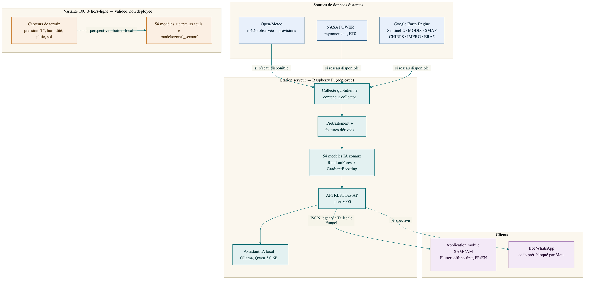
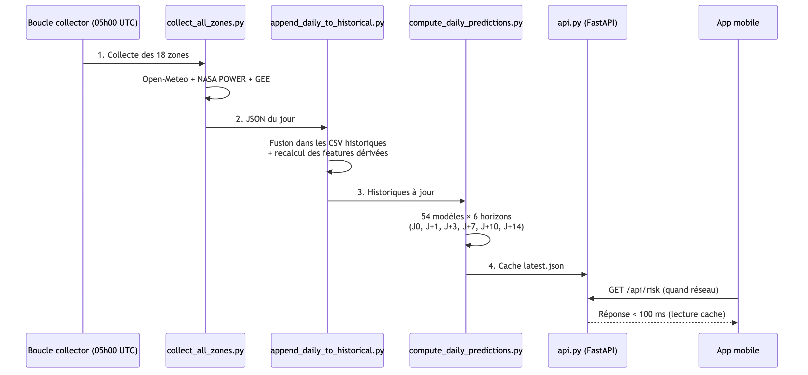
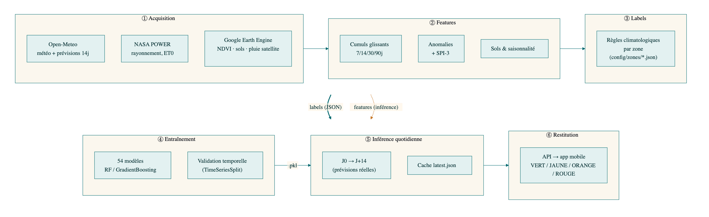
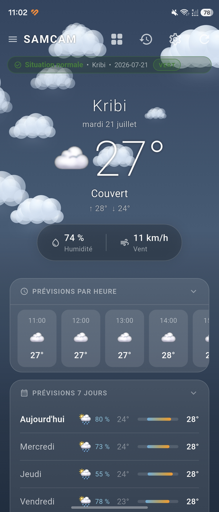
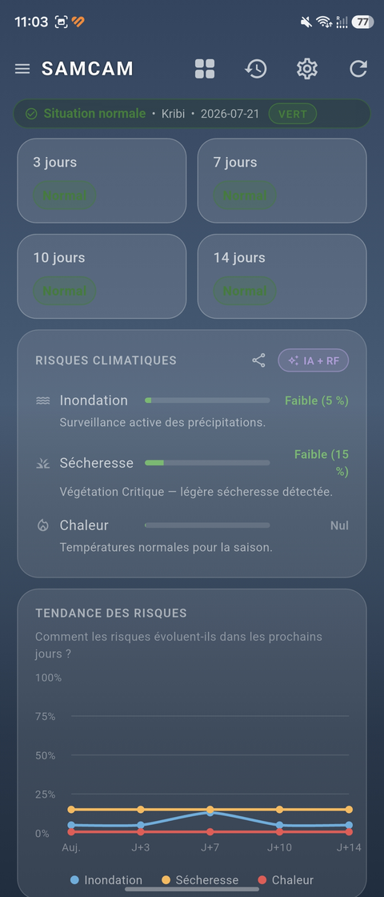
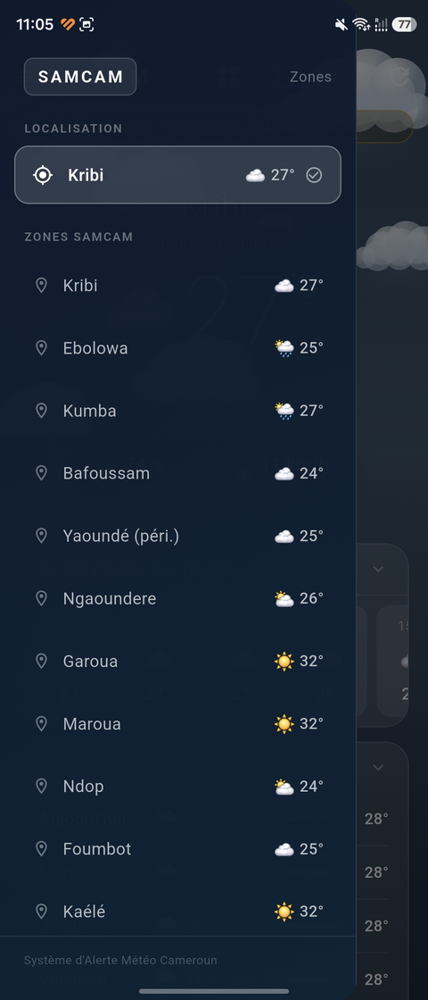
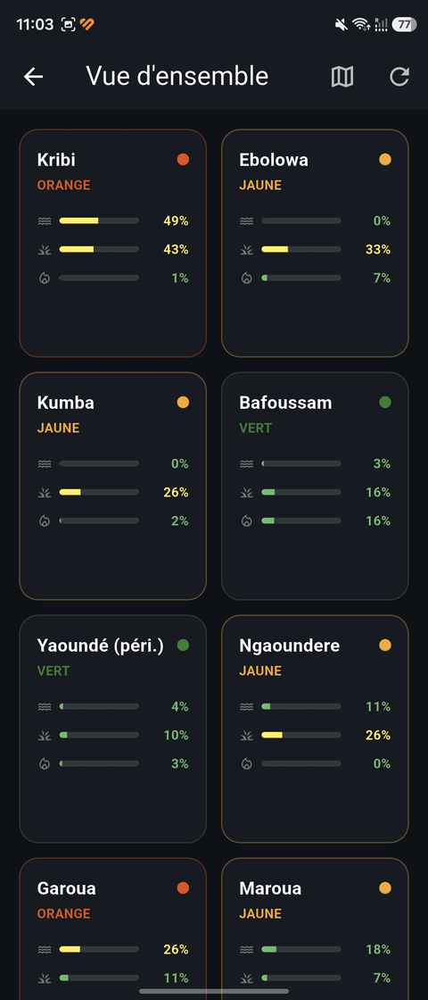
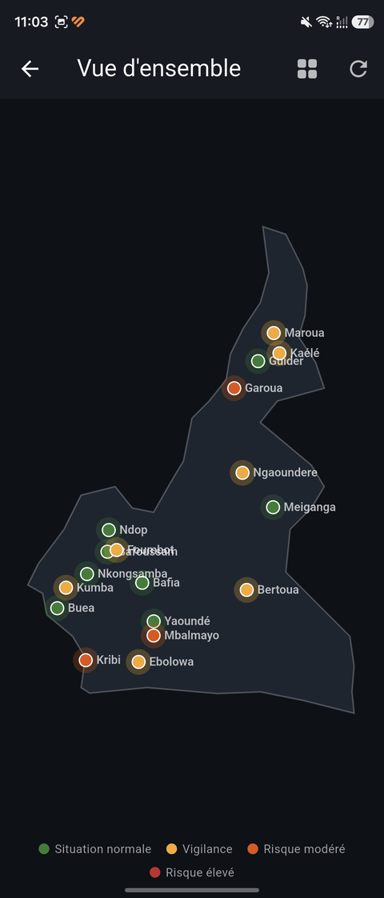
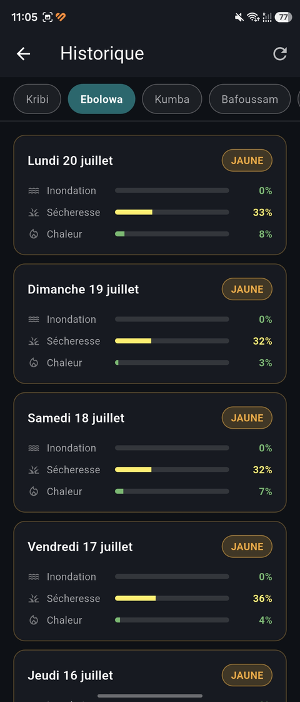
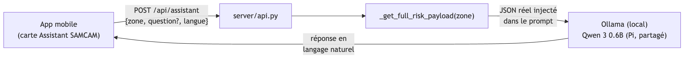

# SAMCAM — Système d'Alerte Météorologique du Cameroun

**Rapport de projet**

| | |
|---|---|
| **Projet** | SAMCAM — Surveillance et Alerte climatique Multi-zones du CAMeroun |
| **Type** | Système d'alerte précoce (inondation, sécheresse, vague de chaleur) |
| **Plateformes** | Serveur embarqué Raspberry Pi · Application mobile Flutter (Android/iOS) |
| **Technologies** | Python, FastAPI, scikit-learn, Flutter/Dart, Google Earth Engine, Ollama |
| **Date** | Juillet 2026 (mis à jour le 20 juillet 2026) |

---

## Table des matières

1. [Introduction](#1-introduction)
2. [Contexte et problématique](#2-contexte-et-problématique)
3. [Présentation du système](#3-présentation-du-système)
4. [Architecture technique du projet](#4-architecture-technique-du-projet)
5. [Conception et implémentation](#5-conception-et-implémentation)
6. [Difficultés rencontrées et solutions apportées](#6-difficultés-rencontrées-et-solutions-apportées)
7. [Résultats et fonctionnalités livrées](#7-résultats-et-fonctionnalités-livrées)
8. [Guide d'utilisation](#8-guide-dutilisation)
9. [Perspectives et évolutions futures](#9-perspectives-et-évolutions-futures)
10. [Conclusion](#10-conclusion)

---

## 1. Introduction

SAMCAM est un prototype de **système d'alerte climatique précoce** conçu pour le Cameroun. Il estime quotidiennement, pour dix-huit zones représentatives du pays, le risque d'**inondation**, de **sécheresse** et de **vague de chaleur**, aujourd'hui et jusqu'à 14 jours à l'avance.

Le système repose sur trois piliers :

1. **Une station serveur autonome** (Raspberry Pi), aujourd'hui déployée et opérationnelle en continu, qui collecte les données et exécute les modèles d'intelligence artificielle ;
2. **Des données météorologiques et satellitaires open source** (Open-Meteo, NASA POWER, Google Earth Engine), avec une variante entièrement hors-ligne (capteurs de terrain) déjà validée sur le plan algorithmique ;
3. **Une application mobile** (Flutter) qui restitue les alertes de façon simple et lisible pour les habitants, agriculteurs et autorités locales, y compris en cas de connectivité limitée, en français ou en anglais.

L'ambition du projet n'est pas de remplacer les services météorologiques nationaux, mais de démontrer qu'un système d'alerte **léger, peu coûteux et déployable localement** peut fournir une information de risque exploitable là où l'accès à l'information climatique fait défaut.

---

## 2. Contexte et problématique

### 2.1 Le contexte climatique camerounais

Le Cameroun est surnommé « l'Afrique en miniature » : il concentre sur son territoire la quasi-totalité des climats du continent, de la forêt équatoriale humide (Kribi, Ebolowa) au Sahel semi-aride (Maroua), en passant par les hauts plateaux de l'Ouest (Bafoussam) et la savane soudanienne (Garoua, Ngaoundéré).

Cette diversité expose le pays à des aléas climatiques variés et récurrents :

- **Inondations** : les crues du Logone et de la Bénoué ont provoqué des catastrophes majeures dans l'Extrême-Nord (2012, 2020, 2022 — plus de 300 000 personnes affectées en 2022 selon OCHA). À l'Ouest, les pluies torrentielles d'octobre 2019 ont causé un éboulement meurtrier à Bafoussam (~43 morts).
- **Sécheresses** : la crise alimentaire sahélienne de 2011-2012 a durement touché l'Extrême-Nord ; l'agriculture pluviale, majoritaire, y est extrêmement vulnérable.
- **Vagues de chaleur** : les canicules sahéliennes (avril 2010, mars-avril 2024 avec des pointes > 45 °C) s'intensifient avec le changement climatique.

### 2.2 La problématique

> **Comment concevoir un système d'alerte climatique léger, peu coûteux et accessible sur smartphone, capable d'exploiter des données météorologiques et satellitaires pour estimer des risques climatiques localisés, tout en restant utilisable dans un contexte de connectivité intermittente et de ressources matérielles limitées ?**

Cette problématique se décompose en plusieurs sous-questions :

| Sous-problème | Contrainte associée |
|---|---|
| Où trouver des données climatiques fiables et gratuites ? | Pas de réseau de stations météo dense au Cameroun |
| Comment produire une prédiction de risque locale ? | Chaque zone a sa propre climatologie (Kribi ≠ Maroua) |
| Où exécuter les calculs ? | Le téléphone des utilisateurs est souvent d'entrée de gamme |
| Comment servir l'information sans connexion permanente ? | Couverture réseau intermittente en zone rurale |
| Comment rendre l'alerte compréhensible ? | Publics variés : agriculteurs, habitants, autorités, francophones et anglophones |

### 2.3 Les dix-huit zones surveillées

Les 8 zones initiales couvraient les grandes villes et leur climat régional. Une deuxième vague de **10 zones agricoles** a été ajoutée pour couvrir des filières et régions non représentées (riziculture, coton, cacao, café, palmier à huile, élevage) — voir §6.5 pour la méthode d'intégration.

**Zones initiales**

| Zone | Région | Climat | Risques dominants |
|---|---|---|---|
| Kribi | Sud (côte) | Équatorial océanique | Inondation, houle |
| Ebolowa | Sud | Équatorial forestier | Inondation |
| Kumba | Sud-Ouest | Équatorial très humide | Inondation |
| Bafoussam | Ouest | Tropical d'altitude | Pluies torrentielles, glissements |
| Yaoundé (périphérie) | Centre | Équatorial à 4 saisons | Inondation urbaine |
| Ngaoundéré | Adamaoua | Soudano-guinéen | Sécheresse, chaleur |
| Garoua | Nord | Soudanien | Inondation (Bénoué), chaleur |
| Maroua | Extrême-Nord | Sahélien | Tous : crues du Logone, sécheresse, canicule |

**Zones agricoles ajoutées**

| Zone | Région | Filière | Climat |
|---|---|---|---|
| Ndop | Nord-Ouest | Riziculture irriguée (plaine du Noun) | Hauts plateaux bimodal |
| Foumbot | Ouest | Maraîchage/maïs (sols volcaniques) | Hauts plateaux bimodal |
| Kaélé | Extrême-Nord | Sorgho/mil pluvial | Sahélien |
| Guider | Nord | Coton, sorgho, arachide | Sahélien |
| Meiganga | Adamaoua | Élevage bovin extensif | Hauts plateaux (transition) |
| Mbalmayo | Centre | Manioc/plantain (bassin vivrier) | Équatorial bimodal |
| Bafia | Centre | Vivrier/arachide | Équatorial bimodal |
| Bertoua | Est | Café robusta/cacao | Équatorial bimodal |
| Nkongsamba | Littoral | Cacao/bananeraie d'exportation | Équatorial bimodal |
| Buea | Sud-Ouest | Palmier à huile/banane | Équatorial bimodal, forte pluviométrie |

---

## 3. Présentation du système

### 3.1 Vue d'ensemble

Le système suit une **architecture centrée sur la station serveur** : le traitement lourd (collecte, IA) est centralisé sur la Raspberry Pi ; l'application mobile ne fait qu'interroger une API REST légère et conserve un cache local pour fonctionner hors-ligne.



### 3.2 Principe de fonctionnement

1. **En continu sur la station** : la Raspberry Pi (nommée *Cameroun*) récupère automatiquement, chaque jour à 05h00 UTC, les données météo observées et prévues ainsi que les données satellitaires, recalcule les risques pour les 18 zones et les 6 horizons (J0, J+1, J+3, J+7, J+10, J+14), et met les résultats à disposition de l'application mobile via son API, publiée sur Internet via Tailscale Funnel (`https://cameroun.tail7296d8.ts.net`).
2. **Côté téléphone** : l'application interroge l'API quand elle a du réseau et met en cache chaque réponse ; hors couverture, elle affiche les dernières données connues avec leur date, sans jamais laisser l'utilisateur devant un écran vide — y compris pour des zones jamais consultées individuellement (voir §6.7).
3. **Perspective validée** : une variante n'utilisant que des capteurs de terrain (sans aucune dépendance réseau) a été testée et donne des résultats quasiment identiques à la version connectée (voir §5.5) — reste une étape matérielle avant un déploiement réel.

Ce découpage répond directement à la contrainte de connectivité : **aucun maillon ne dépend d'une connexion permanente pour rester utile**.

---

## 4. Architecture technique du projet

### 4.1 La station serveur : de la conception au déploiement réel

La station est le cerveau du système. Elle est construite autour d'une **Raspberry Pi** — choisie pour son coût (< 100 €), sa faible consommation et sa capacité suffisante pour exécuter des modèles scikit-learn. Elle est aujourd'hui **effectivement déployée et vérifiée en fonctionnement continu**, à l'adresse publique `https://cameroun.tail7296d8.ts.net`.

**Contrainte de départ** : ce Raspberry Pi (4 Go, en pratique ~2 Go utilisables) héberge **trois projets simultanément**, avec un serveur **Ollama natif partagé** entre eux. L'architecture a donc été conçue pour ne jamais dupliquer Ollama et pour isoler strictement la consommation mémoire des deux seuls services propres à SAMCAM.

```
┌──────────────────────────────────────────────────────────────┐
│                    STATION SAMCAM (Raspberry Pi)              │
│                                                                │
│   ┌──────────────────────────────────────────────────────┐   │
│   │  Ollama (natif, partagé avec 2 autres projets)        │   │
│   │  qwen3:0.6B                                           │   │
│   └───────────────────────┬────────────────────────────────┘   │
│                            │ localhost:11434                   │
│   ┌────────────────────────▼───────────────────────────────┐   │
│   │  Conteneur Docker « api »        (300 Mo max)          │   │
│   │  · API FastAPI :8000                                   │   │
│   │  · assistant IA (appel Ollama)                         │   │
│   ├──────────────────────────────────────────────────────┤   │
│   │  Conteneur Docker « collector »  (250 Mo max)          │   │
│   │  · collecte quotidienne + Google Earth Engine          │   │
│   └──────────────────────────────────────────────────────┘   │
│                            │ WiFi/Ethernet                     │
│                   ┌────────▼─────────┐                        │
│                   │ Tailscale Funnel │──▶ Internet (HTTPS)     │
│                   └──────────────────┘                        │
└──────────────────────────────────────────────────────────────┘
```

- **Docker Engine natif** (pas Docker Desktop) : overhead minimal, adapté à une RAM contrainte.
- **`network_mode: host`** sur le conteneur `api` : lui permet d'appeler Ollama sur `localhost:11434` sans configuration réseau Docker supplémentaire.
- **Volumes montés, pas d'image figée** : le code (`data/`, `models/`, `config/`) est monté depuis le système de fichiers hôte — une mise à jour se fait en resynchronisant les fichiers, pas en reconstruisant systématiquement l'image.
- **Tailscale Funnel** : tunnel HTTPS sortant gratuit, seule option réaliste derrière la 4G camerounaise (CGNAT, pas d'IP publique — voir §8.5).

### 4.2 Architecture logicielle du serveur

Le dépôt est organisé en modules à responsabilité unique :

```
SAMCAM/
├── config/zones/            ← Climatologie de chaque zone (normales, seuils, percentiles)
├── data_collection/         ← Collecte quotidienne (Open-Meteo, NASA POWER, GEE)
│   ├── collect_all_zones.py         (orchestrateur 18 zones)
│   ├── collect_zone.py              (collecteur générique)
│   └── append_daily_to_historical.py (consolidation des historiques)
├── data/
│   ├── historical/          ← 18 CSV historiques (1990/2000 → aujourd'hui)
│   ├── predictions/         ← Cache des prédictions du jour (latest.json)
│   └── community_reports/   ← Signalements terrain des utilisateurs
├── training/                ← Génération des labels + entraînement des modèles
│   ├── build_labels.py              (labels par règles climatologiques + événements réels)
│   ├── generate_zone_config.py      (calibration climatique depuis l'historique réel — §6.5)
│   ├── calibrate_zone_thresholds.py (ré-étalonnage statistique des seuils — §6.5)
│   ├── train_zonal_models.py        (54 modèles ; option --sensor-only, voir §5.5)
│   ├── onboard_new_zones.sh         (pipeline complet d'intégration d'une nouvelle zone)
│   └── evaluate_real_events.py      (validation contre événements réels)
├── inference/               ← Moteur de prédiction
│   ├── infer_zonal.py               (inférence multi-horizon J0 → J+14)
│   └── compute_daily_predictions.py (pré-calcul quotidien → cache)
├── models/
│   ├── zonal/               ← 54 modèles de production (.pkl) + métriques
│   └── zonal_sensor/        ← 54 modèles « capteurs seuls » (.pkl) + métriques
├── server/
│   ├── api.py                       (API REST FastAPI)
│   ├── whatsapp_bot.py              (bot WhatsApp — voir §9.1)
│   └── send_push_alerts.py          (notifications push — voir §9.2)
├── docker/                  ← Images Docker (API + collecteur) pour déploiement Pi
├── docker-compose.yml       ← Orchestration des conteneurs SAMCAM (Ollama reste natif)
├── install_pi.sh            ← Installation automatique sur Raspberry Pi (voir §8.2bis)
├── dashboard/                ← Tableau de bord HTML (écran local)
└── samcam_app/               ← Application mobile Flutter (FR/EN, lib/l10n/)
```

### 4.3 Le cycle quotidien de la station



Le **cache de prédictions** est un choix d'architecture important : l'inférence complète (chargement des historiques + calcul des features glissantes + 54 modèles × 6 horizons) prend plusieurs secondes — inacceptable par requête HTTP sur une Raspberry Pi. En pré-calculant une fois par jour, l'API répond en **moins de 100 ms** quelle que soit la charge.

### 4.4 L'API REST

| Endpoint | Rôle |
|---|---|
| `GET /health` | État du serveur et des modèles |
| `GET /api/zones` | Liste des zones disponibles |
| `GET /api/risk?zone=X` | Bulletin de risque complet d'une zone (J0 → J+14) |
| `GET /api/nearest?lat=&lon=` | Bulletin de la zone la plus proche d'une position GPS |
| `GET /api/overview` | Niveau d'alerte des 18 zones en une requête |
| `GET /api/history?zone=&days=` | Évolution jour par jour des scores (jusqu'à 90 j) |
| `GET /api/meteo?zone=X` | Météo courante et prévisions |
| `POST /api/assistant` | Résumé/question en langage naturel, ancré sur les données réelles (voir §7.1, §9.1) |
| `POST /api/signalement` | Dépôt d'un signalement terrain par un utilisateur |
| `GET /dashboard` | Tableau de bord HTML (écran local) |

### 4.5 Pile technologique

| Couche | Technologies |
|---|---|
| Collecte | Python, requests/httpx, Google Earth Engine API |
| Données | CSV (pandas), JSON |
| ML | scikit-learn (RandomForest, GradientBoosting), TimeSeriesSplit |
| API | FastAPI, uvicorn, pydantic |
| Assistant IA | Ollama — Qwen 3 0.6B sur le Pi (partagé), Phi-3 mini en développement |
| Bot WhatsApp | Meta WhatsApp Business Cloud API, httpx |
| Déploiement Pi | Docker Engine (Linux natif), Docker Compose, Tailscale Funnel |
| Application | Flutter/Dart, fl_chart, geolocator, shared_preferences, flutter_local_notifications, share_plus, flutter_localizations (FR/EN) |
| Écran local | HTML/CSS/JS (servi par FastAPI) |
| Push (préparé) | Firebase Cloud Messaging, firebase-admin |

---

## 5. Conception et implémentation

### 5.1 Schéma complet du flux de données



### 5.2 Les données collectées en détail

| Source | Données | Fréquence | Usage |
|---|---|---|---|
| **Open-Meteo** | Températures, précipitations, humidité, vent, ET0 ; prévisions à 14 jours | Quotidienne | Socle des features + horizons J+1 → J+14 |
| **NASA POWER** | Rayonnement solaire, évapotranspiration de référence | Quotidienne | Stress hydrique (sécheresse) |
| **Sentinel-2** (GEE) | NDVI, NDWI, NDRE (indices de végétation, masquage des nuages) | ~5 jours | État de la végétation (moteur de secours, voir §5.4) |
| **SMAP / ERA5** (GEE) | Humidité des sols sur 3 profondeurs | Quotidienne | Signal clé de la sécheresse |
| **CHIRPS / IMERG** (GEE) | Précipitations estimées par satellite | Quotidienne | Contrôle croisé de la pluie — voir §6.6 pour un bug corrigé sur ce point précis |

Les historiques couvrent **36 ans pour les zones du Nord** (1990-2026) et **26 ans pour les zones du Sud** (2000-2026), soit ~9 500 à 13 200 jours de données par zone.

### 5.3 Pourquoi 54 modèles et pas un seul ?

Un modèle unique « Cameroun » serait dominé par les contrastes entre zones (il pleut 10 fois plus à Kribi qu'à Maroua en janvier) au lieu d'apprendre les anomalies *au sein* de chaque zone. Le choix retenu : **un modèle par zone et par risque** (18 × 3 = 54), chacun entraîné sur l'historique de sa zone avec des labels calibrés sur la climatologie locale.

L'entraînement (`train_zonal_models.py`) :

- essaie **RandomForest** et **GradientBoosting** et retient le meilleur (27/27 sur les 54 modèles de production) ;
- valide en **TimeSeriesSplit** : on ne teste jamais sur le passé de ce qu'on a appris ;
- optimise le **seuil de décision** de chaque modèle (compromis précision/rappel via F1).

Résultats : AUC de validation croisée entre 0,61 et 0,998, **médiane 0,96**. Les plus difficiles restent la sécheresse en zone sahélienne (Maroua : 0,63, Garoua : 0,66), où la saison sèche « normale » ressemble beaucoup à une sécheresse anormale — un défi structurel plutôt qu'un problème d'entraînement (voir §7.2 pour une évaluation contre événements réels).

### 5.4 La prévision multi-horizon (J+1 à J+14)

Pour prédire le risque à J+7, le moteur (`infer_zonal.py`) :

1. prend l'historique réel jusqu'à aujourd'hui ;
2. le **prolonge avec les prévisions météo réelles** d'Open-Meteo ;
3. **recalcule toutes les features glissantes** sur cette série étendue ;
4. pour l'humidité des sols (sans prévision disponible), applique une **extrapolation de tendance** (régression sur les 14 derniers jours) ;
5. applique le modèle de la zone sur la ligne correspondant à la date cible.

### 5.5 Une variante 100 % hors-ligne : les modèles « capteurs seuls »

**Question posée en cours de projet** : le système peut-il fonctionner sans aucune connexion internet, avec un simple boîtier de capteurs de terrain (pression, température, humidité, pluie, sol) ?

**Constat de départ, en relisant le code d'entraînement** : les 54 modèles de production n'utilisaient déjà **pas** le NDVI ni les données CHIRPS/SMAP/ERA5 pour l'apprentissage — uniquement Open-Meteo et NASA POWER (le NDVI n'intervient que dans le moteur de secours à base de règles, `risk_model.py`). Les features réellement utilisées par les modèles ML se recoupent donc fortement avec ce qu'un capteur de terrain peut mesurer.

**Protocole de validation** : un nouveau mode d'entraînement (`train_zonal_models.py --sensor-only`) restreint les features aux seules variables mesurables localement (température, humidité, précipitations, humidité du sol, plus les cumuls glissants qui en dérivent) — en excluant vent, rayonnement solaire, ET0 calculé et tous les champs NASA POWER. Les 54 modèles ont été ré-entraînés dans cette configuration et comparés aux modèles de production.

| | AUC médiane (54 modèles) |
|---|---|
| Production (satellite + NASA) | 0,960 |
| Capteurs seuls | 0,955 |

L'écart est négligeable (delta médian : +0,0006), concentré sur le risque sécheresse (pire cas : Garoua, -0,051), sans impact mesurable sur l'inondation ou la chaleur.

**Conclusion** : un boîtier de terrain entièrement autonome (Raspberry Pi + capteurs + module GSM pour l'alerte SMS, sans connexion data) est réalisable avec une fiabilité quasi identique au système connecté. Les modèles (`models/zonal_sensor/`) sont prêts et versionnés ; il manque le matériel physique et le code d'ingestion embarquée — détaillé en perspective (§9.3).

---

## 6. Difficultés rencontrées et solutions apportées

Le développement a traversé plusieurs difficultés significatives, de la calibration des modèles jusqu'au déploiement matériel. Les plus instructives sont détaillées ici, sous la même forme à chaque fois : symptôme observé → diagnostic → correction.

### 6.1 Des scores de risque aberrants : l'audit des labels

**Symptôme** : certaines zones affichaient des risques quasi permanents (sécheresse Kribi épinglée à 99,9 % sur tous les horizons, inondation Maroua à 100 %… en pleine saison sèche).

**Diagnostic** : les modèles apprenaient des labels générés par règles, et ces règles étaient mal calibrées. Trois bugs distincts ont été identifiés par un audit systématique :

| Bug | Cause | Effet | Correction |
|---|---|---|---|
| **Normales d'ET0 sous-évaluées** (~4 à 5× trop basses) | Valeurs de config jamais confrontées aux données réelles | Le critère « stress ET0 » se déclenchait presque tous les jours | Recalcul des normales depuis les historiques réels |
| **Normales de pluie sous-évaluées** (ex. Kribi juillet : 30 mm configurés vs 224 mm réels) | Idem | Le critère « excès de pluie » sur-déclenchait toute la saison humide | Recalcul depuis les données réelles |
| **Comparaison `>= 0`** | Quand la normale mensuelle de pluie vaut 0, les seuils dérivés valent 0 et `pluie >= 0` est toujours vrai | Label « inondation » à 100 % à Maroua en saison sèche | Remplacement de `>=` par `>` |

**Leçon retenue** : dans un système à base de règles + ML, **la qualité des labels prime sur celle du modèle**. Un AUC élevé ne garantit rien si les labels sont faux.

### 6.2 Un historique figé

**Symptôme** : l'écran « Historique » de l'app affichait la même valeur pour chaque jour passé.

**Cause** : l'endpoint `/api/history` relisait pour chaque jour la valeur *du jour courant* (le cache ne contient qu'une entrée par zone).

**Solution** : exposer la série journalière que le modèle calcule déjà en interne via une fonction dédiée (`infer_zone_risk_series()`), court-circuitant le cache pour les requêtes historiques.

### 6.3 Performance sur Raspberry Pi

**Problème** : l'inférence complète par requête HTTP est trop lente pour le matériel cible.

**Solution** : séparation calcul/restitution — le pipeline quotidien pré-calcule tout, l'API ne fait que lire le cache.

### 6.4 Connectivité intermittente (côté application)

**Problème** : en zone rurale, les téléphones n'ont pas de réseau garanti.

**Solution** : chaque réponse réseau réussie est mise en cache (`SharedPreferences`) ; en cas d'échec, l'app ressort la dernière donnée connue avec un bandeau « Mode hors-ligne ». La carte du Cameroun est dessinée localement, sans tuile réseau.

### 6.5 Intégrer 10 nouvelles zones sans dégrader la fiabilité

**Contexte** : chaque nouvelle zone agricole (§2.3) a sa propre climatologie, inconnue au départ — impossible de dupliquer la configuration d'une zone existante.

**Étape 1 — normales réelles, pas génériques.** `training/generate_zone_config.py` calcule les normales mensuelles directement depuis l'historique météo réellement collecté de chaque nouvelle zone.

**Étape 2 — un premier écueil : seuils trop sensibles.** Même avec des normales réelles, les facteurs de déclenchement restaient génériques : jusqu'à **68 % des jours en alerte chaleur** pour Guider et **32 % en alerte sécheresse** pour Ndop.

**Étape 3 — ré-étalonnage statistique automatique.** `training/calibrate_zone_thresholds.py` recherche par dichotomie le facteur de seuil qui aligne le taux d'alerte sur la moyenne des zones déjà calibrées de la même classe climatique. Résultat : Guider 68 % → 14,7 % (cible 14,8 %), Ndop 32 % → 4,4 % (cible 4,4 %).

**Étape 4 — ancrage sur des événements réels documentés.** Intégration des inondations de l'Extrême-Nord d'août-septembre 2024 (365 000 personnes touchées) et de Buea de mars 2023 comme vérité terrain forcée.

**Résultat** : les 30 nouveaux modèles atteignent des AUC entre 0,73 et 0,998, cohérents avec les 24 modèles initiaux. `training/onboard_new_zones.sh` rend l'ajout d'une future zone mécanique.

### 6.6 Le fallback pluie GPM IMERG cassé : une cause racine de fausses alertes sécheresse

**Symptôme** (remonté en usage réel, une semaine après la mise en production des 18 zones) : la zone de Kribi affichait un score de sécheresse de 0,976 (niveau ROUGE) alors qu'aucun événement réel ne le justifiait.

**Diagnostic** : le système interroge en priorité CHIRPS (précipitations satellite) et, en cas d'indisponibilité (fréquente, latence de quelques jours), retombe automatiquement sur GPM IMERG. Or l'identifiant de collection utilisé pour ce repli, `NASA/GPM_L3/IMERG_V07/DAILY`, **n'existe pas dans le catalogue Google Earth Engine** — ni sa variante V06. Ce fallback échouait donc silencieusement à 100 % du temps depuis son introduction : dès que CHIRPS avait un trou de données, la pluie retombait à une valeur quasi nulle en aval, gonflant artificiellement le score de sécheresse calculé par le modèle.

**Correction** : la collection réelle est `NASA/GPM_L3/IMERG_V07` (demi-horaire, bande `precipitation`, V06 étant dépréciée) ; le code agrège désormais les créneaux de 30 minutes en totaux journaliers avant de reproduire la logique existante. Test en direct sur Earth Engine avant/après :

| | Pluie 30 j calculée pour Kribi |
|---|---|
| Avant (fallback cassé, silencieux) | ~0 mm effectifs |
| Après correction | 128,7 mm (cohérent avec la valeur CHIRPS réelle : 123,6 mm) |

Après relance du pipeline complet sur les 18 zones, le score sécheresse de Kribi est repassé de **0,976 (ROUGE) à 0,427 (ORANGE)**, et l'ensemble des 18 zones a retrouvé une distribution de niveaux d'alerte physiquement plausible (majorité VERT/JAUNE). Ce bug touchait potentiellement toutes les zones, pas seulement Kribi, à chaque trou de couverture CHIRPS.

**Leçon retenue** : un mécanisme de repli (*fallback*) doit être testé pour de vrai, pas seulement codé — un repli qui échoue toujours silencieusement est pire qu'absence de repli, car il masque le problème au lieu de le signaler.

### 6.7 Un trou dans le cache hors-ligne par zone

**Symptôme** (remonté en usage réel, sur site à Kribi) : hors réseau, l'application affichait les données en cache pour la zone consultée (Kribi), mais rien pour les autres zones — alors que la vue d'ensemble, elle, affichait bien les 18 zones.

**Diagnostic** : le cache hors-ligne des bulletins détaillés est indexé par zone (`risk_<zone>`) et n'est rempli que lorsque cette zone précise a été consultée en ligne au moins une fois. La vue d'ensemble, elle, récupère les 18 zones en un seul appel et les met toutes en cache d'un coup — d'où l'incohérence.

**Correction** : ajout d'un repli qui reconstruit un bulletin minimal (niveau de risque actuel, sans prévisions détaillées) à partir du cache de la vue d'ensemble quand le cache dédié à la zone est absent — plutôt que de n'afficher aucune donnée.

### 6.8 Déploiement sur le Raspberry Pi : une connexion trop instable pour `git clone`

**Symptôme** : `git clone` du dépôt (~400 Mo, modèles `.pkl` inclus) échouait systématiquement sur le Pi, y compris en clone superficiel (`--depth 1`), avec une erreur `HTTP/2 stream ... CANCEL`.

**Diagnostic** : le protocole Git en HTTP transfère le paquet d'objets en un flux unique ; s'il est interrompu, la tentative suivante repart intégralement de zéro — sur une connexion qui coupe systématiquement avant la fin du transfert, le clone ne peut jamais aboutir, quelle que soit la taille demandée.

**Correction** : contournement en deux temps —
1. Téléchargement d'une archive tarball via `wget -c` (reprise possible par plage d'octets, contrairement au protocole Git) ;
2. Pour les mises à jour ultérieures, remplacement de `git pull` sur le Pi par un `rsync --partial` déclenché depuis la machine de développement (transfert différentiel sur réseau local, insensible aux mêmes coupures).

**Leçon retenue** : sur une liaison très instable, préférer un protocole avec reprise par plage d'octets (rsync, `wget -c`) à un protocole qui ne peut réussir qu'en un seul passage complet.

### 6.9 Incohérences relevées lors de la mise en service

Plusieurs anomalies mineures, mais bloquantes ou trompeuses, ont été identifiées en testant le déploiement réel :

- **Casse du tag de modèle Ollama** : le modèle installé sur le Pi apparaît comme `qwen3:0.6B` (B majuscule) dans `ollama list`, alors que la configuration attendait `qwen3:0.6b` — l'assistant IA aurait échoué à trouver le modèle. Corrigé en alignant la configuration sur le tag réel, et en rendant la vérification du script d'installation insensible à la casse.
- **Limites mémoire Docker silencieusement ignorées** : le noyau du Pi ne supporte pas les cgroups mémoire montés par défaut, donc les limites fixées (300 Mo/250 Mo) ne sont pas réellement appliquées — signalé pour information, non bloquant à ce stade, corrigible en activant `cgroup_enable=memory` au démarrage si nécessaire.
- **L'assistant IA répondait toujours en français**, y compris quand l'application était réglée en anglais — la langue n'était jamais transmise à l'API. Corrigé en propageant la langue active de l'app jusqu'au prompt système.
- **Qwen 3 génère un bloc de raisonnement complet avant sa réponse** (mode « thinking »), ajoutant environ 20 secondes de calcul pur pour une simple reformulation de bulletin sur le CPU du Pi. Désactivé explicitement (`"think": false`) dans l'appel à Ollama, sans perte de qualité perceptible pour cet usage.
- **La carte « Assistant SAMCAM » perdait son état au défilement** de l'écran (se refermait, relançait une requête à Ollama à chaque réouverture) : le widget vit dans une liste défilante qui détruit par défaut l'état des éléments sortis de l'écran. Corrigé avec `AutomaticKeepAliveClientMixin`. Le fond opaque de cette carte, incohérent avec le style translucide du reste de l'écran, a été aligné au passage.

---

## 7. Résultats et fonctionnalités livrées

### 7.1 L'application mobile SAMCAM

L'application (Flutter, Android/iOS, thème sombre) est la vitrine du système pour l'utilisateur final, conçue autour d'un principe : **une information de risque doit être comprise en moins de cinq secondes**.

**Écran principal**
- Météo courante animée (température, ressenti, humidité, vent) avec fond animé selon le temps ;
- Bandeau d'alerte permanent dès qu'un risque est modéré ou élevé ;
- Tuiles de prévision (3 j / 7 j / 10 j / 14 j), barres de risque du jour avec explication en langage simple, graphique de tendance ;
- Badge de méthode (IA vs règles de secours) ; bouton de signalement.

 

*Écran d'accueil (météo courante, bandeau d'alerte) et section risques climatiques avec tendance sur 14 jours — zone de Kribi.*

**Localisation et zones** : GPS automatique (zone la plus proche via `/api/nearest`), sélecteur des 18 zones + recherche de villes personnalisées (géocodage Nominatim), zone favorite configurable.



*Tiroir latéral de sélection des zones SAMCAM.*

**Vue d'ensemble et carte** : grille des 18 zones en une requête ; carte du Cameroun dessinée localement (fonctionne hors-ligne), marqueurs colorés par niveau d'alerte.

 

*Vue d'ensemble des 18 zones — affichage grille et carte du Cameroun.*

**Historique** : évolution jour par jour des trois risques sur 14 jours, par zone.



*Historique jour par jour des scores de risque (zone d'Ebolowa).*

**Participation communautaire** : signalement terrain (type + description + position GPS), stocké côté serveur comme future vérité terrain pour recalibrer les modèles.

**Alertes et notifications** : seuils personnalisables par risque, notifications locales avec déduplication.

**Robustesse** : bulletin partageable en texte brut (SMS/WhatsApp), mode hors-ligne intégral (§6.4, §6.7).

**Support multilingue** : interface complète (accueil, réglages, vue d'ensemble, historique, signalement, assistant IA) disponible en français et en anglais via le système officiel de localisation Flutter (~130 chaînes traduites), y compris désormais l'assistant IA (§6.9).

**Assistant IA dans l'application** : carte pliable « Assistant SAMCAM » qui reformule en langage naturel le bulletin déjà calculé, ou répond à une question libre — sans jamais calculer de risque elle-même (voir §9.1 pour le détail du principe RAG léger). Testé en conditions réelles sur le Pi : réponse correcte en français en ~30 secondes.

### 7.2 Évaluation de la fiabilité du système

L'AUC de validation croisée (médiane 0,96) mesure la capacité des modèles à **reproduire les labels climatologiques** — pas à détecter de vrais événements. Un protocole d'évaluation contre des **événements documentés** (EM-DAT, OCHA, ReliefWeb) a donc été développé (`training/evaluate_real_events.py`), vérifiant pour chaque événement : détection, préavis, taux de fausse alerte saisonnier, et percentile de l'année dans la distribution historique.

**Résultats sur 10 événements majeurs (1990-2026)**

| Événement | Zone / risque | Détecté | Percentile |
|---|---|---|---|
| Inondations Extrême-Nord 2012 (Logone/Lagdo) | Maroua / inondation | ✅ | 100 % |
| Inondations Nord 2012 (Bénoué) | Garoua / inondation | ✅ | 80 % |
| Inondations Extrême-Nord 2020 | Maroua / inondation | ✅ | 63 % |
| Inondations Extrême-Nord 2022 | Maroua / inondation | ✅ | 86 % |
| Inondations Nord 2022 | Garoua / inondation | ✅ | 80 % |
| Pluies torrentielles Bafoussam oct. 2019 | Bafoussam / inondation | ✅ | 100 % |
| Canicule sahélienne 2024 | Maroua / chaleur | ✅ | 86 % |
| Canicule sahélienne 2024 | Garoua / chaleur | ✅ | 94 % |
| Canicule Sahel avril 2010 | Maroua / chaleur | ✅ | 89 % |
| Sécheresse Sahel 2011-2012 | Maroua / sécheresse | ✅ | 59 % |

**Bilan : 10/10 événements détectés**, souvent dès le premier jour de la fenêtre — mais avec un **taux de fausse alerte saisonnier de 89 %** : à ces périodes de l'année, le seuil est dépassé presque chaque année. Les modèles capturent très bien la **saisonnalité du danger** mais distinguent encore imparfaitement les **années exceptionnelles** des saisons ordinaires. Le percentile moyen de 84 % montre néanmoins que le signal discriminant existe. Cette transparence sur les limites est assumée : un système d'alerte n'est crédible que si ses performances réelles sont mesurées et publiées.

### 7.3 Déploiement effectif sur Raspberry Pi

Contrairement à une simple procédure documentée, le déploiement a été mené à terme et **vérifié en conditions réelles** :

| Vérification | Résultat |
|---|---|
| `GET /health` via l'URL publique | 200 OK, 18 zones, dernière collecte du jour même |
| Collecte quotidienne automatique | Confirmée (toutes les zones à jour sans intervention manuelle) |
| Assistant IA (Qwen 3 0.6B) | Réponse correcte en français, ~30 s, données réelles de la zone |
| Accès public HTTPS | `https://cameroun.tail7296d8.ts.net`, actif en permanence |
| Redémarrage automatique | `restart: unless-stopped` (Docker) + service Docker activé au démarrage système |

Ce résultat clôt la problématique initiale : le système ne dépend plus de la machine de développement, il tourne de façon autonome sur du matériel low-cost.

---

## 8. Guide d'utilisation

Cette section est un guide opérationnel complet : elle permet à une personne n'ayant jamais vu le projet d'installer la station serveur, de déployer l'application mobile et d'exploiter le système au quotidien.

### 8.1 Prérequis

**Matériel**

| Élément | Minimum | Remarque |
|---|---|---|
| Serveur | Raspberry Pi 4 (2 à 4 Go) ou tout PC Linux/macOS | Déploiement réel validé sur Pi 4 2 Go via Docker |
| Stockage | 16 Go | Historiques CSV + modèles ≈ 1 Go |
| Téléphone | Android 8+ | iOS possible (build non signé fourni) |

**Logiciel**

- **Python 3.9 minimum** (3.10+ recommandé) ;
- **Flutter 3.44+** (Dart ≥ 3.12), nécessaire uniquement sur la machine de développement ;
- Un compte Google Cloud avec un **service account Google Earth Engine** (gratuit) — *optionnel : sans lui, la collecte fonctionne en mode dégradé (météo seule)*.

### 8.2 Installation de la station serveur (native)

**Étape 1 — Récupérer le projet et créer l'environnement Python**

```bash
git clone <url-du-depot> SAMCAM && cd SAMCAM

# ⚠️ Nommer le venv exactement « venv » : c'est le seul nom que
# server/start.sh et les schedulers détectent et activent automatiquement.
python3 -m venv venv
source venv/bin/activate
```

> Sur Raspberry Pi OS (Debian bookworm), cette étape est **obligatoire** : `pip install` dans le Python système est bloqué (erreur *externally-managed-environment*, PEP 668).

**Étape 2 — Installer les dépendances**

```bash
pip install -r data_collection/requirements.txt
pip install -r inference/requirements_v4.txt
pip install -r server/requirements.txt
pip install imbalanced-learn   # optionnel : SMOTE au réentraînement
```

**Étape 3 — Configurer la clé Google Earth Engine (optionnel mais recommandé)**

```bash
mkdir -p ~/.config/gee
mv ~/Downloads/<votre-cle>.json ~/.config/gee/kribi-key.json
chmod 600 ~/.config/gee/kribi-key.json
```

**Étape 4 — Première collecte et premières prédictions**

```bash
python3 data_collection/collect_all_zones.py
python3 data_collection/append_daily_to_historical.py
python3 inference/compute_daily_predictions.py
```

**Étape 5 — Lancer le serveur**

```bash
bash server/start.sh          # production (2 workers, port 8000)
bash server/start.sh --dev    # développement (hot-reload)
```

**Étape 6 — Vérifier**

| Test | Commande | Résultat attendu |
|---|---|---|
| Santé | `curl http://localhost:8000/health` | JSON avec version et date de mise à jour |
| Bulletin | `curl "http://localhost:8000/api/risk?zone=Kribi"` | Scores + niveaux J0 → J+14 |
| Doc interactive | `http://localhost:8000/docs` | Interface Swagger |

### 8.2bis Installation Docker sur Raspberry Pi (recommandée, déploiement réel)

Sur un Raspberry Pi à RAM limitée, en particulier hébergeant un **Ollama partagé** avec d'autres projets, l'installation Docker isole strictement la consommation mémoire et ne duplique jamais Ollama. C'est la méthode effectivement utilisée pour le déploiement en production.

```bash
git clone <url-du-depot> SAMCAM && cd SAMCAM
bash install_pi.sh
```

`install_pi.sh` est idempotent (relançable après chaque mise à jour du code) et automatise : swap, Docker Engine, vérification qu'Ollama est joignable, Tailscale + Funnel, build et démarrage des conteneurs `api` et `collector`.

**Sur une connexion internet instable** (situation rencontrée en pratique, §6.8) : préférer un téléchargement resumable (`wget -c <url-archive-tar.gz>`) à `git clone`, et utiliser `rsync --partial` depuis une machine de développement pour les mises à jour plutôt que `git pull`.

Guide complet, budget mémoire détaillé : `docs/DEPLOIEMENT_RASPBERRY_PI.md`.

### 8.3 Automatisation quotidienne

Le conteneur `collector` (ou le planificateur intégré à `start.sh` en installation native) exécute automatiquement la chaîne collecte → historique → prédictions chaque jour à 05h00 UTC. Suivi : `docker compose logs -f collector` (Docker) ou `tail -f logs/collect.log` (native).

### 8.4 Démarrage automatique et redémarrage après coupure

- **Installation Docker** : `restart: unless-stopped` sur les deux conteneurs + service Docker activé au démarrage système — un redémarrage du Pi (coupure de courant, mise à jour) relance le service sans intervention.
- **Installation native** : créer un service `systemd` dédié (`/etc/systemd/system/samcam.service`) pour éviter que le serveur ne meure à la fermeture de la session SSH.

### 8.5 Accès distant : rendre l'API accessible depuis Internet (gratuit)

La solution retenue est **Tailscale Funnel** : gratuite, sans nom de domaine à acheter, fonctionnelle derrière la 4G (CGNAT — pas d'IP publique, la redirection de ports classique est impossible).

```bash
curl -fsSL https://tailscale.com/install.sh | sh
sudo tailscale up --hostname=cameroun
sudo tailscale funnel --bg 8000
```

Une fois cette première connexion établie, la publication redevient automatique à chaque démarrage. **Côté application : aucune configuration** — au premier lancement, l'app teste automatiquement une liste d'adresses connues (`Config.defaultServerCandidates`, l'URL du Pi en tête) et retient la première qui répond. Une URL saisie manuellement dans **Réglages** garde toujours la priorité — à effacer si elle date d'un test antérieur.

### 8.6 Installation de l'application mobile

```bash
cd samcam_app
flutter pub get
flutter build apk --release --split-per-abi   # APK ~17-21 Mo par architecture
adb install -r build/app/outputs/flutter-apk/app-arm64-v8a-release.apk
```

### 8.7 Guide d'utilisation de l'application

1. **Ouvrir l'app** → météo et risques de la zone favorite (ou GPS) se chargent ;
2. **Lire les risques** : trois barres (inondation, sécheresse, chaleur), quatre tuiles de tendance (3j/7j/10j/14j), graphique d'évolution ;
3. **Changer de zone** : menu latéral → 18 zones + recherche de ville ;
4. **Vue nationale** : grille ou carte du Cameroun ;
5. **Historique** : évolution jour par jour sur 14 jours ;
6. **Personnaliser** : Réglages → zone favorite, seuils d'alerte, notifications, **langue** ;
7. **Partager** : bulletin texte complet vers WhatsApp/SMS/e-mail ;
8. **Signaler** : type + description d'un événement observé ;
9. **Interroger l'assistant** : carte « Assistant SAMCAM » → résumé automatique ou question libre ;
10. **Sans réseau** : dernières données connues affichées avec un bandeau « Mode hors-ligne ».

### 8.8 Réentraîner les modèles

```bash
python training/build_labels.py
python training/train_zonal_models.py --force              # modèles de production
python training/train_zonal_models.py --sensor-only --force # variante capteurs (§5.5)
python training/evaluate_real_events.py
python3 inference/compute_daily_predictions.py
```

`--zone <Nom>` limite à une zone, `--risk <risque>` à un risque, `--force` est indispensable pour un vrai réentraînement.

### 8.9 Dépannage

| Symptôme | Cause probable | Remède |
|---|---|---|
| L'app affiche « Erreur serveur » | Mauvaise URL, station éteinte | Réglages → effacer l'URL sauvegardée, laisser la détection auto reprendre |
| API 503 « Aucune donnée pour la zone » | Collecte jamais lancée | `python3 data_collection/collect_all_zones.py --zones <Zone>` |
| Collecte sans données satellite | Clé GEE absente/invalide | Vérifier `~/.config/gee/kribi-key.json` (droits 600) |
| `git clone` échoue sur connexion instable | Protocole Git non-résumable (§6.8) | `wget -c` (archive) puis `rsync --partial` pour les mises à jour |
| Assistant IA introuvable / erreur modèle | Nom de tag Ollama différent (§6.9) | Vérifier `ollama list` et aligner `OLLAMA_MODEL` |
| `pip install` échoue sur Raspberry Pi | PEP 668 (Python système protégé) | Créer et activer le venv |

---

## 9. Perspectives et évolutions futures

### 9.1 Assistant IA — implémenté et déployé

Les 54 modèles de risque restent l'unique source des scores — un modèle de langage **ne calcule jamais un risque**, il reformule. **Principe (RAG léger)** : le serveur calcule le bulletin réel de la zone, l'injecte dans un prompt, et Ollama le reformule en français ou en anglais selon la langue de l'app (§6.9).



Déployé et validé de bout en bout sur la station réelle (§7.3).

### 9.2 Bot WhatsApp (code prêt, bloqué par une vérification anti-fraude Meta)

Le code du bot est écrit et monté dans le serveur (`server/whatsapp_bot.py`) — une façade qui traduit un message WhatsApp en appel aux endpoints existants et renvoie la réponse formatée. Chaque étape a été testée par simulation de webhook.

**Statut réel** : lors de la configuration du compte Meta Business, le compte WhatsApp Business a été **verrouillé par le système anti-fraude de Meta** (erreur 131031) — une procédure de vérification côté Meta, indépendante du code du projet. Dès le déverrouillage, le test réel peut être fait immédiatement, sans redéploiement.

**Ce qui reste à faire — uniquement des étapes côté compte** : créer un compte Meta Business et une app WhatsApp Business, récupérer un numéro et un jeton d'accès, configurer le webhook sur l'URL Tailscale Funnel déjà active. Détail complet dans le dépôt (`server/whatsapp_bot.py`, en-tête du fichier).

### 9.3 Notifications push (préparé)

Complémentaire au bot WhatsApp : de vraies notifications push app fermée (Firebase Cloud Messaging).

- `server/send_push_alerts.py` : publie une alerte par zone dès qu'elle passe ORANGE/ROUGE, avec déduplication — testé en simulation ;
- `docs/NOTIFICATIONS_PUSH_FCM.md` : guide d'installation complet.

### 9.4 Capteurs de terrain — faisabilité validée, matériel restant

La faisabilité algorithmique est désormais **démontrée** (§5.5) : perte de précision négligeable entre modèles connectés et modèles « capteurs seuls ». Reste à réaliser :

1. Matériel : Raspberry Pi + capteurs (pression, température, humidité, pluie, sol) + module GSM (SIM800L/SIM7000) pour l'alerte SMS, sans connexion data ;
2. Code d'ingestion local : lecture des capteurs, stockage de l'historique, calcul des cumuls glissants 7j/30j/90j ;
3. Chargement du modèle `.pkl` sensor-only et inférence embarquée ;
4. Génération de l'alerte (écran local + SMS) ;
5. ~90 jours d'accumulation après le premier démarrage avant que les cumuls longs (30j/90j) soient pleinement fiables.

### 9.5 Domaine et accès public

Une demande de domaine gratuit (`samcam-cameroun.eu.org`) a été soumise et est en attente de validation administrative. Les nameservers Cloudflare sont déjà configurés et validés techniquement ; il ne manque que l'approbation du registrar. À terme, ce domaine pourra remplacer l'URL Tailscale (`*.ts.net`) pour une adresse plus professionnelle.

### 9.6 Autres pistes

- **Miroir cloud pour le passage à l'échelle** : la station pousse quotidiennement son cache de prédictions vers un petit serveur hébergé qui sert le trafic public — la Raspberry Pi n'est plus exposée directement à Internet ;
- **Alertes proactives par WhatsApp** : diffusion automatique aux numéros abonnés d'une zone en alerte, en attente du déverrouillage du compte Meta (§9.2) ;
- **Langues locales** : au-delà du français/anglais déjà disponibles, le prompt de l'assistant IA pourrait être adapté au fulfulde ou au pidgin ;
- **Ré-entraînement continu** : intégrer les signalements validés comme labels, avec ré-entraînement périodique automatisé ;
- **Publication Play Store** : changer l'identifiant d'application, signer la version release (le build APK release est déjà fonctionnel) ;
- **Architecture multi-serveurs** : si plusieurs stations régionales sont déployées à terme, le bot WhatsApp (un numéro = un webhook chez Meta) devra être centralisé sur un serveur « hub » agrégeant les données de toutes les zones.

---

## 10. Conclusion

SAMCAM démontre qu'avec des **données ouvertes** (météo et satellite), du **matériel modeste** (une Raspberry Pi à 2 Go de RAM, partagée entre plusieurs projets) et des **modèles d'apprentissage classiques** bien calibrés, il est possible de construire un système d'alerte climatique multirisque, multizone et multi-horizon, **effectivement déployé et fonctionnel de bout en bout** :

- **18 zones** couvrant tous les climats du Cameroun, des grandes villes aux filières agricoles (riz, coton, cacao, café, palmier, élevage) ;
- **3 risques** (inondation, sécheresse, chaleur) × **6 horizons** (aujourd'hui → J+14) ;
- **54 modèles IA** entraînés sur 20 à 36 ans d'historique, validés contre 10 catastrophes réelles documentées (10/10 détectées, §7.2), et **54 modèles supplémentaires** validant une variante 100 % hors-ligne à capteurs de terrain (§5.5) ;
- **Un déploiement réel et vérifié** sur Raspberry Pi 4 à 2 Go de RAM, accessible publiquement en HTTPS, avec collecte quotidienne autonome et assistant IA local ;
- **Une interface bilingue** (français/anglais) sur toute la chaîne, y compris l'assistant IA ;
- **Une méthodologie de débogage rigoureuse** ayant permis d'identifier et corriger des bugs de fond (fallback météo cassé, trous de cache, incohérences de déploiement) directement responsables de fausses alertes ou de blocages, documentée en détail (§6) plutôt que dissimulée.

Le projet assume ses limites — la difficulté à distinguer l'année exceptionnelle de la saison ordinaire, un bot WhatsApp bloqué par une procédure de vérification externe, un boîtier capteurs validé mais pas encore construit — et embarque les outils pour les dépasser : évaluation contre événements réels, signalements communautaires comme future vérité terrain, et une méthode de calibration reproductible pour toute future zone ou tout futur capteur.

Au-delà de la technique, SAMCAM illustre une conviction : **l'information climatique doit aller vers les populations, dans leur langue et sur leurs canaux, avec ou sans connexion internet** — et non l'inverse.

---

## Annexes

### A. Métriques des modèles (validation croisée temporelle)

**Modèles de production (satellite + NASA), zones initiales**

| Zone | Inondation (AUC) | Sécheresse (AUC) | Chaleur (AUC) |
|---|---|---|---|
| Kribi | 0,94 | 0,94 | 0,61 |
| Ebolowa | 0,96 | 0,89 | 0,94 |
| Kumba | 0,81 | 0,91 | 0,97 |
| Bafoussam | 0,84 | 0,72 | 0,98 |
| Yaoundé (péri.) | 0,92 | 0,90 | 0,91 |
| Ngaoundéré | 0,93 | 0,84 | 0,98 |
| Garoua | 0,81 | 0,66 | 0,84 |
| Maroua | 0,99 | 0,63 | 0,96 |

**Modèles de production, zones agricoles ajoutées** (voir §6.5 pour la méthode de calibration)

| Zone | Inondation (AUC) | Sécheresse (AUC) | Chaleur (AUC) |
|---|---|---|---|
| Ndop | 0,99 | 0,73 | 0,95 |
| Foumbot | 0,99 | 0,93 | 0,96 |
| Kaélé | 0,99 | 0,94 | 0,99 |
| Guider | 0,99 | 0,98 | 0,99 |
| Meiganga | 0,99 | 0,96 | 0,96 |
| Mbalmayo | 0,99 | 0,96 | 0,98 |
| Bafia | 0,99 | 0,97 | 0,99 |
| Bertoua | 0,99 | 0,96 | 0,99 |
| Nkongsamba | 0,99 | 0,96 | 0,99 |
| Buea | 0,98 | 0,96 | 0,99 |

**Modèles « capteurs seuls »** (voir §5.5) : AUC médiane 0,955 sur les 54 modèles, contre 0,960 pour les modèles de production — écart négligeable, détail complet dans `models/zonal_sensor/metrics/*.json`.

*Algorithme retenu par sélection automatique (RandomForest ou GradientBoosting, le meilleur des deux sur validation croisée).*

### B. Reproduire le pipeline

```bash
# 1. Collecte du jour (18 zones)
python data_collection/collect_all_zones.py

# 2. Consolidation des historiques
python data_collection/append_daily_to_historical.py

# 3. (Ré)entraînement des 54 modèles de production
python training/build_labels.py && python training/train_zonal_models.py --force

# 3bis. (Ré)entraînement de la variante capteurs seuls
python training/train_zonal_models.py --sensor-only --force

# 4. Pré-calcul des prédictions
python inference/compute_daily_predictions.py

# 5. Évaluation contre les événements réels
python training/evaluate_real_events.py

# 6. Serveur API + dashboard
uvicorn server.api:app --host 0.0.0.0 --port 8000
```
