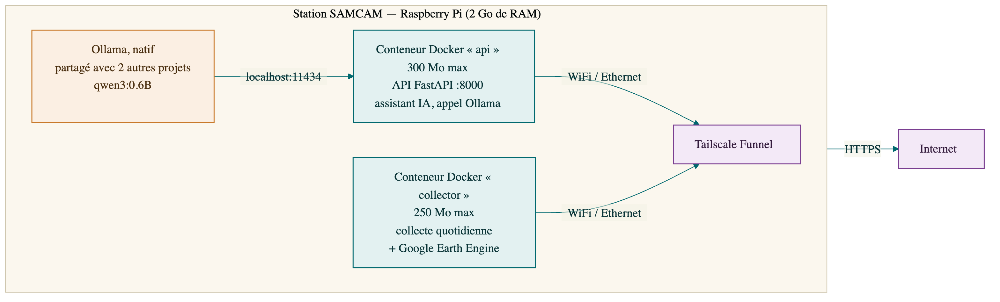
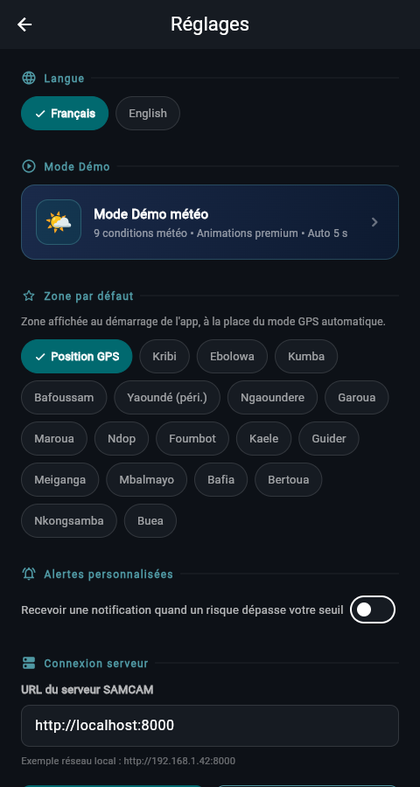
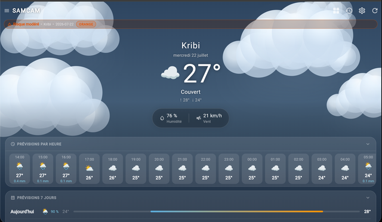
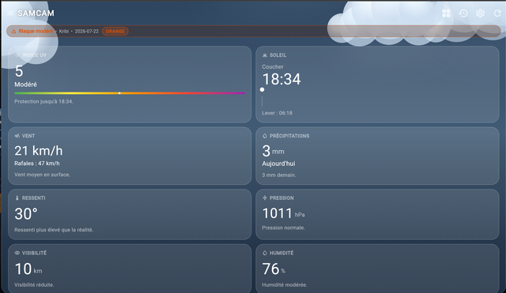
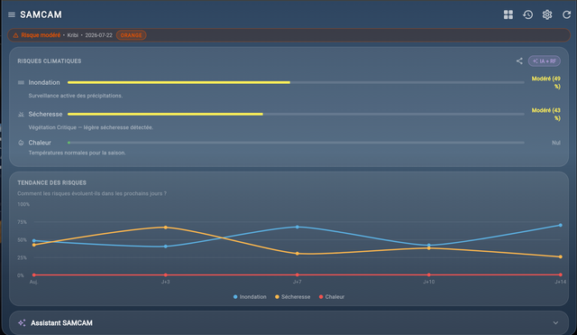
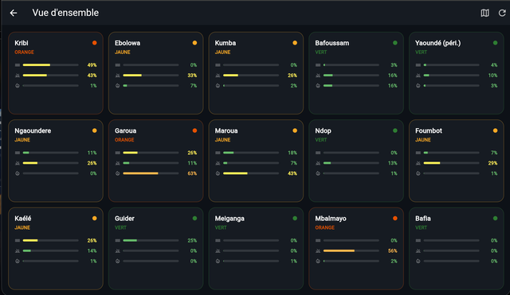
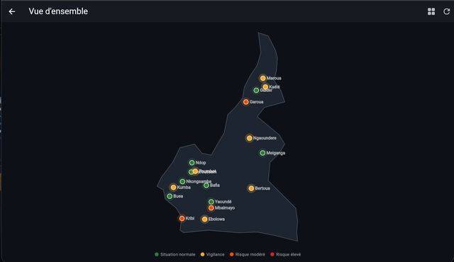
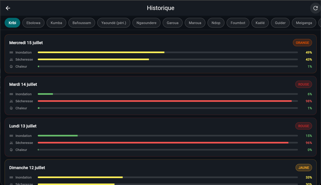
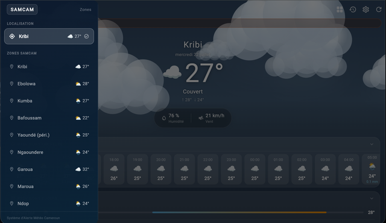
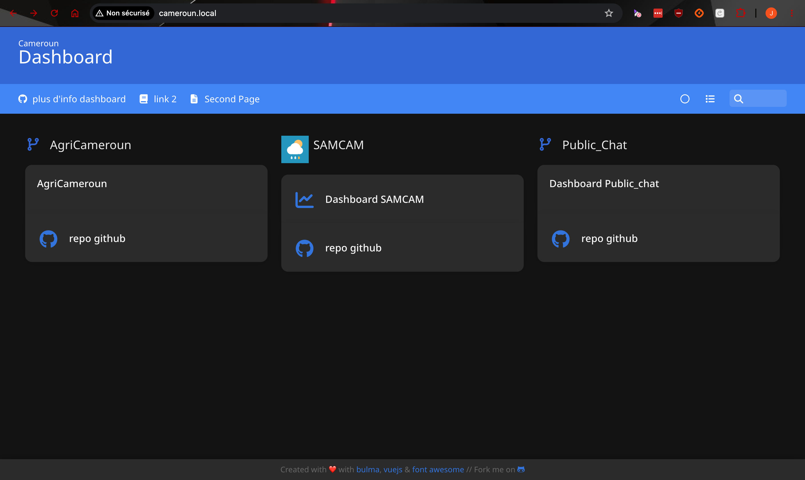

<div class="cover">

<p>&nbsp;&nbsp;&nbsp;&nbsp;&nbsp;&nbsp;&nbsp;&nbsp;</p>

<h1>SAMCAM</h1>
<h3>Système d'Alerte Météorologique du Cameroun</h3>

<p>Plateforme d'intelligence artificielle pour la prédiction des risques climatiques<br>
(inondation, sécheresse, vague de chaleur)</p>

<p style="margin-top:40px;"><strong>Rapport de stage technicien FISEA</strong><br>
Stage effectué du 8 juin 2026 au 7 août 2026</p>

<p style="margin-top:40px;">
<strong>Jérémy GEORGES-DURAND</strong><br>
3ᵉ année du cycle ingénieur — filière FISEA<br>
École Nationale d'Ingénieurs de Brest (ENIB) — Bretagne INP
</p>

<p style="margin-top:30px;">
Structure d'accueil : <strong>IUT de Ngaoundéré</strong>, Cameroun<br>
Lieu du stage : <strong>Ocean Innovation Center (OIC)</strong>, Kribi, Cameroun
</p>

<p style="margin-top:30px;">
Tuteur de stage : <strong>Arouna NDAM NJOYA</strong>, Expert IA<br>
Second tuteur : <strong>Jacques BONJAWO</strong>, Directeur de l'OIC<br>
Tuteur académique (ENIB) : <strong>Jean-Matthieu BOURGEOT</strong>
</p>

<p style="margin-top:40px;">Année académique 2025/2026</p>

</div>

---

## Table des matières

1. [Présentation du stage](#1-presentation-du-stage)

2. [Résumé](#2-resume)

3. [Introduction](#3-introduction)

    - [3.1 Contexte et Problématique](#31-contexte-et-problematique)
    - [3.2 Revue des solutions existantes](#32-revue-des-solutions-existantes)
    - [3.3 Limites des solutions existantes](#33-limites-des-solutions-existantes)
    - [3.4 Contributions](#34-contributions)
    - [3.5 Organisation du rapport](#35-organisation-du-rapport)

4. [Présentation du système](#4-presentation-du-systeme)

5. [Architecture technique du projet](#5-architecture-technique-du-projet)
6. [Conception et implémentation](#6-conception-et-implementation)
7. [Difficultés rencontrées et solutions apportées](#7-difficultes-rencontrees-et-solutions-apportees)
8. [Résultats et fonctionnalités livrées](#8-resultats-et-fonctionnalites-livrees)
9. [Guide d'utilisation](#9-guide-dutilisation)
10. [Perspectives et évolutions futures](#10-perspectives-et-evolutions-futures)
11. [Conclusion](#11-conclusion)
12. [Références](#references)
13. [Annexes](#annexes)

---

## 1. Présentation du stage

### 1.1 Cadre du stage

Ce rapport présente le travail réalisé dans le cadre d'un **stage technicien FISEA** de 9 semaines (44 jours de présence effective, du 8 juin au 7 août 2026), effectué au cours de la 3ᵉ année du cycle ingénieur de l'**École Nationale d'Ingénieurs de Brest (ENIB — Bretagne INP)**, dans le cadre d'une mobilité internationale.

L'organisme d'accueil officiel est l'**IUT de Ngaoundéré** (Cameroun). Le stage s'est déroulé physiquement à l'**Ocean Innovation Center (OIC)**, à Kribi, sur la côte sud du pays.

### 1.2 L'organisme d'accueil : IUT de Ngaoundéré et Ocean Innovation Center

L'**IUT de Ngaoundéré**, composante de l'Université de Ngaoundéré, est l'établissement camerounais partenaire ayant conventionné avec l'ENIB pour l'accueil du stage.

Le stage s'est déroulé à l'**Ocean Innovation Center (OIC)**, un technopôle privé fondé en 2017 par Jacques Bonjawo (ancien cadre de Microsoft) à Kribi, ville côtière qui héberge les points d'atterrissage de câbles sous-marins de fibre optique reliant le Cameroun au reste du monde. L'OIC a pour mission de favoriser l'accès à la formation numérique et de faire émerger des compétences et des projets technologiques locaux, avec un accès à une connexion très haut débit.

### 1.3 Objectifs et missions du stage

**Intitulé du stage** : concevoir un système intelligent capable de détecter et prédire les risques climatiques.

**Activités confiées** :
- Collecter et traiter des données climatiques ;
- Développer des modèles d'intelligence artificielle de prédiction des risques climatiques.

**Compétences visées** : maîtrise de l'analyse de données climatiques et du machine learning, développement de système embarqué, intégration de capteurs, débogage et documentation technique — le tout dans un contexte de ressources matérielles contraintes et de connectivité limitée, représentatif des conditions réelles d'exploitation du système visé.

Le projet réalisé au cours de ce stage, **SAMCAM**, répond directement à cette commande : il constitue l'objet de l'ensemble de ce rapport, à partir du chapitre 3.

### 1.4 Encadrement

| Rôle | Nom | Fonction |
|---|---|---|
| Tuteur de stage (OIC) | Arouna NDAM NJOYA | Expert IA |
| Second tuteur (OIC) | Jacques BONJAWO | Directeur de l'Ocean Innovation Center |
| Tuteur académique (ENIB) | Jean-Matthieu BOURGEOT | Tuteur académique (stages et contrats professionnels) |

---

## 2. Résumé

Le Cameroun, exposé à des inondations, des sécheresses et des vagues de chaleur récurrentes, ne dispose pas d'un réseau dense de stations météorologiques ni d'un système d'alerte climatique local, peu coûteux et accessible sur smartphone. **SAMCAM** (Système d'Alerte Météorologique du Cameroun) répond à ce besoin : un prototype de système d'alerte précoce qui estime quotidiennement, pour **18 zones** représentatives du pays (villes et filières agricoles), le risque d'**inondation**, de **sécheresse** et de **vague de chaleur**, aujourd'hui et jusqu'à 14 jours à l'avance.

Le système combine des **données ouvertes** (Open-Meteo, NASA POWER, Google Earth Engine) et **54 modèles d'apprentissage automatique** (un par zone et par risque, RandomForest/GradientBoosting), entraînés sur 20 à 36 ans d'historique climatique et validés contre 10 catastrophes réelles documentées (10/10 détectées). L'ensemble tourne en continu sur une **Raspberry Pi** à faible coût, exposée publiquement en HTTPS via Tailscale Funnel, et restitué par une **application mobile Flutter** bilingue (français/anglais), conçue pour fonctionner même en cas de connectivité intermittente grâce à un cache local systématique.

Une contribution notable de ce travail est le **test préliminaire d'une variante 100 % hors-ligne**, encore en cours : un jeu de 54 modèles supplémentaires, restreints aux seules variables mesurables par des capteurs de terrain low-cost (température, humidité, précipitations, humidité du sol), atteint sur données historiques une fiabilité quasi identique aux modèles connectés (AUC médiane 0,955 contre 0,960) — un résultat encourageant qui ouvrirait la voie à un boîtier d'alerte sans dépendance réseau, sous réserve d'une validation sur du matériel de terrain réel.

Le système est **effectivement déployé et vérifié en fonctionnement continu**, et non simplement documenté comme une preuve de concept. Le rapport détaille également la méthodologie de débogage ayant permis d'identifier et de corriger plusieurs bugs de fond (labels mal calibrés, fallback satellite cassé, incohérences de déploiement) directement responsables de fausses alertes, ainsi que les limites assumées du système et les pistes d'évolution (bot WhatsApp, notifications push, capteurs de terrain, extension géographique).

---

## 3. Introduction

SAMCAM est un prototype de **système d'alerte climatique précoce** conçu pour le Cameroun. Il estime quotidiennement, pour dix-huit zones représentatives du pays, le risque d'**inondation**, de **sécheresse** et de **vague de chaleur**, aujourd'hui et jusqu'à 14 jours à l'avance.

Le système repose sur trois piliers :

1. **Une station serveur autonome** (Raspberry Pi), aujourd'hui déployée et opérationnelle en continu, qui collecte les données et exécute les modèles d'intelligence artificielle ;
2. **Des données météorologiques et satellitaires open source** (Open-Meteo, NASA POWER, Google Earth Engine), avec une variante entièrement hors-ligne (capteurs de terrain) actuellement en cours de test sur le plan algorithmique ;
3. **Une application mobile** (Flutter) qui restitue les alertes de façon simple et lisible pour les habitants, agriculteurs et autorités locales, y compris en cas de connectivité limitée, en français ou en anglais.

L'ambition du projet n'est pas de remplacer les services météorologiques nationaux, mais de démontrer qu'un système d'alerte **léger, peu coûteux et déployable localement** peut fournir une information de risque exploitable là où l'accès à l'information climatique fait défaut.

### 3.1 Contexte et Problématique

**Le contexte climatique camerounais**

Le Cameroun est surnommé « l'Afrique en miniature » : il concentre sur son territoire la quasi-totalité des climats du continent, de la forêt équatoriale humide (Kribi, Ebolowa) au Sahel semi-aride (Maroua), en passant par les hauts plateaux de l'Ouest (Bafoussam) et la savane soudanienne (Garoua, Ngaoundéré).

Cette diversité expose le pays à des aléas climatiques variés et récurrents :

- **Inondations** : les crues du Logone et de la Bénoué ont provoqué des catastrophes majeures dans l'Extrême-Nord (2012, 2020, 2022 — plus de 300 000 personnes affectées en 2022 selon OCHA). À l'Ouest, les pluies torrentielles d'octobre 2019 ont causé un éboulement meurtrier à Bafoussam (~43 morts).
- **Sécheresses** : la crise alimentaire sahélienne de 2011-2012 a durement touché l'Extrême-Nord ; l'agriculture pluviale, majoritaire, y est extrêmement vulnérable.
- **Vagues de chaleur** : les canicules sahéliennes (avril 2010, mars-avril 2024 avec des pointes > 45 °C) s'intensifient avec le changement climatique.

**La problématique**

> **Comment concevoir un système d'alerte climatique léger, peu coûteux et accessible sur smartphone, capable d'exploiter des données météorologiques et satellitaires pour estimer des risques climatiques localisés, tout en restant utilisable dans un contexte de connectivité intermittente et de ressources matérielles limitées ?**

Cette problématique se décompose en plusieurs sous-questions :

| Sous-problème | Contrainte associée |
|---|---|
| Où trouver des données climatiques fiables et gratuites ? | Pas de réseau de stations météo dense au Cameroun |
| Comment produire une prédiction de risque locale ? | Chaque zone a sa propre climatologie (Kribi ≠ Maroua) |
| Où exécuter les calculs ? | Le téléphone des utilisateurs est souvent d'entrée de gamme |
| Comment servir l'information sans connexion permanente ? | Couverture réseau intermittente en zone rurale |
| Comment rendre l'alerte compréhensible ? | Publics variés : agriculteurs, habitants, autorités, francophones et anglophones |

### 3.2 Revue des solutions existantes

Plusieurs initiatives, internationales ou nationales, adressent déjà tout ou partie de l'alerte climatique en Afrique :

- **FEWS NET** (Famine Early Warning Systems Network, USAID) : créé après les famines de 1984 en Afrique de l'Est et de l'Ouest, il fournit des analyses prospectives sur l'insécurité alimentaire, dont la sécheresse est un facteur central, à l'échelle régionale.
- **Google Flood Hub** : combine deux modèles d'IA exploitant prévisions météo et imagerie satellite pour prédire les crues fluviales ; disponible dans plus de 80 pays, dont le Cameroun, mais limité au risque d'inondation le long des grands bassins versants.
- **CREWS** (Climate Risk and Early Warning Systems) : initiative multilatérale lancée en 2015 (COP21) visant à renforcer les capacités nationales de systèmes d'alerte multirisques dans les pays les moins avancés.
- **La Direction de la Météorologie Nationale du Cameroun**, appuyée par des projets comme **SEWA** (Strengthening Early Warning in Africa), qui vise à améliorer les services météorologiques nationaux grâce aux technologies satellitaires.
- Les produits satellitaires ouverts eux-mêmes (**CHIRPS**, **CHIRPS/IMERG**, **Sentinel-2**, **SMAP**), qui alimentent la plupart de ces systèmes et sont directement réutilisés par SAMCAM (voir §6.2).

### 3.3 Limites des solutions existantes

Ces solutions, bien qu'utiles, laissent un espace que SAMCAM cherche à occuper :

- **Granularité** : les systèmes nationaux et FEWS NET raisonnent à l'échelle régionale ou nationale, pas à l'échelle d'une commune ou d'une filière agricole précise ;
- **Portée limitée à un seul risque** : Google Flood Hub ne couvre que l'inondation fluviale — ni la sécheresse, ni la chaleur, ni les zones sans bassin versant surveillé ;
- **Dépendance à une infrastructure lourde** : les services météorologiques nationaux s'appuient historiquement sur des réseaux de stations au sol, rares et coûteux à entretenir au Cameroun ;
- **Restitution peu adaptée au dernier kilomètre** : ces systèmes publient des bulletins, cartes ou API techniques, rarement une application mobile grand public, bilingue, utilisable hors connexion et compréhensible en quelques secondes par un agriculteur ou un habitant ;
- **Coût et autonomie de déploiement** : aucune de ces solutions ne propose une brique déployable localement, à bas coût, sur un matériel aussi modeste qu'une Raspberry Pi, avec une variante fonctionnant sans connexion réseau du tout.

### 3.4 Contributions

Ce travail se décompose en six modules largement indépendants, chacun apportant une contribution concrète :

| Module | Contribution |
|---|---|
| **Modélisation ML** | 54 modèles d'apprentissage automatique spécifiques à 18 zones camerounaises (villes et filières agricoles), couvrant 3 risques et 6 horizons de prévision, validés contre 10 événements climatiques réels documentés (10/10 détectés) |
| **Variante hors-ligne** *(en test)* | Premier test statistique, mesure à l'appui, montrant qu'un jeu de modèles restreint aux seules données de capteurs de terrain low-cost pourrait atteindre une fiabilité proche de la version connectée aux données satellitaires — validation encore préliminaire, sans matériel de terrain ni données réelles de capteurs |
| **Station serveur** | Système effectivement déployé — et non une simple maquette — sur un matériel bas coût (Raspberry Pi 2 Go de RAM, partagée avec deux autres projets), accessible publiquement, avec collecte quotidienne autonome et redémarrage automatique |
| **Application mobile** | Application bilingue (français/anglais) conçue pour le contexte réel d'usage : connectivité intermittente, téléphones d'entrée de gamme, publics variés |
| **Calibration des zones** | Méthodologie reproductible (`training/onboard_new_zones.sh`) permettant d'intégrer une nouvelle zone climatique sans reprise manuelle des seuils |
| **Transparence et évaluation** | Documentation publiée des limites réelles du système (taux de fausse alerte saisonnier, bugs identifiés et corrigés) plutôt que dissimulée, et protocole d'évaluation contre des événements réels documentés |

### 3.5 Organisation du rapport

Le reste de ce rapport est organisé comme suit. Le **chapitre 4** présente une vue d'ensemble du système et des 18 zones surveillées. Le **chapitre 5** détaille l'architecture technique de la station serveur et de sa pile logicielle. Le **chapitre 6** décrit la conception et l'implémentation du pipeline de données et des modèles de machine learning. Le **chapitre 7** revient sur les principales difficultés rencontrées et sur la façon dont elles ont été diagnostiquées puis corrigées. Le **chapitre 8** présente les résultats obtenus et les fonctionnalités livrées, y compris l'évaluation contre des événements réels. Le **chapitre 9** constitue un guide d'utilisation opérationnel, de l'installation au dépannage. Le **chapitre 10** discute des perspectives et évolutions futures, et le **chapitre 11** conclut le rapport. Les références et annexes techniques (métriques complètes, procédure de reproduction du pipeline) figurent en fin de document.

---

## 4. Présentation du système

Dans son principe, SAMCAM se résume à une idée simple : une **station météo reliée à une Raspberry Pi**, qui fait office de serveur et embarque un **assistant IA (LLM) exécuté localement**. Cette station complète ses propres mesures par des données récupérées sur Internet (prévisions météo, imagerie satellite), calcule un niveau de risque, et le restitue à l'utilisateur par deux canaux au choix : un **écran local** branché directement sur le serveur (tableau de bord), ou une **application mobile** qui interroge le serveur à distance.


Ce principe répond directement à la problématique posée en introduction (§3.1) : en centralisant le calcul sur une machine peu coûteuse et en ne rendant aucun maillon dépendant d'une connexion permanente, le système reste utile aussi bien en zone bien connectée qu'en zone rurale à connectivité intermittente. Le chapitre suivant (§5) détaille concrètement comment ce principe a été implémenté pour SAMCAM : le choix du matériel, le cycle de collecte quotidien, les 18 zones couvertes, et l'ensemble de la pile logicielle.

---

## 5. Architecture technique du projet

### 5.1 Vue d'ensemble et principe de fonctionnement

Le système suit une **architecture centrée sur la station serveur** : le traitement lourd (collecte, IA) est centralisé sur la Raspberry Pi ; l'application mobile ne fait qu'interroger une API REST légère et conserve un cache local pour fonctionner hors-ligne.

1. **En continu sur la station** : la Raspberry Pi (nommée *Cameroun*) récupère automatiquement, chaque jour à 05h00 UTC, les données météo observées et prévues ainsi que les données satellitaires, recalcule les risques pour les 18 zones et les 6 horizons (J0, J+1, J+3, J+7, J+10, J+14), et met les résultats à disposition de l'application mobile via son API, publiée sur Internet via Tailscale Funnel (`https://cameroun.tail5aeee0.ts.net`).
2. **Côté téléphone** : l'application interroge l'API quand elle a du réseau et met en cache chaque réponse ; hors couverture, elle affiche les dernières données connues avec leur date, sans jamais laisser l'utilisateur devant un écran vide — y compris pour des zones jamais consultées individuellement (voir §7.7).
3. **Perspective en test** : une variante n'utilisant que des capteurs de terrain (sans aucune dépendance réseau) a été testée sur données historiques et donne des résultats statistiquement proches de la version connectée (voir §6.5) — reste une validation matérielle réelle avant tout déploiement.

Ce découpage répond directement à la contrainte de connectivité : **aucun maillon ne dépend d'une connexion permanente pour rester utile**.

### 5.2 Les dix-huit zones surveillées

Les 8 zones initiales couvraient les grandes villes et leur climat régional. Une deuxième vague de **10 zones agricoles** a été ajoutée pour couvrir des filières et régions non représentées (riziculture, coton, cacao, café, palmier à huile, élevage) — voir §7.5 pour la méthode d'intégration.

**Zones initiales**

| Zone | Région | Climat | Risques dominants |
|---|---|---|---|
| Kribi | Sud (côte) | Équatorial océanique | Inondation, houle |
| Ebolowa | Sud | Équatorial forestier | Inondation |
| Kumba | Sud-Ouest | Équatorial très humide | Inondation |
| Bafoussam | Ouest | Tropical d'altitude | Pluies torrentielles, glissements |
| Yaoundé (périphérie) | Centre | Équatorial à 4 saisons | Inondation urbaine |
| Ngaoundéré | Adamaoua | Soudano-guinéen | Sécheresse, chaleur |
| Garoua | Nord | Soudanien | Inondation (Bénoué), chaleur |
| Maroua | Extrême-Nord | Sahélien | Tous : crues du Logone, sécheresse, canicule |

**Zones agricoles ajoutées**

| Zone | Région | Filière | Climat |
|---|---|---|---|
| Ndop | Nord-Ouest | Riziculture irriguée (plaine du Noun) | Hauts plateaux bimodal |
| Foumbot | Ouest | Maraîchage/maïs (sols volcaniques) | Hauts plateaux bimodal |
| Kaélé | Extrême-Nord | Sorgho/mil pluvial | Sahélien |
| Guider | Nord | Coton, sorgho, arachide | Sahélien |
| Meiganga | Adamaoua | Élevage bovin extensif | Hauts plateaux (transition) |
| Mbalmayo | Centre | Manioc/plantain (bassin vivrier) | Équatorial bimodal |
| Bafia | Centre | Vivrier/arachide | Équatorial bimodal |
| Bertoua | Est | Café robusta/cacao | Équatorial bimodal |
| Nkongsamba | Littoral | Cacao/bananeraie d'exportation | Équatorial bimodal |
| Buea | Sud-Ouest | Palmier à huile/banane | Équatorial bimodal, forte pluviométrie |

### 5.3 La station serveur : de la conception au déploiement réel

La station est le cerveau du système. Elle est construite autour d'une **Raspberry Pi** — choisie pour son coût (< 100 €), sa faible consommation et sa capacité suffisante pour exécuter des modèles scikit-learn. Elle est aujourd'hui **effectivement déployée et vérifiée en fonctionnement continu**, à l'adresse publique `https://cameroun.tail5aeee0.ts.net`.

**Contrainte de départ** : un modèle à 4 Go de RAM était initialement prévu, mais le Raspberry Pi effectivement disponible n'a que **2 Go**, et héberge en plus **trois projets simultanément**, avec un serveur **Ollama natif partagé** entre eux. L'architecture a donc été conçue dès le départ pour cette contrainte mémoire serrée : ne jamais dupliquer Ollama et isoler strictement la consommation des deux seuls services propres à SAMCAM.



- **Docker Engine natif** (pas Docker Desktop) : overhead minimal, adapté à une RAM contrainte.
- **`network_mode: host`** sur le conteneur `api` : lui permet d'appeler Ollama sur `localhost:11434` sans configuration réseau Docker supplémentaire.
- **Volumes montés, pas d'image figée** : le code (`data/`, `models/`, `config/`) est monté depuis le système de fichiers hôte — une mise à jour se fait en resynchronisant les fichiers, pas en reconstruisant systématiquement l'image.
- **Tailscale Funnel** : tunnel HTTPS sortant gratuit, seule option réaliste derrière la 4G camerounaise (CGNAT, pas d'IP publique — voir §9.6).

### 5.4 Architecture logicielle du serveur

Le dépôt est organisé en modules à responsabilité unique :

```
SAMCAM/
├── config/zones/            ← Climatologie de chaque zone (normales, seuils, percentiles)
├── data_collection/         ← Collecte quotidienne (Open-Meteo, NASA POWER, GEE)
│   ├── collect_all_zones.py         (orchestrateur 18 zones)
│   ├── collect_zone.py              (collecteur générique)
│   └── append_daily_to_historical.py (consolidation des historiques)
├── data/
│   ├── historical/          ← 18 CSV historiques (1990/2000 → aujourd'hui)
│   ├── predictions/         ← Cache des prédictions du jour (latest.json)
│   └── community_reports/   ← Signalements terrain des utilisateurs
├── training/                ← Génération des labels + entraînement des modèles
│   ├── build_labels.py              (labels par règles climatologiques + événements réels)
│   ├── generate_zone_config.py      (calibration climatique depuis l'historique réel — §7.5)
│   ├── calibrate_zone_thresholds.py (ré-étalonnage statistique des seuils — §7.5)
│   ├── train_zonal_models.py        (54 modèles ; option --sensor-only, voir §6.5)
│   ├── onboard_new_zones.sh         (pipeline complet d'intégration d'une nouvelle zone)
│   └── evaluate_real_events.py      (validation contre événements réels)
├── inference/               ← Moteur de prédiction
│   ├── infer_zonal.py               (inférence multi-horizon J0 → J+14)
│   └── compute_daily_predictions.py (pré-calcul quotidien → cache)
├── models/
│   ├── zonal/               ← 54 modèles de production (.pkl) + métriques
│   └── zonal_sensor/        ← 54 modèles « capteurs seuls » (.pkl) + métriques
├── server/
│   ├── api.py                       (API REST FastAPI)
│   ├── whatsapp_bot.py              (bot WhatsApp — voir §10.2)
│   └── send_push_alerts.py          (notifications push — voir §10.3)
├── docker/                  ← Images Docker (API + collecteur) pour déploiement Pi
├── docker-compose.yml       ← Orchestration des conteneurs SAMCAM (Ollama reste natif)
├── install_pi.sh            ← Installation automatique sur Raspberry Pi, s'occupe de tout (voir §9.2)
├── dashboard/                ← Ancien tableau de bord HTML (conservé en repli, non maintenu)
└── samcam_app/               ← Application mobile Flutter (FR/EN, lib/l10n/)
    └── build_dashboard.sh    ← Compile l'app en web statique, servie comme écran local sur /dashboard (§5.6)
```

### 5.5 Le cycle quotidien de la station


Le **cache de prédictions** est un choix d'architecture important : l'inférence complète (chargement des historiques + calcul des features glissantes + 54 modèles × 6 horizons) prend plusieurs secondes — inacceptable par requête HTTP sur une Raspberry Pi. En pré-calculant une fois par jour, l'API répond en **moins de 100 ms** quelle que soit la charge.

### 5.6 L'API REST

| Endpoint | Rôle |
|---|---|
| `GET /health` | État du serveur et des modèles |
| `GET /api/zones` | Liste des zones disponibles |
| `GET /api/risk?zone=X` | Bulletin de risque complet d'une zone (J0 → J+14) |
| `GET /api/nearest?lat=&lon=` | Bulletin de la zone la plus proche d'une position GPS |
| `GET /api/overview` | Niveau d'alerte des 18 zones en une requête |
| `GET /api/history?zone=&days=` | Évolution jour par jour des scores (jusqu'à 90 j) |
| `GET /api/meteo?zone=X` | Météo courante et prévisions |
| `POST /api/assistant` | Résumé/question en langage naturel, ancré sur les données réelles (voir §8.1, §10.1) |
| `POST /api/signalement` | Dépôt d'un signalement terrain par un utilisateur |
| `GET /dashboard` | Écran local — le même build web que l'application mobile (`flutter build web`, voir §8.1), servi en statique |

### 5.7 Pile technologique

| Couche | Technologies |
|---|---|
| Collecte | Python, requests/httpx, Google Earth Engine API |
| Données | CSV (pandas), JSON |
| ML | scikit-learn (RandomForest, GradientBoosting), TimeSeriesSplit |
| API | FastAPI, uvicorn, pydantic |
| Assistant IA | Ollama — Qwen 3 0.6B sur le Pi (partagé), Phi-3 mini en développement |
| Bot WhatsApp | Meta WhatsApp Business Cloud API, httpx |
| Déploiement Pi | Docker Engine (Linux natif), Docker Compose, Tailscale Funnel |
| Application | Flutter/Dart, fl_chart, geolocator, shared_preferences, flutter_local_notifications, share_plus, flutter_localizations (FR/EN) |
| Écran local | Flutter/Dart (même build web que l'application mobile, servi en statique par FastAPI) |
| Push (préparé) | Firebase Cloud Messaging, firebase-admin |

---

## 6. Conception et implémentation

### 6.1 Schéma complet du flux de données


### 6.2 Les données collectées en détail

| Source | Données | Fréquence | Usage |
|---|---|---|---|
| **Open-Meteo** | Températures, précipitations, humidité, vent, ET0 ; prévisions à 14 jours | Quotidienne | Socle des features + horizons J+1 → J+14 |
| **NASA POWER** | Rayonnement solaire, évapotranspiration de référence | Quotidienne | Stress hydrique (sécheresse) |
| **Sentinel-2** (GEE) | NDVI, NDWI, NDRE (indices de végétation, masquage des nuages) | ~5 jours | État de la végétation (moteur de secours, voir §6.4) |
| **SMAP / ERA5** (GEE) | Humidité des sols sur 3 profondeurs | Quotidienne | Signal clé de la sécheresse |
| **CHIRPS / IMERG** (GEE) | Précipitations estimées par satellite | Quotidienne | Contrôle croisé de la pluie — voir §7.6 pour un bug corrigé sur ce point précis |

Les historiques couvrent **36 ans pour les zones du Nord** (1990-2026) et **26 ans pour les zones du Sud** (2000-2026), soit ~9 500 à 13 200 jours de données par zone.

### 6.3 Pourquoi 54 modèles et pas un seul ?

Un modèle unique « Cameroun » serait dominé par les contrastes entre zones (il pleut 10 fois plus à Kribi qu'à Maroua en janvier) au lieu d'apprendre les anomalies *au sein* de chaque zone. Le choix retenu : **un modèle par zone et par risque** (18 × 3 = 54), chacun entraîné sur l'historique de sa zone avec des labels calibrés sur la climatologie locale.

L'entraînement (`train_zonal_models.py`) :

- essaie **RandomForest** et **GradientBoosting** et retient le meilleur (27/27 sur les 54 modèles de production) ;
- valide en **TimeSeriesSplit** : on ne teste jamais sur le passé de ce qu'on a appris ;
- optimise le **seuil de décision** de chaque modèle (compromis précision/rappel via F1).

Résultats : AUC de validation croisée entre 0,61 et 0,998, **médiane 0,96**. Les plus difficiles restent la sécheresse en zone sahélienne (Maroua : 0,63, Garoua : 0,66), où la saison sèche « normale » ressemble beaucoup à une sécheresse anormale — un défi structurel plutôt qu'un problème d'entraînement (voir §8.2 pour une évaluation contre événements réels).

### 6.4 La prévision multi-horizon (J+1 à J+14)

Pour prédire le risque à J+7, le moteur (`infer_zonal.py`) :

1. prend l'historique réel jusqu'à aujourd'hui ;
2. le **prolonge avec les prévisions météo réelles** d'Open-Meteo ;
3. **recalcule toutes les features glissantes** sur cette série étendue ;
4. pour l'humidité des sols (sans prévision disponible), applique une **extrapolation de tendance** (régression sur les 14 derniers jours) ;
5. applique le modèle de la zone sur la ligne correspondant à la date cible.

### 6.5 Une variante 100 % hors-ligne : les modèles « capteurs seuls » *(en cours de test)*

**Question posée en cours de projet** : le système pourrait-il fonctionner sans aucune connexion internet, avec un simple boîtier de capteurs de terrain (pression, température, humidité, pluie, sol) ? Ce chantier est encore expérimental : ce qui suit est un premier test statistique sur données historiques, pas une validation de terrain.

**Constat de départ, en relisant le code d'entraînement** : les 54 modèles de production n'utilisaient déjà **pas** le NDVI ni les données CHIRPS/SMAP/ERA5 pour l'apprentissage — uniquement Open-Meteo et NASA POWER (le NDVI n'intervient que dans le moteur de secours à base de règles, `risk_model.py`). Les features réellement utilisées par les modèles ML se recoupent donc fortement avec ce qu'un capteur de terrain peut mesurer.

**Protocole de test** : un nouveau mode d'entraînement (`train_zonal_models.py --sensor-only`) restreint les features aux seules variables mesurables localement (température, humidité, précipitations, humidité du sol, plus les cumuls glissants qui en dérivent) — en excluant vent, rayonnement solaire, ET0 calculé et tous les champs NASA POWER. Les 54 modèles ont été ré-entraînés dans cette configuration et comparés aux modèles de production, **sur les mêmes données historiques satellitaires/météo déjà collectées** — aucun capteur physique n'a encore fourni de données réelles à ce stade.

| | AUC médiane (54 modèles) |
|---|---|
| Production (satellite + NASA) | 0,960 |
| Capteurs seuls | 0,955 |

L'écart est négligeable (delta médian : +0,0006), concentré sur le risque sécheresse (pire cas : Garoua, -0,051), sans impact mesurable sur l'inondation ou la chaleur.

**Conclusion (provisoire)** : ce premier test statistique suggère qu'un boîtier de terrain entièrement autonome (Raspberry Pi + capteurs + module GSM pour l'alerte SMS, sans connexion data) pourrait atteindre une fiabilité proche du système connecté. Les modèles (`models/zonal_sensor/`) sont prêts et versionnés, mais la démonstration reste à faire sur du matériel réel : il manque le boîtier physique, le code d'ingestion embarquée, et une confrontation à de vraies données de capteurs (bruit, dérive, pannes) — détaillé en perspective (§10.4).

---

## 7. Difficultés rencontrées et solutions apportées

Le développement a traversé plusieurs difficultés significatives, de la calibration des modèles jusqu'au déploiement matériel. Les plus instructives sont détaillées ici, sous la même forme à chaque fois : symptôme observé → diagnostic → correction.

### 7.1 Des scores de risque aberrants : l'audit des labels

**Symptôme** : certaines zones affichaient des risques quasi permanents (sécheresse Kribi épinglée à 99,9 % sur tous les horizons, inondation Maroua à 100 %… en pleine saison sèche).

**Diagnostic** : les modèles apprenaient des labels générés par règles, et ces règles étaient mal calibrées. Trois bugs distincts ont été identifiés par un audit systématique :

| Bug | Cause | Effet | Correction |
|---|---|---|---|
| **Normales d'ET0 sous-évaluées** (~4 à 5× trop basses) | Valeurs de config jamais confrontées aux données réelles | Le critère « stress ET0 » se déclenchait presque tous les jours | Recalcul des normales depuis les historiques réels |
| **Normales de pluie sous-évaluées** (ex. Kribi juillet : 30 mm configurés vs 224 mm réels) | Idem | Le critère « excès de pluie » sur-déclenchait toute la saison humide | Recalcul depuis les données réelles |
| **Comparaison `>= 0`** | Quand la normale mensuelle de pluie vaut 0, les seuils dérivés valent 0 et `pluie >= 0` est toujours vrai | Label « inondation » à 100 % à Maroua en saison sèche | Remplacement de `>=` par `>` |

**Leçon retenue** : dans un système à base de règles + ML, **la qualité des labels prime sur celle du modèle**. Un AUC élevé ne garantit rien si les labels sont faux.

### 7.2 Un historique figé

**Symptôme** : l'écran « Historique » de l'app affichait la même valeur pour chaque jour passé.

**Cause** : l'endpoint `/api/history` relisait pour chaque jour la valeur *du jour courant* (le cache ne contient qu'une entrée par zone).

**Solution** : exposer la série journalière que le modèle calcule déjà en interne via une fonction dédiée (`infer_zone_risk_series()`), court-circuitant le cache pour les requêtes historiques.

### 7.3 Performance sur Raspberry Pi

**Problème** : l'inférence complète par requête HTTP est trop lente pour le matériel cible.

**Solution** : séparation calcul/restitution — le pipeline quotidien pré-calcule tout, l'API ne fait que lire le cache.

### 7.4 Connectivité intermittente (côté application)

**Problème** : en zone rurale, les téléphones n'ont pas de réseau garanti.

**Solution** : chaque réponse réseau réussie est mise en cache (`SharedPreferences`) ; en cas d'échec, l'app ressort la dernière donnée connue avec un bandeau « Mode hors-ligne ». La carte du Cameroun est dessinée localement, sans tuile réseau.

### 7.5 Intégrer 10 nouvelles zones sans dégrader la fiabilité

**Contexte** : chaque nouvelle zone agricole (§5.2) a sa propre climatologie, inconnue au départ — impossible de dupliquer la configuration d'une zone existante.

**Étape 1 — normales réelles, pas génériques.** `training/generate_zone_config.py` calcule les normales mensuelles directement depuis l'historique météo réellement collecté de chaque nouvelle zone.

**Étape 2 — un premier écueil : seuils trop sensibles.** Même avec des normales réelles, les facteurs de déclenchement restaient génériques : jusqu'à **68 % des jours en alerte chaleur** pour Guider et **32 % en alerte sécheresse** pour Ndop.

**Étape 3 — ré-étalonnage statistique automatique.** `training/calibrate_zone_thresholds.py` recherche par dichotomie le facteur de seuil qui aligne le taux d'alerte de la nouvelle zone sur une **valeur cible** : la moyenne du taux d'alerte des zones déjà calibrées appartenant à la même classe climatique (deux zones sahéliennes doivent, en moyenne, déclencher une alerte le même nombre de jours par an). Résultat : Guider 68 % → 14,7 % (cible 14,8 %), Ndop 32 % → 4,4 % (cible 4,4 %).

**Étape 4 — ancrage sur des événements réels documentés.** Intégration des inondations de l'Extrême-Nord d'août-septembre 2024 (365 000 personnes touchées) et de Buea de mars 2023 comme vérité terrain forcée.

**Résultat** : les 30 nouveaux modèles atteignent des AUC entre 0,73 et 0,998, cohérents avec les 24 modèles initiaux. `training/onboard_new_zones.sh` rend l'ajout d'une future zone mécanique.

### 7.6 Le fallback pluie GPM IMERG cassé : une cause racine de fausses alertes sécheresse

**Symptôme** (remonté en usage réel, une semaine après la mise en production des 18 zones) : la zone de Kribi affichait un score de sécheresse de 0,976 (niveau ROUGE) alors qu'aucun événement réel ne le justifiait.

**Diagnostic** : le système interroge en priorité CHIRPS (précipitations satellite) et, en cas d'indisponibilité (fréquente, latence de quelques jours), retombe automatiquement sur GPM IMERG. Or l'identifiant de collection utilisé pour ce repli, `NASA/GPM_L3/IMERG_V07/DAILY`, **n'existe pas dans le catalogue Google Earth Engine** — ni sa variante V06. Ce fallback échouait donc silencieusement à 100 % du temps depuis son introduction : dès que CHIRPS avait un trou de données, la pluie retombait à une valeur quasi nulle en aval, gonflant artificiellement le score de sécheresse calculé par le modèle.

**Correction** : la collection réelle est `NASA/GPM_L3/IMERG_V07` (demi-horaire, bande `precipitation`, V06 étant dépréciée) ; le code agrège désormais les créneaux de 30 minutes en totaux journaliers avant de reproduire la logique existante. Test en direct sur Earth Engine avant/après :

| | Pluie 30 j calculée pour Kribi |
|---|---|
| Avant (fallback cassé, silencieux) | ~0 mm effectifs |
| Après correction | 128,7 mm (cohérent avec la valeur CHIRPS réelle : 123,6 mm) |

Après relance du pipeline complet sur les 18 zones, le score sécheresse de Kribi est repassé de **0,976 (ROUGE) à 0,427 (ORANGE)**, et l'ensemble des 18 zones a retrouvé une distribution de niveaux d'alerte physiquement plausible (majorité VERT/JAUNE). Ce bug touchait potentiellement toutes les zones, pas seulement Kribi, à chaque trou de couverture CHIRPS.

**Leçon retenue** : un mécanisme de repli (*fallback*) doit être testé pour de vrai, pas seulement codé — un repli qui échoue toujours silencieusement est pire qu'absence de repli, car il masque le problème au lieu de le signaler.

### 7.7 Un trou dans le cache hors-ligne par zone

**Symptôme** (remonté en usage réel, sur site à Kribi) : hors réseau, l'application affichait les données en cache pour la zone consultée (Kribi), mais rien pour les autres zones — alors que la vue d'ensemble, elle, affichait bien les 18 zones.

**Diagnostic** : le cache hors-ligne des bulletins détaillés est indexé par zone (`risk_<zone>`) et n'est rempli que lorsque cette zone précise a été consultée en ligne au moins une fois. La vue d'ensemble, elle, récupère les 18 zones en un seul appel et les met toutes en cache d'un coup — d'où l'incohérence.

**Correction** : ajout d'un repli qui reconstruit un bulletin minimal (niveau de risque actuel, sans prévisions détaillées) à partir du cache de la vue d'ensemble quand le cache dédié à la zone est absent — plutôt que de n'afficher aucune donnée.

### 7.8 Déploiement sur le Raspberry Pi : une connexion trop instable pour `git clone`

**Symptôme** : `git clone` du dépôt (~400 Mo, modèles `.pkl` inclus) échouait systématiquement sur le Pi, y compris en clone superficiel (`--depth 1`), avec une erreur `HTTP/2 stream ... CANCEL`.

**Diagnostic** : le protocole Git en HTTP transfère le paquet d'objets en un flux unique ; s'il est interrompu, la tentative suivante repart intégralement de zéro — sur une connexion qui coupe systématiquement avant la fin du transfert, le clone ne peut jamais aboutir, quelle que soit la taille demandée.

**Correction** : contournement en deux temps —
1. Téléchargement d'une archive tarball via `wget -c` (reprise possible par plage d'octets, contrairement au protocole Git) ;
2. Pour les mises à jour ultérieures, remplacement de `git pull` sur le Pi par un `rsync --partial` déclenché depuis la machine de développement (transfert différentiel sur réseau local, insensible aux mêmes coupures).

**Leçon retenue** : sur une liaison très instable, préférer un protocole avec reprise par plage d'octets (rsync, `wget -c`) à un protocole qui ne peut réussir qu'en un seul passage complet.

### 7.9 Incohérences relevées lors de la mise en service

Plusieurs anomalies mineures, mais bloquantes ou trompeuses, ont été identifiées en testant le déploiement réel :

- **Casse du tag de modèle Ollama** : le modèle installé sur le Pi apparaît comme `qwen3:0.6B` (B majuscule) dans `ollama list`, alors que la configuration attendait `qwen3:0.6b` — l'assistant IA aurait échoué à trouver le modèle. Corrigé en alignant la configuration sur le tag réel, et en rendant la vérification du script d'installation insensible à la casse.
- **Limites mémoire Docker silencieusement ignorées** : le noyau du Pi ne supporte pas les cgroups mémoire montés par défaut, donc les limites fixées (300 Mo/250 Mo) ne sont pas réellement appliquées — signalé pour information, non bloquant à ce stade, corrigible en activant `cgroup_enable=memory` au démarrage si nécessaire.
- **L'assistant IA répondait toujours en français**, y compris quand l'application était réglée en anglais — la langue n'était jamais transmise à l'API. Corrigé en propageant la langue active de l'app jusqu'au prompt système.
- **Qwen 3 génère un bloc de raisonnement complet avant sa réponse** (mode « thinking »), ajoutant environ 20 secondes de calcul pur pour une simple reformulation de bulletin sur le CPU du Pi. Désactivé explicitement (`"think": false`) dans l'appel à Ollama, sans perte de qualité perceptible pour cet usage.
- **La carte « Assistant SAMCAM » perdait son état au défilement** de l'écran (se refermait, relançait une requête à Ollama à chaque réouverture) : le widget vit dans une liste défilante qui détruit par défaut l'état des éléments sortis de l'écran. Corrigé avec `AutomaticKeepAliveClientMixin`. Le fond opaque de cette carte, incohérent avec le style translucide du reste de l'écran, a été aligné au passage.

### 7.10 Un « 0 » silencieux plutôt qu'une donnée manquante : NDVI et pluie CHIRPS

**Symptôme** (remonté en usage réel) : la zone de Kribi — forêt équatoriale côtière, en pleine saison des pluies — affichait un score de sécheresse à 99 % (CRITIQUE), avec un indicateur « végétation : données indisponibles ».

**Diagnostic (NDVI)** : le calcul du NDVI moyen se fait sur un cercle de 10 km autour du point de la zone. Pour une ville côtière comme Kribi, ce cercle mord largement sur l'océan, dont le NDVI est fortement négatif — sa moyenne avec la forêt environnante tire le résultat vers le bas. Un second bug amplifiait le problème : quand le satellite ne renvoyait aucune valeur exploitable, le code substituait un `0` littéral (`idx.get("NDVI_mean") or 0`) au lieu de laisser la donnée manquante, ce qui se traduisait par « aucune végétation » aux yeux du modèle plutôt que par « donnée indisponible ».

**Diagnostic (pluie CHIRPS)** : même symptôme sur la source de pluie satellite CHIRPS, cette fois pour une autre raison — le code supposait une latence de publication de 3 à 5 jours, alors que le produit utilisé (`UCSB-CHG/CHIRPS/DAILY`, version finale) n'est en pratique complet que jusqu'à la fin du mois précédent (~1 mois de retard réel, vérifié directement sur le catalogue Earth Engine). La fenêtre de 30 jours interrogée chevauchait donc presque exclusivement des jours non encore publiés, et le total retombait silencieusement près de 0 mm au lieu de déclencher une erreur.

**Correction** :
- NDVI : masquage de l'eau permanente (jeu de données JRC Global Surface Water) avant de calculer la moyenne de végétation, pour les zones côtières ;
- CHIRPS : un résultat manquant ou nul sur l'ensemble des indicateurs déclenche désormais explicitement le repli déjà existant vers GPM IMERG (§7.6), au lieu d'être publié tel quel.

**Leçon retenue** : un `0` par défaut est rarement neutre — dans un système de détection de sécheresse, il est presque toujours interprété comme « pas d'eau », le pire cas possible. Une donnée manquante doit rester manquante (`None`) jusqu'à ce qu'un repli explicite la remplace, jamais un zéro silencieux.

### 7.11 Clé Google Earth Engine inaccessible après le durcissement du conteneur

**Symptôme** : après le passage du conteneur `collector` en utilisateur non-root (mesure de durcissement sécurité), la collecte échouait avec `Clé JSON introuvable : /root/.config/gee/kribi-key.json`, alors que le fichier existait bien sur la Raspberry Pi.

**Diagnostic** : le montage Docker de la clé pointait vers `/root/.config/gee` — or `/root` est par construction inaccessible en traversée à un utilisateur non-root, quels que soient les droits du sous-dossier monté. La bascule vers un utilisateur applicatif dédié (`samcam`, exécutée pour limiter l'impact d'une éventuelle faille dans une dépendance Python) avait cassé un chemin qui supposait encore un accès root.

**Correction** : montage de la clé dans le répertoire personnel de l'utilisateur applicatif (`/home/samcam/.config/gee`) plutôt que dans celui de `root`, avec mise à jour cohérente de la variable `EE_PRIVATE_KEY_PATH`.

### 7.12 Le Funnel Tailscale meurt silencieusement sans redémarrage du service

**Symptôme** : l'API restait accessible en local (réseau domestique) mais l'URL publique (`https://cameroun.tail5aeee0.ts.net`) devenait injoignable après un flottement réseau ponctuel sur la Raspberry Pi — sans qu'aucun crash ne déclenche de redémarrage automatique du service `tailscaled`, qui continuait d'ailleurs à s'afficher comme « Connected ».

**Diagnostic** : le canal d'ingress du Funnel (la connexion permettant de recevoir du trafic public) peut se rompre indépendamment du reste du service Tailscale, qui ne surveille pas ce cas précis. Le service redémarrait ce canal correctement une fois relancé manuellement (`systemctl restart tailscaled`), confirmant que le logiciel lui-même n'était pas en cause.

**Correction** : mise en place d'un script de surveillance (`check_funnel.sh`), exécuté toutes les 5 minutes par une tâche planifiée (`cron`), qui compare l'accessibilité de l'API en local et via le Funnel — et ne redémarre `tailscaled` que si la première fonctionne sans la seconde, pour ne jamais masquer une vraie panne de l'API elle-même.

**Effet de bord observé** : ce même flottement réseau, trop bref pour être vu par ce contrôle toutes les 5 minutes, a suffi à faire échouer la collecte quotidienne des 18 zones d'un coup (résolution DNS momentanément indisponible pour les appels sortants du conteneur collecteur) — sans qu'aucune zone ne soit jamais retentée avant le lendemain. Corrigé en ajoutant une nouvelle tentative automatique, 5 minutes après la première, pour les seules zones encore sans donnée du jour (`docker/collector_loop.sh`) — la collecte ignorant déjà les zones traitées avec succès le jour même, ce second passage ne refait jamais de travail inutile.

### 7.13 L'écran local dépendait d'Internet malgré lui

**Symptôme** : le dashboard local (§8.1), pourtant conçu pour fonctionner directement depuis la Raspberry Pi sans dépendre du réseau, restait bloqué sur un écran vide en l'absence d'accès Internet, avec une erreur JavaScript (`charCodeAt is not a function`) dans la console du navigateur.

**Diagnostic** : par défaut, le moteur de rendu web de Flutter (CanvasKit) est chargé depuis le CDN public de Google (`gstatic.com`) au démarrage de l'application — même lorsque ces mêmes fichiers sont déjà présents localement dans le build (`build/web/canvaskit/`). Sans accès Internet, ce chargement échoue et l'application plante avant même d'afficher quoi que ce soit.

**Correction** : personnalisation du script d'amorçage Flutter (`web/flutter_bootstrap.js`) pour forcer l'utilisation de la copie locale de CanvasKit (`canvasKitBaseUrl`) plutôt que du CDN distant — cohérent avec l'objectif initial d'un écran local fonctionnant sans aucune dépendance réseau.

---

## 8. Résultats et fonctionnalités livrées

### 8.1 L'application mobile SAMCAM

L'application (Flutter, Android/iOS, thème sombre) est la vitrine du système pour l'utilisateur final, conçue autour d'un principe : **une information de risque doit être comprise en moins de cinq secondes**. **Écran principal** : météo courante animée (température, ressenti, humidité, vent) avec fond animé selon le temps ; bandeau d'alerte permanent dès qu'un risque est modéré ou élevé ; tuiles de prévision (3 j / 7 j / 10 j / 14 j), barres de risque du jour avec explication en langage simple, graphique de tendance ; badge de méthode (IA vs règles de secours) ; bouton de signalement. **Localisation et zones** : GPS automatique (zone la plus proche via `/api/nearest`), sélecteur des 18 zones + recherche de villes personnalisées (géocodage Nominatim), zone favorite configurable. **Vue d'ensemble et carte** : grille des 18 zones en une requête ; carte du Cameroun dessinée localement (fonctionne hors-ligne), marqueurs colorés par niveau d'alerte. **Historique** : évolution jour par jour des trois risques sur 14 jours, par zone.

<div class="shots">
<figure><figcaption>Écran d'accueil : météo courante et bandeau d'alerte.</figcaption></figure>
<figure><figcaption>Risques climatiques et tendance sur 14 jours (zone de Kribi).</figcaption></figure>
<figure><figcaption>Tiroir latéral de sélection des zones.</figcaption></figure>
</div>

<div class="shots">
<figure><figcaption>Vue d'ensemble des 18 zones — affichage en grille.</figcaption></figure>
<figure><figcaption>Vue d'ensemble des 18 zones — carte du Cameroun.</figcaption></figure>
<figure><figcaption>Historique jour par jour des scores de risque (zone d'Ebolowa).</figcaption></figure>
</div>

<div class="shots">
<figure><figcaption>Réglages : URL du serveur, seuils d'alerte, langue.</figcaption></figure>
</div>

**Participation communautaire** : signalement terrain (type + description + position GPS), stocké côté serveur comme future vérité terrain pour recalibrer les modèles.

**Alertes et notifications** : seuils personnalisables par risque, notifications locales avec déduplication.

**Robustesse** : bulletin partageable en texte brut (SMS/WhatsApp), mode hors-ligne intégral (§7.4, §7.7).

**Support multilingue** : interface complète (accueil, réglages, vue d'ensemble, historique, signalement, assistant IA) disponible en français et en anglais via le système officiel de localisation Flutter (~130 chaînes traduites), y compris désormais l'assistant IA (§7.9).

**Assistant IA dans l'application** : carte pliable « Assistant SAMCAM » qui reformule en langage naturel le bulletin déjà calculé, ou répond à une question libre — sans jamais calculer de risque elle-même (voir §10.1 pour le détail du principe RAG léger). Testé en conditions réelles sur le Pi : réponse correcte en français en ~30 secondes.

**Même code, cible web** : le même code Flutter compile aussi pour le web (`flutter run -d chrome`), utile en développement pour itérer sans passer par un appareil physique — sans réécriture spécifique. Ce même build web (`samcam_app/build_dashboard.sh`) est aussi ce qui sert désormais d'écran local sur la station (route `/dashboard`, §5.6), à la place de l'ancien tableau de bord HTML séparé.

<div class="shots wide">
<figure><figcaption>Accueil (web).</figcaption></figure>
<figure><figcaption>Détails météo (web).</figcaption></figure>
</div>

<div class="shots wide">
<figure><figcaption>Risques et tendance (web).</figcaption></figure>
<figure><figcaption>Vue d'ensemble (web).</figcaption></figure>
</div>

<div class="shots wide">
<figure><figcaption>Carte (web).</figcaption></figure>
<figure><figcaption>Historique multi-zones (web).</figcaption></figure>
</div>

<div class="shots wide">
<figure><figcaption>Tiroir de zones (web).</figcaption></figure>
</div>

*Même code Flutter, cible web — accueil, détails météo, risques, vue d'ensemble, carte, historique, tiroir de zones.*

### 8.2 Évaluation de la fiabilité du système

L'AUC de validation croisée (médiane 0,96) mesure la capacité des modèles à **reproduire les labels climatologiques** — pas à détecter de vrais événements. Un protocole d'évaluation contre des **événements documentés** (EM-DAT, OCHA, ReliefWeb) a donc été développé (`training/evaluate_real_events.py`), vérifiant pour chaque événement : détection, préavis, taux de fausse alerte saisonnier, et percentile de l'année dans la distribution historique.

**Résultats sur 10 événements majeurs (1990-2026)**

| Événement | Zone / risque | Détecté | Percentile |
|---|---|---|---|
| Inondations Extrême-Nord 2012 (Logone/Lagdo) | Maroua / inondation | ✅ | 100 % |
| Inondations Nord 2012 (Bénoué) | Garoua / inondation | ✅ | 80 % |
| Inondations Extrême-Nord 2020 | Maroua / inondation | ✅ | 63 % |
| Inondations Extrême-Nord 2022 | Maroua / inondation | ✅ | 86 % |
| Inondations Nord 2022 | Garoua / inondation | ✅ | 80 % |
| Pluies torrentielles Bafoussam oct. 2019 | Bafoussam / inondation | ✅ | 100 % |
| Canicule sahélienne 2024 | Maroua / chaleur | ✅ | 86 % |
| Canicule sahélienne 2024 | Garoua / chaleur | ✅ | 94 % |
| Canicule Sahel avril 2010 | Maroua / chaleur | ✅ | 89 % |
| Sécheresse Sahel 2011-2012 | Maroua / sécheresse | ✅ | 59 % |

**Bilan : 10/10 événements détectés**, souvent dès le premier jour de la fenêtre — mais avec un **taux de fausse alerte saisonnier de 89 %** : à ces périodes de l'année, le seuil est dépassé presque chaque année. Les modèles capturent très bien la **saisonnalité du danger** mais distinguent encore imparfaitement les **années exceptionnelles** des saisons ordinaires. Le percentile moyen de 84 % montre néanmoins que le signal discriminant existe. Cette transparence sur les limites est assumée : un système d'alerte n'est crédible que si ses performances réelles sont mesurées et publiées.

### 8.3 Déploiement effectif sur Raspberry Pi

Contrairement à une simple procédure documentée, le déploiement a été mené à terme et **vérifié en conditions réelles** :

| Vérification | Résultat |
|---|---|
| `GET /health` via l'URL publique | 200 OK, 18 zones, dernière collecte du jour même |
| Collecte quotidienne automatique | Confirmée (toutes les zones à jour sans intervention manuelle) |
| Assistant IA (Qwen 3 0.6B) | Réponse correcte en français, ~30 s, données réelles de la zone |
| Accès public HTTPS | `https://cameroun.tail5aeee0.ts.net`, actif en permanence |
| Redémarrage automatique | `restart: unless-stopped` (Docker) + service Docker activé au démarrage système |

Ce résultat clôt la problématique initiale : le système ne dépend plus de la machine de développement, il tourne de façon autonome sur du matériel low-cost.

---

## 9. Guide d'utilisation

Cette section est un guide opérationnel complet : elle permet à une personne n'ayant jamais vu le projet d'installer la station serveur, de déployer l'application mobile et d'exploiter le système au quotidien.

**Ressources du projet**

| Ressource | Référence |
|---|---|
| Dépôt du code source | [github.com/jeremygeorgesdurand-dev/SAMCAM](https://github.com/jeremygeorgesdurand-dev/SAMCAM) |
| Contact projet | `samcam.cameroun@gmail.com` |
| Adresse publique de la station (Tailscale Funnel) | `https://cameroun.tail5aeee0.ts.net` |

### 9.1 Prérequis

**Matériel**

| Élément | Minimum | Remarque |
|---|---|---|
| Serveur | Raspberry Pi 4 (2 à 4 Go) ou tout PC Linux/macOS | Déploiement réel validé sur Pi 4 2 Go via Docker |
| Stockage | 16 Go (carte micro-SD ou SSD USB) | Historiques CSV + modèles ≈ 1 Go |
| Alimentation | Bloc secteur USB-C officiel (5V/3A) | Une alimentation sous-dimensionnée cause des redémarrages aléatoires sous charge |
| Réseau | WiFi ou Ethernet | Le système tolère une connectivité intermittente (voir §7.4) mais a besoin d'un accès initial pour la configuration |
| Téléphone | Android 8+ | iOS possible (build non signé fourni) |

**Logiciel**

- **Python 3.9 minimum** (3.10+ recommandé) ;
- **Flutter 3.44+** (Dart ≥ 3.12), nécessaire uniquement sur la machine de développement ;
- Un compte Google Cloud avec un **service account Google Earth Engine** (gratuit) — *optionnel : sans lui, la collecte fonctionne en mode dégradé (météo seule)*.

### 9.2 Installer la station serveur — méthode recommandée

**Un seul script s'occupe de tout : `install_pi.sh`.** C'est la méthode effectivement utilisée pour le déploiement en production, et celle à suivre pour installer SAMCAM sur un nouveau Raspberry Pi.

```bash
git clone https://github.com/jeremygeorgesdurand-dev/SAMCAM.git && cd SAMCAM
bash install_pi.sh
```

Ce script est idempotent (on peut le relancer sans risque après chaque mise à jour du code) et automatise, sans intervention manuelle :

1. la configuration du swap (nécessaire vu les 2 Go de RAM) ;
2. l'installation de Docker Engine ;
3. la vérification qu'Ollama (le moteur de l'assistant IA) est bien joignable ;
4. la connexion au réseau Tailscale et l'activation du Funnel (accès public HTTPS) ;
5. la construction et le démarrage des conteneurs `api` et `collector`.

Sur un Raspberry Pi à RAM limitée — en particulier hébergeant un **Ollama partagé** avec d'autres projets, comme c'est le cas ici — cette installation Docker isole strictement la consommation mémoire des deux services propres à SAMCAM et ne duplique jamais Ollama (voir §5.3).

**Sur une connexion internet instable** (situation rencontrée en pratique, §7.8) : préférer un téléchargement resumable (`wget -c <url-archive-tar.gz>`) à `git clone`, et utiliser `rsync --partial` depuis une machine de développement pour les mises à jour plutôt que `git pull`.

Guide complet, budget mémoire détaillé : `docs/DEPLOIEMENT_RASPBERRY_PI.md`.

### 9.3 Comprendre l'installation en détail (mode natif, sans Docker)

Cette section n'est **pas une méthode alternative à suivre** : c'est le détail de ce que fait `install_pi.sh` en coulisses, utile pour comprendre le système, déboguer, ou faire tourner le serveur directement sur un PC Linux/macOS de développement (sans Docker).

**Étape 1 — Récupérer le projet et créer l'environnement Python**

```bash
git clone https://github.com/jeremygeorgesdurand-dev/SAMCAM.git && cd SAMCAM

# ⚠️ Nommer le venv exactement « venv » : c'est le seul nom que
# server/start.sh et les schedulers détectent et activent automatiquement.
python3 -m venv venv
source venv/bin/activate
```

> Sur Raspberry Pi OS (Debian bookworm), cette étape est **obligatoire** : `pip install` dans le Python système est bloqué (erreur *externally-managed-environment*, PEP 668).

**Étape 2 — Installer les dépendances**

```bash
pip install -r data_collection/requirements.txt
pip install -r inference/requirements_v4.txt
pip install -r server/requirements.txt
pip install imbalanced-learn   # optionnel : SMOTE au réentraînement
```

**Étape 3 — Configurer la clé Google Earth Engine (optionnel mais recommandé)**

```bash
mkdir -p ~/.config/gee
mv ~/Downloads/<votre-cle>.json ~/.config/gee/kribi-key.json
chmod 600 ~/.config/gee/kribi-key.json
```

**Étape 4 — Première collecte et premières prédictions**

```bash
python3 data_collection/collect_all_zones.py
python3 data_collection/append_daily_to_historical.py
python3 inference/compute_daily_predictions.py
```

**Étape 5 — Lancer le serveur**

```bash
bash server/start.sh          # production (2 workers, port 8000)
bash server/start.sh --dev    # développement (hot-reload)
```

**Étape 6 — Vérifier**

| Test | Commande | Résultat attendu |
|---|---|---|
| Santé | `curl http://localhost:8000/health` | JSON avec version et date de mise à jour |
| Bulletin | `curl "http://localhost:8000/api/risk?zone=Kribi"` | Scores + niveaux J0 → J+14 |
| Doc interactive | `http://localhost:8000/docs` | Interface Swagger |

### 9.4 Automatisation quotidienne

Le conteneur `collector` (ou le planificateur intégré à `start.sh` en installation native) exécute automatiquement la chaîne collecte → historique → prédictions chaque jour à 05h00 UTC. Suivi : `docker compose logs -f collector` (Docker) ou `tail -f logs/collect.log` (native).

### 9.5 Démarrage automatique et redémarrage après coupure

- **Installation Docker** : `restart: unless-stopped` sur les deux conteneurs + service Docker activé au démarrage système — un redémarrage du Pi (coupure de courant, mise à jour) relance le service sans intervention.
- **Installation native** : créer un service `systemd` dédié (`/etc/systemd/system/samcam.service`) pour éviter que le serveur ne meure à la fermeture de la session SSH.

### 9.6 Accès distant : rendre l'API accessible depuis Internet (gratuit)

La solution retenue est **Tailscale Funnel** : gratuite, sans nom de domaine à acheter, fonctionnelle derrière la 4G (CGNAT — pas d'IP publique, la redirection de ports classique est impossible).

```bash
curl -fsSL https://tailscale.com/install.sh | sh
sudo tailscale up --hostname=cameroun
sudo tailscale funnel --bg 8000
```

Une fois cette première connexion établie, la publication redevient automatique à chaque démarrage. **Côté application : aucune configuration** — au premier lancement, l'app teste automatiquement une liste d'adresses connues (`Config.defaultServerCandidates`, l'URL du Pi en tête) et retient la première qui répond. Une URL saisie manuellement dans **Réglages** garde toujours la priorité — à effacer si elle date d'un test antérieur. La fiabilité de ce canal public est surveillée automatiquement (§7.12) : un redémarrage silencieux du Funnel ne reste jamais indétecté plus de 5 minutes.

**Superviser les projets partagés sur la Pi (Homer).** La Raspberry Pi héberge SAMCAM aux côtés d'autres projets indépendants (AgriCameroun, un bot de discussion). Pour garder une vue d'ensemble sans avoir à mémoriser chaque port ni chaque URL, un tableau de bord léger [Homer](https://github.com/bastienwirtz/homer) — une simple page HTML statique, aucune base de données — centralise l'accès à chacun d'eux : lien direct vers le dashboard SAMCAM (§8.1) et vers son dépôt GitHub, aux côtés des autres services.

<div class="shots xl">
<figure><figcaption>Homer : page d'accueil centralisant l'accès aux différents projets hébergés sur la Raspberry Pi, dont SAMCAM.</figcaption></figure>
</div>

### 9.7 Installation de l'application mobile

```bash
cd samcam_app
flutter pub get
flutter build apk --release --split-per-abi   # APK ~17-21 Mo par architecture
adb install -r build/app/outputs/flutter-apk/app-arm64-v8a-release.apk
```

### 9.8 Guide d'utilisation de l'application

1. **Ouvrir l'app** → météo et risques de la zone favorite (ou GPS) se chargent ;
2. **Lire les risques** : trois barres (inondation, sécheresse, chaleur), quatre tuiles de tendance (3j/7j/10j/14j), graphique d'évolution ;
3. **Changer de zone** : menu latéral → 18 zones + recherche de ville ;
4. **Vue nationale** : grille ou carte du Cameroun ;
5. **Historique** : évolution jour par jour sur 14 jours ;
6. **Personnaliser** : Réglages → zone favorite, seuils d'alerte, notifications, **langue** ;
7. **Partager** : bulletin texte complet vers WhatsApp/SMS/e-mail ;
8. **Signaler** : type + description d'un événement observé ;
9. **Interroger l'assistant** : carte « Assistant SAMCAM » → résumé automatique ou question libre ;
10. **Sans réseau** : dernières données connues affichées avec un bandeau « Mode hors-ligne ».

### 9.9 Réentraîner les modèles

```bash
python training/build_labels.py
python training/train_zonal_models.py --force              # modèles de production
python training/train_zonal_models.py --sensor-only --force # variante capteurs (§6.5)
python training/evaluate_real_events.py
python3 inference/compute_daily_predictions.py
```

`--zone <Nom>` limite à une zone, `--risk <risque>` à un risque, `--force` est indispensable pour un vrai réentraînement.

### 9.10 Dépannage

| Symptôme | Cause probable | Remède |
|---|---|---|
| L'app affiche « Erreur serveur » | Mauvaise URL, station éteinte | Réglages → effacer l'URL sauvegardée, laisser la détection auto reprendre |
| API 503 « Aucune donnée pour la zone » | Collecte jamais lancée | `python3 data_collection/collect_all_zones.py --zones <Zone>` |
| Collecte sans données satellite | Clé GEE absente/invalide | Vérifier `~/.config/gee/kribi-key.json` (droits 600) |
| `git clone` échoue sur connexion instable | Protocole Git non-résumable (§7.8) | `wget -c` (archive) puis `rsync --partial` pour les mises à jour |
| Assistant IA introuvable / erreur modèle | Nom de tag Ollama différent (§7.9) | Vérifier `ollama list` et aligner `OLLAMA_MODEL` |
| `pip install` échoue sur Raspberry Pi | PEP 668 (Python système protégé) | Créer et activer le venv |

---

## 10. Perspectives et évolutions futures

### 10.1 Assistant IA — implémenté et déployé

Les 54 modèles de risque restent l'unique source des scores — un modèle de langage **ne calcule jamais un risque**, il reformule. **Principe (RAG léger)** : le serveur calcule le bulletin réel de la zone, l'injecte dans un prompt, et Ollama le reformule en français ou en anglais selon la langue de l'app (§7.9).


Déployé et validé de bout en bout sur la station réelle (§8.3).

### 10.2 Bot WhatsApp (code prêt, bloqué par une vérification anti-fraude Meta)

Le code du bot est écrit et monté dans le serveur (`server/whatsapp_bot.py`) — une façade qui traduit un message WhatsApp en appel aux endpoints existants et renvoie la réponse formatée. Chaque étape a été testée par simulation de webhook.

**Statut réel** : lors de la configuration du compte Meta Business, le compte WhatsApp Business a été **verrouillé par le système anti-fraude de Meta** (erreur 131031) — une procédure de vérification côté Meta, indépendante du code du projet. Le déverrouillage nécessite une adresse e-mail professionnelle sur un nom de domaine propre au projet, ce qui suppose l'approbation du domaine `samcam-cameroun.eu.org` en cours (§10.5) ; une fois cette adresse disponible, la vérification du compte Meta pourra être relancée, et le test réel pourra être fait immédiatement, sans redéploiement.

**Ce qui reste à faire — uniquement des étapes côté compte** : créer un compte Meta Business et une app WhatsApp Business, récupérer un numéro et un jeton d'accès, configurer le webhook sur l'URL Tailscale Funnel déjà active. Détail complet dans le dépôt (`server/whatsapp_bot.py`, en-tête du fichier).

### 10.3 Notifications push (préparé)

Complémentaire au bot WhatsApp : de vraies notifications push app fermée (Firebase Cloud Messaging).

- `server/send_push_alerts.py` : publie une alerte par zone dès qu'elle passe ORANGE/ROUGE, avec déduplication — testé en simulation ;
- `docs/NOTIFICATIONS_PUSH_FCM.md` : guide d'installation complet.

### 10.4 Capteurs de terrain — validation algorithmique en cours, matériel restant

Un premier test statistique (§6.5) montre une perte de précision négligeable entre modèles connectés et modèles « capteurs seuls » — un résultat encourageant, mais encore préliminaire : il repose sur des données historiques satellitaires/météo, pas sur de vrais capteurs de terrain. Reste à réaliser avant de pouvoir parler de faisabilité démontrée :

1. Matériel : Raspberry Pi + capteurs (pression, température, humidité, pluie, sol) + module GSM (SIM800L/SIM7000) pour l'alerte SMS, sans connexion data ;
2. Code d'ingestion local : lecture des capteurs, stockage de l'historique, calcul des cumuls glissants 7j/30j/90j ;
3. Chargement du modèle `.pkl` sensor-only et inférence embarquée ;
4. Génération de l'alerte (écran local + SMS) ;
5. ~90 jours d'accumulation après le premier démarrage avant que les cumuls longs (30j/90j) soient pleinement fiables ;
6. Confrontation des modèles à de vraies données de capteurs (bruit de mesure, dérive, pannes) — le test actuel (§6.5) ne porte que sur des données historiques propres, pas sur la réalité d'un capteur bas coût sur le terrain.

### 10.5 Domaine et accès public

Une demande de domaine gratuit (`samcam-cameroun.eu.org`) a été soumise et est en attente de validation administrative. Les nameservers Cloudflare sont déjà configurés et validés techniquement ; il ne manque que l'approbation du registrar. À terme, ce domaine pourra remplacer l'URL Tailscale (`*.ts.net`) pour une adresse plus professionnelle.

### 10.6 Autres pistes

- **Miroir cloud pour le passage à l'échelle** : la station pousse quotidiennement son cache de prédictions vers un petit serveur hébergé qui sert le trafic public — la Raspberry Pi n'est plus exposée directement à Internet ;
- **Alertes proactives par WhatsApp** : diffusion automatique aux numéros abonnés d'une zone en alerte, en attente du déverrouillage du compte Meta (§10.2) ;
- **Langues locales** : au-delà du français/anglais déjà disponibles, le prompt de l'assistant IA pourrait être adapté au fulfulde ou au pidgin ;
- **Ré-entraînement continu** : intégrer les signalements validés comme labels, avec ré-entraînement périodique automatisé ;
- **Publication Play Store** : changer l'identifiant d'application, signer la version release (le build APK release est déjà fonctionnel) ;
- **Architecture multi-serveurs** : si plusieurs stations régionales sont déployées à terme, le bot WhatsApp (un numéro = un webhook chez Meta) devra être centralisé sur un serveur « hub » agrégeant les données de toutes les zones.

---

## 11. Conclusion

SAMCAM démontre qu'avec des **données ouvertes** (météo et satellite), du **matériel modeste** (une Raspberry Pi à 2 Go de RAM, partagée entre plusieurs projets) et des **modèles d'apprentissage classiques** bien calibrés, il est possible de construire un système d'alerte climatique multirisque, multizone et multi-horizon, **effectivement déployé et fonctionnel de bout en bout** :

- **18 zones** couvrant tous les climats du Cameroun, des grandes villes aux filières agricoles (riz, coton, cacao, café, palmier, élevage) ;
- **3 risques** (inondation, sécheresse, chaleur) × **6 horizons** (aujourd'hui → J+14) ;
- **54 modèles IA** entraînés sur 20 à 36 ans d'historique, validés contre 10 catastrophes réelles documentées (10/10 détectées, §8.2), et **54 modèles supplémentaires** testant, à ce stade sur données historiques seulement, une variante 100 % hors-ligne à capteurs de terrain (§6.5, encore expérimentale) ;
- **Un déploiement réel et vérifié** sur Raspberry Pi 4 à 2 Go de RAM, accessible publiquement en HTTPS, avec collecte quotidienne autonome et assistant IA local ;
- **Une interface bilingue** (français/anglais) sur toute la chaîne, y compris l'assistant IA ;
- **Une méthodologie de débogage rigoureuse** ayant permis d'identifier et corriger des bugs de fond (fallback météo cassé, trous de cache, incohérences de déploiement) directement responsables de fausses alertes ou de blocages, documentée en détail (§7) plutôt que dissimulée.

Le projet assume ses limites — la difficulté à distinguer l'année exceptionnelle de la saison ordinaire, un bot WhatsApp bloqué par une procédure de vérification externe, un boîtier capteurs encore au stade du test statistique et pas encore construit — et embarque les outils pour les dépasser : évaluation contre événements réels, signalements communautaires comme future vérité terrain, et une méthode de calibration reproductible pour toute future zone ou tout futur capteur.

Au-delà de la technique, SAMCAM illustre une conviction : **l'information climatique doit aller vers les populations, dans leur langue et sur leurs canaux, avec ou sans connexion internet** — et non l'inverse.

---

## Références

**Données climatiques et satellitaires**

- Open-Meteo — API météo open source (observations et prévisions à 14 jours). [open-meteo.com](https://open-meteo.com)
- NASA POWER — Prediction Of Worldwide Energy Resources (rayonnement solaire, évapotranspiration). [power.larc.nasa.gov](https://power.larc.nasa.gov)
- Google Earth Engine — catalogue de données satellitaires (Sentinel-2, SMAP, ERA5, CHIRPS, GPM IMERG). [earthengine.google.com](https://earthengine.google.com)
- Funk, C. et al. — *CHIRPS: Climate Hazards group InfraRed Precipitation with Station data*, USGS/FEWS NET.
- NASA GPM — *Global Precipitation Measurement, IMERG*. [gpm.nasa.gov](https://gpm.nasa.gov)

**Événements climatiques documentés**

- EM-DAT — The International Disaster Database, CRED (Centre for Research on the Epidemiology of Disasters).
- OCHA — UN Office for the Coordination of Humanitarian Affairs, rapports de situation Cameroun.
- ReliefWeb — service d'information humanitaire géré par OCHA.

**Systèmes d'alerte précoce existants (voir §3.2)**

- FEWS NET — Famine Early Warning Systems Network. [fews.net](https://fews.net)
- Google Flood Hub. [cities.google/flood-hub](https://cities.google/intl/fr_ALL/flood-hub)
- CREWS — Climate Risk and Early Warning Systems Initiative.
- Direction de la Météorologie Nationale du Cameroun. [meteocameroon.gov.cm](https://meteocameroon.gov.cm)

**Outils et bibliothèques logicielles**

- Pedregosa, F. et al. (2011) — *Scikit-learn: Machine Learning in Python*, JMLR 12.
- FastAPI — framework API Python. [fastapi.tiangolo.com](https://fastapi.tiangolo.com)
- Flutter — framework applicatif multiplateforme, Google. [flutter.dev](https://flutter.dev)
- Ollama — exécution locale de modèles de langage. [ollama.com](https://ollama.com)
- Tailscale — réseau privé et Tailscale Funnel. [tailscale.com](https://tailscale.com)
- Docker Engine — conteneurisation. [docker.com](https://docker.com)

---


## Annexes

### A. Métriques des modèles (validation croisée temporelle)

**Modèles de production (satellite + NASA), zones initiales**

| Zone | Inondation (AUC) | Sécheresse (AUC) | Chaleur (AUC) |
|---|---|---|---|
| Kribi | 0,94 | 0,94 | 0,61 |
| Ebolowa | 0,96 | 0,89 | 0,94 |
| Kumba | 0,81 | 0,91 | 0,97 |
| Bafoussam | 0,84 | 0,72 | 0,98 |
| Yaoundé (péri.) | 0,92 | 0,90 | 0,91 |
| Ngaoundéré | 0,93 | 0,84 | 0,98 |
| Garoua | 0,81 | 0,66 | 0,84 |
| Maroua | 0,99 | 0,63 | 0,96 |

**Modèles de production, zones agricoles ajoutées** (voir §7.5 pour la méthode de calibration)

| Zone | Inondation (AUC) | Sécheresse (AUC) | Chaleur (AUC) |
|---|---|---|---|
| Ndop | 0,99 | 0,73 | 0,95 |
| Foumbot | 0,99 | 0,93 | 0,96 |
| Kaélé | 0,99 | 0,94 | 0,99 |
| Guider | 0,99 | 0,98 | 0,99 |
| Meiganga | 0,99 | 0,96 | 0,96 |
| Mbalmayo | 0,99 | 0,96 | 0,98 |
| Bafia | 0,99 | 0,97 | 0,99 |
| Bertoua | 0,99 | 0,96 | 0,99 |
| Nkongsamba | 0,99 | 0,96 | 0,99 |
| Buea | 0,98 | 0,96 | 0,99 |

**Modèles « capteurs seuls »** (voir §6.5) : AUC médiane 0,955 sur les 54 modèles, contre 0,960 pour les modèles de production — écart négligeable, détail complet dans `models/zonal_sensor/metrics/*.json`.

*Algorithme retenu par sélection automatique (RandomForest ou GradientBoosting, le meilleur des deux sur validation croisée).*

### B. Reproduire le pipeline

```bash
# 1. Collecte du jour (18 zones)
python data_collection/collect_all_zones.py

# 2. Consolidation des historiques
python data_collection/append_daily_to_historical.py

# 3. (Ré)entraînement des 54 modèles de production
python training/build_labels.py && python training/train_zonal_models.py --force

# 3bis. (Ré)entraînement de la variante capteurs seuls
python training/train_zonal_models.py --sensor-only --force

# 4. Pré-calcul des prédictions
python inference/compute_daily_predictions.py

# 5. Évaluation contre les événements réels
python training/evaluate_real_events.py

# 6. Serveur API + dashboard
uvicorn server.api:app --host 0.0.0.0 --port 8000
```

### C. Diagrammes en grand format

Les schémas présentés dans le corps du rapport (§4, §5.3, §6.1, §10.1) sont reproduits ci-dessous en pleine largeur, chacun sur sa propre page si nécessaire, pour en faciliter la lecture. Les fichiers sources sont aussi exportés en haute résolution (`docs/images/diagramme_*.png`, rendus à l'échelle ×4) pour un zoom sans perte dans le PDF ou en dehors du rapport.

**Architecture globale du système (§4)**

<div class="diagram-xl"></div>

**Station SAMCAM sur Raspberry Pi (§5.3)**

<div class="diagram-xl"></div>

**Cycle quotidien de la station (§5.5)**

<div class="diagram-xl"></div>

**Flux de données et pipeline machine learning (§6.1)**

<div class="diagram-xl"></div>

**Principe de l'assistant IA (§10.1)**

<div class="diagram-xl"></div>

### D. Captures d'écran en grand format

#### Application mobile

<div class="shots">
<figure><figcaption>Écran d'accueil.</figcaption></figure>
<figure><figcaption>Risques climatiques et tendance.</figcaption></figure>
<figure><figcaption>Vue d'ensemble — grille.</figcaption></figure>
</div>

<div class="shots">
<figure><figcaption>Vue d'ensemble — carte.</figcaption></figure>
<figure><figcaption>Historique.</figcaption></figure>
<figure><figcaption>Tiroir de sélection des zones.</figcaption></figure>
</div>

<div class="shots">
<figure><figcaption>Réglages.</figcaption></figure>
</div>

#### Application web

<div class="shots xl">
<figure><figcaption>Accueil (web).</figcaption></figure>
</div>

<div class="shots xl">
<figure><figcaption>Détails météo (web).</figcaption></figure>
</div>

<div class="shots xl">
<figure><figcaption>Risques et tendance (web).</figcaption></figure>
</div>

<div class="shots xl">
<figure><figcaption>Vue d'ensemble (web).</figcaption></figure>
</div>

<div class="shots xl">
<figure><figcaption>Carte (web).</figcaption></figure>
</div>

<div class="shots xl">
<figure><figcaption>Historique multi-zones (web).</figcaption></figure>
</div>

<div class="shots xl">
<figure><figcaption>Tiroir de zones (web).</figcaption></figure>
</div>

#### Supervision des services partagés (Homer)

<div class="shots xl">
<figure><figcaption>Homer (§9.6) : page d'accueil centralisant l'accès aux différents projets hébergés sur la Raspberry Pi.</figcaption></figure>
</div>
